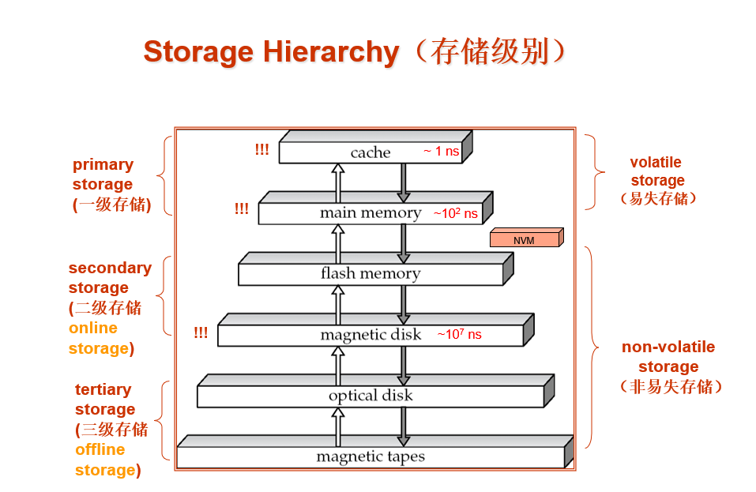
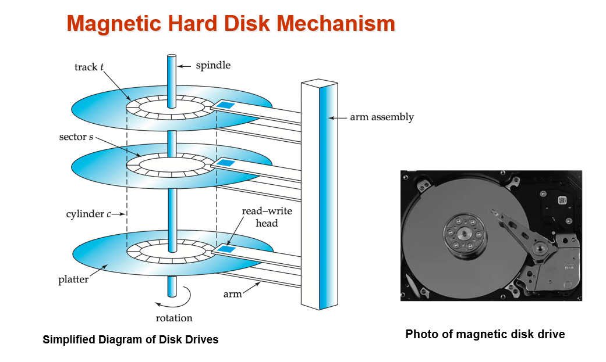
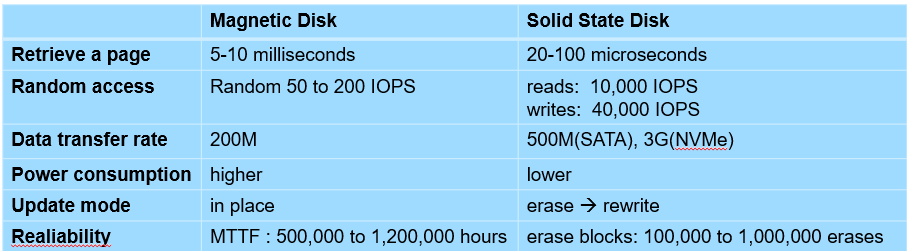
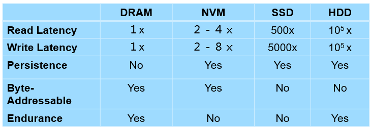

# Chapter 12: Physical Storage Systems
## 1. Classification of Physical Storage Media
- Can differentiate storage into:
    - volatile storage(易失存储): loses contents when power is switched off
    - non-volatile storage（非易失存储）: 
        - Contents persist even when power is switched off. 
        - Includes secondary and tertiary storage, as well as batter-    backed up main-memory.
- Speed with which data can be accessed
- Cost per unit of data
- Reliability
    - data loss on power failure or system crash
    - physical failure of the storage device
## 2. Storage Hierarchy（存储级别）

The storage hierarchy is a layered model of storage devices. 越顶层访问速度越快，cache层甚至能达到1ns访问时间。
易失存储： 掉电易丢
非易失存储：掉电不丢

- Cache: 存储在CPU内部，用于加速CPU的访问。$1$ns
- Main memory: 存储在CPU外部，用于存储CPU的指令和数据。$10^2$ns
- Megnetic disk: 存储在磁带上，用于存储CPU的指令和数据。$10^7$ns
- primary storage: Fastest media but volatile (cache, main memory).
- secondary storage: next level in hierarchy, non-volatile, moderately fast access time
    - also called on-line storage 
    - E.g. flash memory, magnetic disks
- tertiary storage: lowest level in hierarchy, non-volatile, slow access time
    - also called off-line storage 
    - E.g. magnetic tape, optical storage

**Magnetic Hard Disk Mechanism**

机械运动

结构：
- Read-write head 
    - Positioned very close to the platter surface (almost touching it)
    - Reads or writes magnetically encoded information.
- Surface of platter divided into circular tracks（磁道）
    - Over 50K-100K tracks per platter on typical hard disks
- Each track is divided into sectors（扇区）.  
    - A sector is the smallest unit of data that can be read or written.
    - Sector size typically 512 bytes
    - Typical sectors per track: 500 to 1000 (on inner tracks) to 1000 to 2000 (on outer tracks)
- To read/write a sector
    - disk arm swings to position head on right track
    - platter spins continually; data is read/written as sector passes under head
- Head-disk assemblies 
    - multiple disk platters on a single spindle (1 to 5 usually)
    - one head per platter, mounted on a common arm.
- Cylinder（柱面） i consists of ith track of all the platters 

## 3. Magnetic Disks

- Disk controller(磁盘控制器)  – interfaces between the computer system and the disk drive hardware.
    - accepts high-level commands to read or write a sector 
    - initiates actions such as moving the disk arm to the right track and actually reading or writing the data
    - Computes and attaches **checksums** to each sector to verify that data is read back correctly
        - If data is corrupted, with very high probability stored checksum won’t match recomputed checksum
    - Ensures successful writing by reading back sector after writing it
    - Performs **remapping of bad sectors**
#### Performance Measures of Disks
- Access time(访问时间) – the time it takes from when a read or write request is issued to when data transfer begins.  Consists of: 
    - Seek time（寻道时间） – time it takes to reposition the arm over the correct track. 
        - Average seek time is 1/2 the worst case seek time.
        - 4 to 10 milliseconds on typical disks
    - Rotational latency （旋转延迟）– time it takes for the sector to be accessed to appear under the head. 
        - Average latency is 1/2 of the worst case latency.
        - 4 to 11 milliseconds on typical disks (5400 to 15000 r.p.m.)
- Data-transfer rate（数据传输率） – the rate at which data can be retrieved from or stored to the disk.
    - 25 to 100 MB per second max rate, lower for inner tracks
    - Multiple disks may share a controller, so rate that controller can handle is also important
        - E.g. SATA: 150 MB/sec, SATA-II 3Gb (300 MB/sec)
        - Ultra 320 SCSI: 320 MB/s, SAS (3 to 6 Gb/sec)
        - Fiber Channel (FC2Gb or 4Gb): 256 to 512 MB/s
- Disk block is a logical unit for storage allocation and retrieval
    - 4 to 16 kilobytes typically
        - Smaller blocks: more transfers from disk
        - Larger blocks:  more space wasted due to partially filled blocks
- Sequential access pattern(顺序访问模式)
    - Successive requests are for successive disk blocks
    - Disk seek required only for first block
- Random access pattern（随机访问模式）
    - Successive requests are for blocks that can be anywhere on disk
    - Each access requires a seek
    - Transfer rates are low since a lot of time is wasted in seeks
- **I/O operations per second** (IOPS ，每秒I/O操作数)
    - Number of random block reads that a disk can support per second
    - 50 to 200 IOPS on current generation magnetic disks
- **Mean time to failure** (MTTF，平均故障时间) – the average time the disk is expected to run continuously without any failure.
    - Typically 3 to 5 years
    - Probability of failure of new disks is quite low, corresponding to a “theoretical MTTF” of 500,000 to 1,200,000 hours （57 to 136 years）for a new disk
    - An MTTF of 1,200,000 hours for a new disk means that given 1000 relatively new disks, on an average one will fail every 1200 hours(50 days)
    - MTTF decreases as disk ages

#### Disk Interface Standards
- Disk interface standards families
    - SATA (Serial ATA) 
        - SATA 3 supports data transfer speeds of up to 6 gigabits/sec
    - SAS (Serial Attached SCSI)
        - SAS Version 3 supports 12 gigabits/sec
    - NVMe (Non-Volatile Memory Express) interface
        - Works with PCIe connectors to support lower latency and higher transfer rates
        - Supports data transfer rates of up to 24 gigabits/sec
- Disks usually connected directly to computer system
- In Storage Area Networks (SAN), a large number of disks are connected by a high-speed network to a number of servers
- In Network Attached Storage (NAS) networked storage provides a file system interface using networked file system protocol, instead of providing a disk system interface
#### Optimization of Disk-Block Access
- **Buffering**: in-memory buffer to cache disk blocks
- **Read-ahead(Prefetch)**: Read extra blocks from a track in anticipation that they will be requested soon
- **Disk-arm-scheduling** algorithms re-order block requests so that disk arm movement is minimized 
    - **elevator algorithm**: move arm to track with most requests
- **File organization**
    - Allocate blocks of a file in as contiguous a manner as possible
    - Allocation in units of **extents** (盘区)
    - Files may get **fragmented**
        - E.g., if free blocks on disk are scattered, and newly created file has its blocks scattered over the disk
        - Sequential access to a fragmented file results in increased disk arm movement
        - Some systems have utilities to defragment the file system, in order to speed up file access
- **Nonvolatile write buffers （非易失性写缓存）** – speed up disk writes by writing blocks to a non-volatile RAM buffer immediately
    - Non-volatile RAM:  battery backed up RAM or flash memory
        - Even if power fails, the data is safe and will be written to disk when power returns
    - Controller then writes to disk whenever the disk has no other requests or request has been pending for some time
    - Database operations that require data to be safely stored before continuing can continue without waiting for data to be written to disk
    - Writes can be reordered to minimize disk arm movement
- **Log disk（日志磁盘）** – a disk devoted to writing a sequential log of block updates
    - Used exactly like nonvolatile RAM
        - Write to log disk is very fast since no seeks are required
        - No need for special hardware (NV-RAM)
## 4. Flash Storage
- NAND flash - used widely for storage, cheaper than NOR flash
    - requires page-at-a-time read (page: 512 bytes to 4 KB)
        - Not much difference between sequential and random read
    - Page can only be written once
        - Must be erased to allow rewrite
- SSD(Solid State Disks) 
    - Use standard block-oriented disk interfaces, but store data on multiple flash storage devices internally

- Erase happens in units of erase block 
    - Takes 2 to 5 milliseconds
    - Erase block typically 256 KB to 1 MB (128 to 256 pages)
    - After 100,000 to 1,000,000 erases, erase block becomes unreliable and cannot be used
- Remapping of logical page addresses to physical page addresses avoids waiting for erase
- Flash translation table tracks mapping
    - also stored in a label field of flash page
    - remapping carried out by flash translation layer
- wear leveling(磨损均衡)- evenly distributed erase operators across physical blocks
## 5. Storage Class Memory(NVM)
- 3D-XPoint memory technology pioneered by Intel
- Available as Intel Optane
    - SSD interface shipped from 2017
        - Allows lower latency than flash SSDs
    - Non-volatile memory interface announced in 2018
        - Supports direct access to words, at speeds comparable to main-memory speeds

