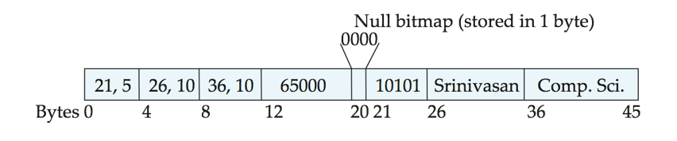
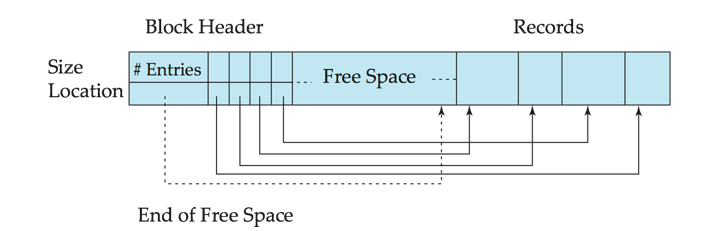
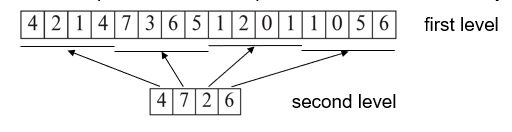

# Chapter13. Data Storage Structures
## 1. File Orginization
- The database is stored as a collection of files.  
- Each file is a sequence of records.  
- A record is a sequence of fields.
- One approach:
    - assume record size is fixed
    - each file has records of one particular type only 
    - different files are used for different relations
- This case is easiest to implement; will consider variable length records later. 
- We assume that records are smaller than a disk block

### Fixed-Length Records
- Each record has a fixed length.
- Simple approach:
    - Store record i starting from byte n  (i – 1), where n is the size of each record.
    - Record access is simple but records may cross blocks
        - Modification: do not allow records to cross block boundaries
- Deletion of record i: 3 alternatives:
    1. move records i + 1, . . ., n  to i, . . . , n – 1
    2. move record n  to i
    3. do not move records, but link all free records on a free list

### Variable-Length Records
- Each record has a variable length.
- Variable-length records arise in database systems in several ways:
    - Storage of multiple record types in a file.
    - Record types that allow variable lengths for one or more fields such as strings (varchar)
    - Record types that allow repeating fields (used in some older data models).
- Attributes are stored in order
- Variable length attributes represented by fixed size (offset, length), with actual data stored after all fixed length attributes
- Null values represented by null-value bitmap（空位图）
例子：Instructor(id，name, dept_name, salary) 

**Slotted Page Structure**

- Slotted page（分槽页） header contains:
    - number of record entries
    - end of free space in the block
    - location and size of each record
- Records can be moved around within a page to keep them contiguous with no empty space between them; entry in the header must be updated.
- Record pointers should not point directly to record — instead they should point to the entry for the record in header.

## 2. Organization of Records in Files
1. Heap – record can be placed anywhere in the file where there is space
2. Sequential – store records in sequential order, based on the value of the search key of each record
3. In a  multitable clustering file organization  records of several different relations can be stored in the same file
    - Motivation: store related records on the same block to minimize I/O
4. B+-tree file organization
    - Ordered storage even with inserts/deletes
5. Hashing – a hash function computed on search key; the result specifies in which block of the file the record should be placed

**Heap Fule Organization**
- Records can be placed anywhere in the file where there is free space
- Records usually do not move once allocated
- Important to be able to efficiently find free space within file
- Free-space map
    - Array with 1 entry per block.  Each entry is a few bits to a byte, and records fraction of block that is free
    - In example below, 3 bits per block, value divided by 8 indicates 
    
    - Can have second-level free-space map
    - In example above, each entry stores maximum from 4 entries of first-level free-space map
- Free space map written to disk periodically, OK to have wrong (old) values for some entries (will be detected and fixed)

**Sequential File Organization**
- Suitable for applications that require sequential processing of the entire file 
- The records in the file are ordered by a search-key
*operations on the file*:
1. Deletion – use pointer chains
2. Insertion –locate the position where the record is to be inserted
    - if there is free space insert there 
    - if no free space, insert the record in an overflow block
    - In either case, pointer chain must be updated
3. Need to reorganize the file from time to time to restore sequential order

**Multitable Clustering File Organization**
- Store several relations in one file using a multitable clustering file organization
- good for queries involving join $department \Join instructor$, and for queries involving one single department and its instructors
- bad for queries involving only department
- results in variable size records
- Can add pointer chains to link records of a particular relation

**Table Partitioning**
- *Table partitioning*: Records in a relation can be partitioned into smaller relations that are stored separately
- E.g., transaction relation may be partitioned into $transaction\_2018, transaction\_2019$, etc.
- Queries written on transaction must access records in all partitions
    - Unless query has a selection such as year=2019, in which case only one partition in needed
- Partitioning 
    - Reduces costs of some operations such as free space management
    - Allows different partitions to be stored on different storage devices 
        - E.g., transaction partition for current year on SSD, for older years on magnetic disk
## 3. Data Dictionary Storage
The Data dictionary (also called system catalog) stores metadata; that is, data about data, such as:
- Information about relations
    - names of relations
    - names, types and lengths of attributes of each relation
    - names and definitions of views
    - integrity constraints
- User and accounting information, including passwords
- Statistical and descriptive data
    - number of tuples in each relation
- Physical file organization information
    - How relation is stored (sequential/hash/…)
    - Physical location of relation 
- Information about indices 

## 4. Storage Access
- Blocks are units of both storage allocation and data transfer.
- Database system seeks to minimize the number of block transfers between the disk and memory.  We can reduce the number of disk accesses by keeping as many blocks as possible in main memory.
- Buffer – portion of main memory available to store copies of disk blocks.
- Buffer manager – subsystem responsible for allocating buffer space in main memory.

