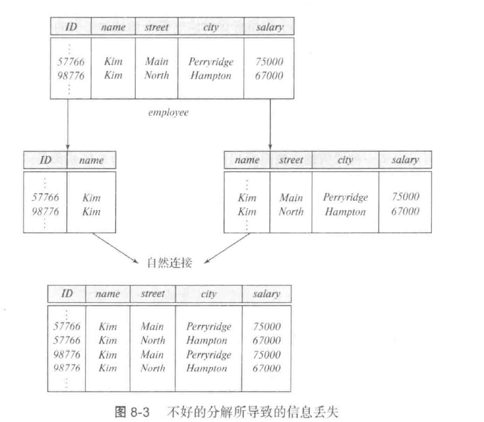
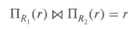

# chapter7.Relational Database Design
## 1. Decomposition(分解)
避免关系模式R信息重复的唯一方式是将其分解为几个模式。
例如：  
> employee(ID, name, salary, street,city)

可分为以下两个模式：
> employee1(ID, name)
> employee2(name,street,city,salary)

有2个实例
> (57766,Kim,Main,Perryride,75000)
> (98776,Kim,North,Hamptom,67000)

由于分解成的两个模式所生成的元组通过自然连接(natural join)重新生成原始元组可能得到其他的结果（两个nmae相同的职员数据错误地混合在一起，产生更多元组，但实际上却拥有了更少的信息，无法准确区别）
我们称这样的分解为有损分解（lossy decomposition）,没有信息丢失的为无损分解（lossless decomposition）

- **无损分解**
令R为关系模式，R1和R2构成R的分解，即若将三者视为属性集，$R=R_1UR_2$。如果用R1,R2自然连接去替代R无信息丢失，则为无损分解。
用关系代数表示：
  
A decomposition of R into R1 and R2 is **lossless join** if at least one of the following dependencies holds:
   - R1 U R2 -> R1    
   - R1 U R2 -> R2

- **有损分解**
令R为关系模式，R1和R2构成R的分解，即若将三者视为属性集，$R=R_1UR_2$。如果用R1,R2自然连接去替代R信息多了（信息论中信息有损），则为有损分解。

## 2. First Normal Form(第一范式)
- A relational schema R is in first normal form if the domains of all attributes of R are atomic.
- 如果 R 的所有属性域都是原子的，那么关系模式 R 符合第一范式 （1NF）。
对于关系数据库，要求所有关系都位于 1NF 中。

**GOAL**  --devise a Theory for the Following
- Decide whether a particular relation R is in “good” form.
- In the case that a relation R is not in “good” form, decompose it into a set of relations {R1, R2, ..., Rn} such that 
    - each relation is in good form 
    - the decomposition is a lossless-join decomposition
- Our theory is based on:
    - functional dependencies
    - multivalued dependencies
- Normal  Forms(NF):
    - 1NF→2NF→3NF→BCNF→4NF 

## 3. Functional Dependencies
- 定义：数据库中函数的依赖关系与数学中的函数很相近，我们可以进行类比：数学中 $x$ 能够决定 $f(x)$ 或者说  ，而在数据库中，我们有以下的说法：$y$ 依赖于$x$, $x$决定 $y$. $x→y$
>e.g
>Consider r(A, B) with the following instance of r.
>
>在这里，因为若B属性值确定了，则A属性值也唯一确定了；因此B→A成立。

> 先给出一些规定：
>- 用希腊字母来表示属性集（例如 $\alpha$ ）,用大写罗马字母来表示关系模式（例如 $R$ ），使用$r(R)$来表示模式R是对于关系r而言的。
一个关系模式是一个属性集，但并非所有属性集都是关系模式。
>- 当属性集是超码时，我们可能用K来表示。其属于一个特定的关系模式。
>- 我们对关系使用小写的名称，例如 $instructor$
>- 因此符号$r(R)$是指具有模式R的关系r。

> **平凡函数依赖**（trivial functional dependencies）:
> For example: $ID,name→ID$,$name→name$
> In general,$\alpha\rightarrow\beta $ is trivial if $\beta\subset\alpha$

**码和函数依赖**
约束关系可以被形式化地表示为码或者表示为我们在下面所定义的函数依赖。
- 给定$r(R)$,$R$的一个子集$K$是$r(R)$的**超码（superkey）**的条件是：
在其合法实例中，对于$r$的实例中**所有元组**对$t_1$和$t_2$总满足：（如果部分实例成立，不说明就是满足该条件）
    - 若$t_1$不等于$t_2$，则$t_1[K]$和$t_2[K]$值不等。那么一个$K$值能**唯一标识一个元组**

如果$K→R$在$r(R)$中成立，则称K是R的一个函数依赖(一个超码superkey,都是属性集)。

   
**各种键：**
    - **超键(super key)**:在关系中能唯一标识元组的属性集称为关系模式的超键
    - **候选键(candidate key)**:不含有多余属性的超键称为候选键
    - **主键(primary key)**:用户选作元组标识的一个候选键程序主键
    - **外键(foreign key)**:如果关系模式R1中的某属性集不是R1的主键，而是另一个关系R2的主键则该属性集是关系模式R1的外键。  
       

**Closure**(闭包)
用$F$表示。We denote the closure of F by F+.
The set of all functional dependencies logically implied by F is the closure of F.
由$F$内的所有函数依赖可推导出来的所有函数依赖(包含平凡函数依赖)构成的集合用$F^+$表示,称为**闭包**。 $F^+$ is a superset of $F$($F\subset F^+$ 包含另一集合所有元素).

 公理系统：We can find F+,  the closure of F, by repeatedly applying **Armstrong’s Axioms**:
   1. if $\beta\subset\alpha$,then $\alpha\to\beta$ (reflexivity,自反率)
   2. if $\alpha\to\beta$ and $\beta\to\gamma$, then $\alpha\to\gamma$ (transitivity,传递率)
   3. if $\alpha\to\beta$，then $\gamma\alpha\to\gamma\beta$ (augmentation,增补率)
 Additional rules(inferred from the axioms):
   1. if $\alpha\to\beta$ and $\alpha\to\gamma$, then $\alpha\to\beta\gamma$ (union,合并)
   2. if $\alpha\to\beta\gamma$,then $\alpha\to\beta$ and $\alpha\to\gamma$ (decomposition,分解)
   3. if $\alpha\to\beta$ and $\gamma\beta\to\delta$, then $\gamma\alpha\to\delta$ (pseudo-transitivity,伪传递)

These rules are **Sound（正确有效的）** (generate only functional dependencies that actually hold),  and **Complete（完备的）** (generate all functional dependencies that hold).   
 
**Closure of Attribute Sets**:
Given a set of attributes a, define the closure of a under F (denoted by a+) as the set of attributes that are functionally determined by a under F.由该属性决定的所有属性的集合称为属性的闭包。
> For emample, $R(A,B,C,D)$,$F=\{A\to B,B\to C,B\to D\}$, 
> $A^+=ABCD$, $B^+=BCD$, $C^+=C$, $D^+=D$
> 可画图来看
  
Uses of Attribute Closure：
1. To test if $\alpha$ is a **superkey**, we compute $\alpha$+, and check if $\alpha$+ contains all attributes of R.
2. To check if a functional dependency $\alpha\to\beta$ holds (or, in other words, is in F+), just check if $\beta\subset\alpha^+$. 
3. For each $\gamma\subset R$, we find the closure $\gamma^+$, and for each $S\subset\gamma^+$, we output a functional dependency $\gamma\to S$.
 
 

## 4. Canonical Cover 正则覆盖(最简覆盖)
Sets of functional dependencies may have redundant dependencies that can be inferred from the others.不存在多余的函数依赖，左右都没有多余的属性。
A canonical cover for F is a set of dependencies Fc such that ：
- F logically implies all dependencies in Fc, 
- Fc logically implies all dependencies in F, 
- No functional dependency in Fc contains an extraneous attribute(无关属性), 
- Each left side of functional dependency in Fc is unique.

## 5. Boyce-Codd Normal Form(BCNF)
A relation schema R is in BCNF with respect to a set F of functional  dependencies if for all functional dependencies in F+ of the form $\alpha\to\beta$,where $\alpha$ and $\beta$ are nonempty sets of attributes, at least one of the following is true:
- $\alpha\to\beta$ is a trivial dependency
- $\alpha$ is a superkey for R

任何一条非平凡函数依赖，左边都是superkey。即左边属性的闭包是所有属性的集合.

- BCNF分解算法：
分解出来不一定依赖保持
:joy::cry:

BCNF and Dependency Preservation(分解的依赖保持)
- 原来关系R上的每一个函数依赖，都可以在分解后的单一关系上得到检验或者推导得到。$F^+=(\cup_{i=1}^nF_i)^+$

## 6. 3NF
- 3NF:
- 3NF分解算法：

