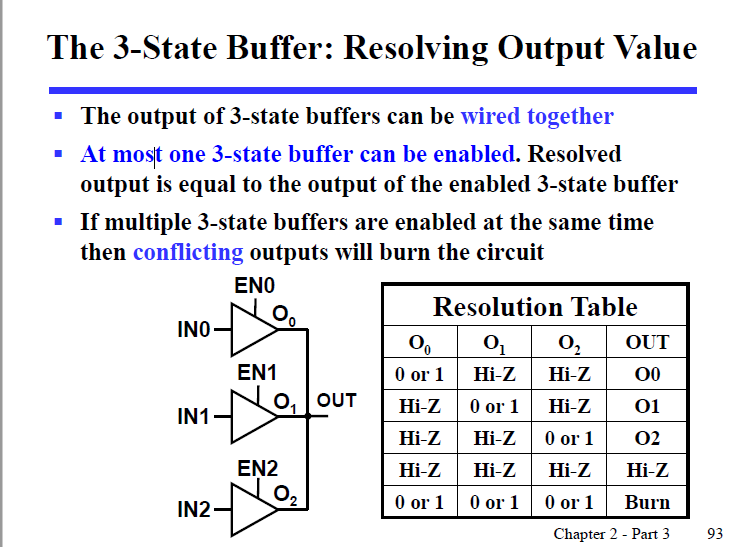

# Chapter 2
## The 3-State Buffer
三态门，除输入输出外，还有一个使能端（Enable control）来控制输出  
所谓三态：
- 当使能为1，且输入为1，输出1
- 当使能为1，且输入为0，输出0
- 当使能为0，无论输入是什么，输出为0（Hi-Z/Z/z）(浮动，高阻态，当作0)

**高阻态**
>高阻态同它字面意思相同，我们可以当它此时是断路，而高阻态重点要与低电平做区分：如果现在存在一个“导线”，它有三个端，其中我们人为地认为其中两个是输入，分别命名为 a 和 b，另外一个认为是输出，命名为 c。
此时，我们是不允许 a 和 b 一个为高电平，一个为低电平的，因为我们这里人为定义的输入输出并不影响电流的流动方向，所以当 a 为 1，b 为 0 时，电流很可能会变成从 a 流向 b，电源可能直接接地，这是我们不希望看到的，这也是为什么我们需要一个或门来实现这个逻辑行为（换言之，这种“三端”电路是相当危险的，不过当我们人为定义多个输出时，一般作为接收端的电路都有二极管防止逆流，所以单输入多输出是很常见的）。
从更抽象地角度来理解，一根导线最多承载一份信息，然而有两个输入介入，此时我们只有 0/1 两态，不管怎么样，我们都同时拿到了来自两个输入的数据，而对于只能承载一份信息的导线来说，这两个信息冲突了。所以我们需要 MUX 来选择我们需要的到底是哪个信息，然后再给导线。
而三态门，在高低电平外引入了「高阻态」，就非常巧妙地解决了这个「多输入」危险的问题，当我们不希望这个数据被输入时，我们直接把它断开，类似于直接把开关断开，只要我们让导线的若干输入中只有一个三态门不在「高阻态」，就能够优雅地实现多路输出互联。

高电平有效

作用:
可以用三态门来解决多路输出互联的问题。可以让多个输入在同一时间只有一个被输出到总线解决，即在同一时刻只有一个使能端有效（1），其余均为Hi-Z状态

