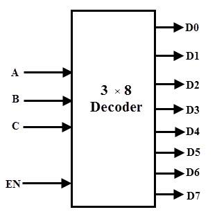
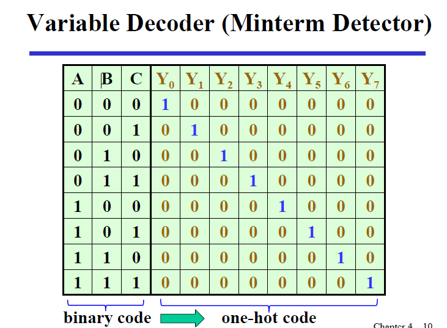
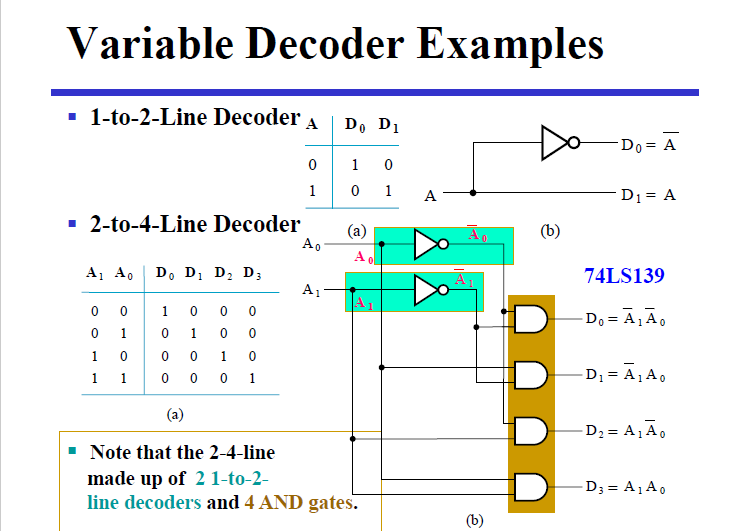
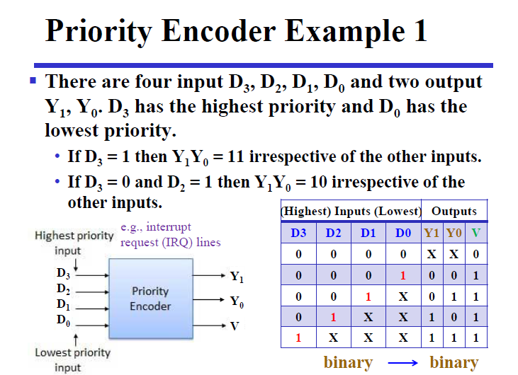

# Chapter3 Combinational Logic Design
## Part1 Implementation Technology and Logic Design
有两种类型的逻辑电路：
- combinational logic circuit(组合电路)
  - 有m个输入，n个输出，期中包含2^m^种输入组合，以及n个不同的输出函数
  - 它的输出只依赖于m个输入的组合（不包含回路）
- sequential logic circuit(时序电路)
  - 它的输出不但取决于输入，而且也依赖于之前的输入（有记忆功能）
### 组合电路
表示逻辑的方法：
1. 真值表(Truth Table)；
2. 布尔函数(Boolean Function)；
3. 卡诺图(Karnaugh Maps)；
4. 时序图(Timing Diagram)；
5. 逻辑电路图(Logic Circuit)；

其中，方法1，3，4在功能确定的情况下，其表示是唯一的。  

而我们的设计，就是在满足功能的前提下，尽可能优化和找到最好的设计。
而主要的设计过程如下：
1. 确定系统的行为；
2. 阐述输入和输出之间的逻辑关系，并用真值表或逻辑表达式表达出来；
3. 优化逻辑表达以减少成本（比如使用卡诺图）；
4. 将优化后的逻辑设计工艺映射到硬件实现上；
5. 验证正确性（在仿真环境中）；

### 分层设计
分层设计即将复杂问题模块化分解为若干层次，然后逐个抽象解决。
其设计方法分为自顶向下(Top-Down)和自底向上(Bottom-Up)。
前者从需求开始，自顶向下分解功能设计；后者根据现有的元件去组合成目标功能。
### 集成电路（integrated circuits）
集成电路(integrated circuits)又叫芯片(chip)，分为如下若干等级：
- SSI(small-scale integrated) 内含不到 10 个 gates；
- MSI(medium-scale integrated) 内含 10 ~ 100 个 gates；
- LSI(large-scale integrated) 内含 成百上千 个 gates；
- VLSI(very large-scale integrated) 内含 成千上亿 个 gates；
### 技术参数（technical parameters）

|name|description|
|---|---|
|fan-in|一个门的可用输入数量|
|fan-out|一个门输出驱动的标准负载数量|
|logic levels|高低电平输入输出电压范围|
|noise margin|噪声容错能力|
|cost for one gate|一个门成本|
|propagation delay|信号改变后从输入到输出所需变化时间|
|power dissipation|一个门消耗的能量|

### Fan-in and Fan-out
扇入描述了一个门能够接受的最多输入量，如一个四输入与非门的扇入就是 4；而扇出描述的则是一个门的输出（栅极输出）在不降低工作性能的情况下能够负载多少门，例如一个非门的输出能够同时负载 4 个非门并且都能正常工作，则其扇出为 4，其也能通过标准负载来定义。

### propagation delay
... :joy:
### delay models
... :joy:
## Part2 Combinational Functional Blocks
### 基本逻辑函数
- 常数函数 $$F=0$$or$$F=1$$

- 传输函数 $$F=X$$直接输出输入值  

- 逆变函数 $$F=X'$$输出输入相反值

- 使能函数 $$F=X(EN)$$or$$F=X+(EN)'$$通过控制使能控制输入是否可变（注意区别与三态门，高阻值Hi-Zor定值）
### 基本功能块
- 译码器 decoder
- 编码器 encoder
- (三端)多路复用器（multiplexer）MUX
- (三端)信号分配器（demultiplexer）DEMUX
### 译码器 （n-2^n^ line BCD decoder）
稠密->稀疏/稠密

译码器可以由与门或与非门来负责输出。若使用与门，当所有的输入均为高电平时，输出才为高电平，这样的输出称为“高电平有效”的输出；若使用与非门，则当所有的输入均为高电平时，输出才为低电平，这样的输出称为“低电平有效”的输出。

更复杂的译码器是n线－2^n^线类型的二进制译码器。这类译码器是一种组合逻辑电路，能从已编码的n个输入，将二进制信息转换为2^n^个独特的输出中最大个数的输出。我们说2^n^个输出的最大个数，是因为当n位已编码信息中有未使用的位组合时，译码器可能会有少于2^n^个输出。
>3-8 decoder

one hot code 稀疏

### 编码器
与译码器作用相反
稠密/稀疏->稠密
> 如上定义的编码器有一个限制，即任何时候输入只能有一个是活动的，即输入是one-hot的

优先编码器
>优先编码器能够实现优先级函数，它不要求输入是 one-hot 的，而是总是关注有效输入中优先级最高的那一个。即比如当优先级最高的那一位是 1 时，其它所有优先级不如它的位置的值都是我们不关心的内容了。

