# Sequential Circiuts
## Part1 Storage Elements and Sequential Circuit Analysis
### Introduction to Sequential Circuits
A sequential circuit contains:
- Storage elements: Latches锁存器 or Flip-Flops触发器
- Combinational Logic:
    - Inputs：
        - signals from the outside
        - signals from storage elements called State or Present State（现态$Q_n$）.
    - Outputs:
        - signals to the outside
        - signals to storage elements called Next State(次态$Q_{n+1}$)

**Combinational Logic**:
- Next state function: $Q_{n+1}=f(Q_n,X)$,其中$X$为输入变量。次态方程
- Output function: （Mealy）$Y=g(Q_n,X)$
- Output function: （Moore）$Y=h(Q_n)$输入不会直接改变输出，而是通过改变状态来间接改变输出。

时序逻辑电路是数字逻辑电路的重要组成部分,时序逻辑电路又称时序电路,主要由**存储元件**和**组合逻辑电路**两部分组成。它和我们熟悉的其他电路不同,其在任何一个时刻的输出状态由当时的输入信号和电路原来的状态共同决定,而它的状态主要是由存储电路来记忆和表示的。同时时序逻辑电路在结构以及功能上的特殊性,相较其他种类的数字逻辑电路而言,往往具有难度大、电路复杂并且应用范围广的特点。
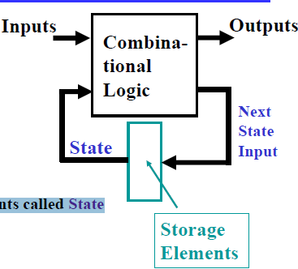

### Type of Sequential Circuit
- Depends on the times at which:
    - storage elements observe their inputs, and
    - storage elements change their state
- Synchronous(同步时序)
    - 状态更新一定发生在时钟周期的整周期上
    - 根据对离散时间信号的了解确定行为
    - 存储元件观察输入，只能根据定时信号（来自时钟的时钟脉冲）改变状态
    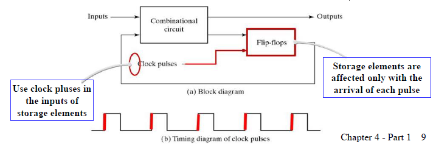  有触发器flip-flop
- Asynchronous（异步时序）
    - 状态更新可以在任意时间发生
    - 如果时钟也被看做一个输入，那么所有电路都是 Asynchronous
    - Asynchronous 可以让我们在有需要的时候更新电路，降低电路的功耗
    

### Latch 锁存器
只要输入信号不发生变化，存储元件将能够无限期保存二进制数据。最基本的存储元件是锁存器。通常情况下，触发器是由锁存器构成的。
- Many components to store historical state
    - Capacitors, Inductors, etc.
    - Latches, Triggers
- Satisfy the following three conditions can be referred to as **latches**
    - There are two stable states, i.e., "0", "1";2个稳态
    - Long term maintaining a given stable state;能长期保持给定的稳定状态
    - Under certain conditions, it can change state, such as setting “1” or resetting “0”.
- The simplest latches are RS latch and D latch

#### RS latch
1. Basic (NAND) $\overline{S}-\overline{R}\  Latch$
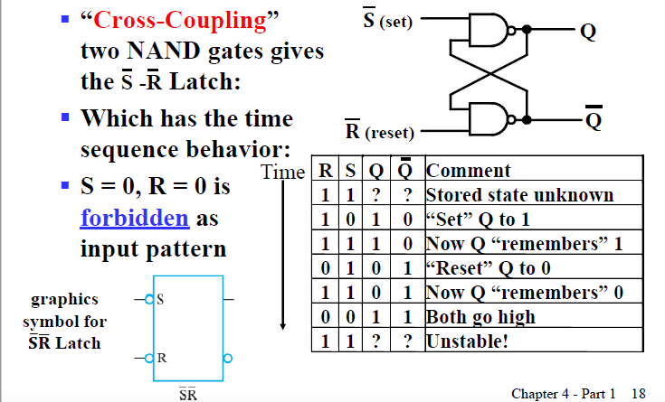

最后一步，两个引脚同时从 0 -> 1, 那么两个与非门的输出都期望变成 0, 但只要有一个门的输出变为 0 另一个门就被锁住变成 1, 因此两个门不可能同时变化。但我们无法确定是哪个门会变成 1.
所以均为0是禁止的。

- The principle of a latch is quite similar to a seesaw:
    - The two ends of the seesaw represent the outputs Q and Q.
    - The two people, Mr. R and Mr. S, represent the inputs R and S.
    - Only one person is allowed to sit at a time — they can't sit together.
    - When Mr. S sits on the seesaw, the output Q becomes high.
    - Even if Mr. S gets off the seesaw, the seesaw keeps its state.
    - When Mr. R sits on the seesaw, Q becomes low. When Mr. R gets off, the seesaw still holds that state.
- 锁存器的原理与跷跷板十分相似：
    - 跷跷板的两端分别代表输出端 Q 和 Q。
    - R 先生和 S 先生这两个人分别代表输入端 R 和 S。
    - 每次只能坐一个人，他们不能坐在一起。
    - 当 S 先生坐在跷跷板上时，输出 Q 变为高电平。
    - 即使 S 先生从跷跷板上下来，跷跷板也会保持其状态。
    - 当 R 先生坐在跷跷板上时，Q 变为低电平。当 R 先生离开时，跷跷板仍保持该状态。

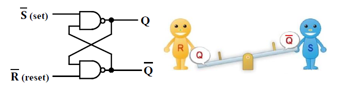

2. Basic (NOR) $S-R$ Latch
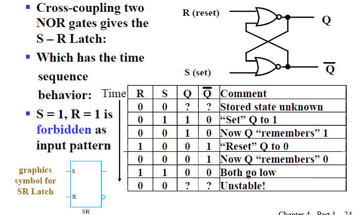

3. Clocked $S-R$ Latch :Synchronous Circuit
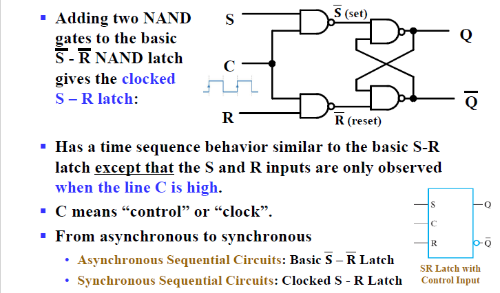
$C$作为一个 ENABLE 的功能。当$C=0$时，$Q$不会发生改变。当$C=1$时，上面相当于$\overline{S}$,下面相当于$\overline{R}$, 变成一个钟控的 S-R 锁存器。

|$C$|$S$|$R$|$Q(t+1)$|
|-|-|-|-|
|0|x|x|no change|
|1|0|0|no change|
|1|0|1|0:Claer Q|
|1|1|0|1:Set Q|
|1|1|1|Indeterminate|

$Q(t+1)$based on current state$Q(t)$and current inputs $(S,R,C)$

#### D latch
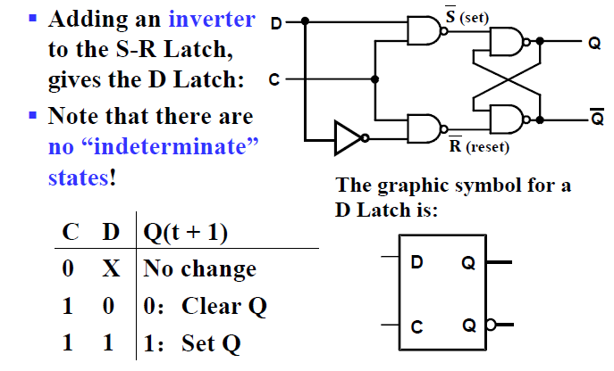

即当$C=1$时，$Q=D$

Latch 是 透明的(transparent)，就是说**输入的变换立即就能传递到输出端口**，当几个透明的 latch 级联时，输入端的信号也能立即传递到输出端。当给 latch 添加额外的逻辑电路（比如使能信号 enable 无效时），就会使它变为 不透明的(non-transparent)。

### Flip-Flop触发器
锁存器不适合使用在电路中：不能做到一个周期内状态值更新一次。
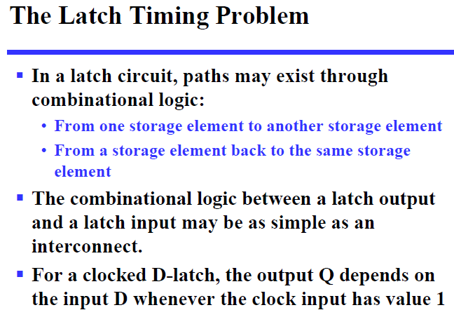
在锁存器电路中，可能存在通过组合逻辑的路径：
-从一个存储元件到另一个存储元件
-从一个存储元件返回到同一存储元件
-锁存器输出端和锁存器输入端之间的组合逻辑可以是简单的互连。
-对于时钟 D 锁存器，只要时钟输入值为 1，输出 Q 就取决于输入 D。
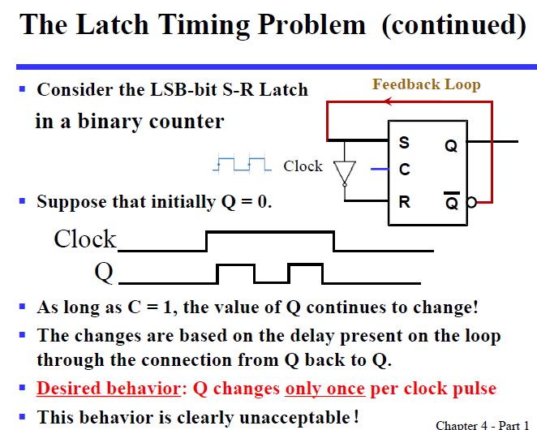
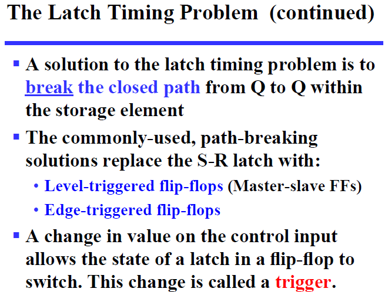
闩锁时序问题的解决方案是在存储元件内打破从 Q 到 Q 的封闭路径
-常用的路径断开解决方案是用以下器件取代 S-R 锁存器：
-触发触发式触发器（主从触发式触发器）
-边缘触发触发器
-控制输入端的值发生变化时，触发器中锁存器的状态就会发生切换。这种变化称为触发。

#### S-R Master-Slave Flip-Flop
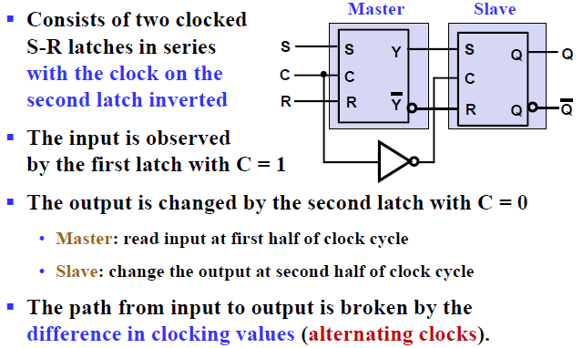
前面称为 master(主锁存器), 后面称为 slave(从锁存器)
当$C=0$时，主锁存器不变。
$C$从 0 变为 1 时，主锁存器被使能，Q 改变，但从锁存器不变。
周期变长一倍一次性采样问题(1s catching)：当 S R 均为 0 时如果有小扰动，无法复原
要求主从触发器避免 S R 的扰动
Such a circuit is called a pulse-triggered or level-triggered flip-flop.

#### Edge-Triggered D Flip-Flop
An **edge-triggered flip-flop** ignores the pulse while it is at a constant level and triggers only during a transition of the clock signal.
A **master-slave D flip-flop** which also exhibits **edge-triggered** behavior can be used.
边缘触发触发器在脉冲处于恒定电平时忽略脉冲，仅在时钟信号转换时触发。
主从式 D 触发器也具有边缘触发特性。
**Negative edge-triggered flip-flop**
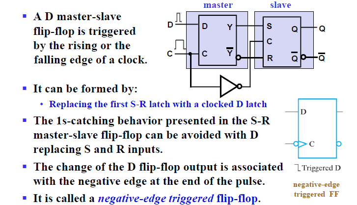

The delay of the S-R master-slave flip-flop can be avoided since the 1s-catching behavior is not present with D replacing S and R inputs. (D 锁存器不会出现 S R 同时为 0 的情况)

**Positive-Edge Triggered D Flip-Flop** is Formed by adding inverter to clock input. (上升沿触发器)
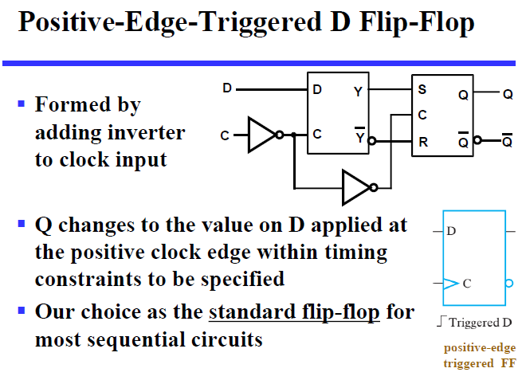
Q changes to the value on D applied at the positive clock edge within timing constraints to be specified

#### J-K Flip-Flop
- Behavior
    - 类似 SR 触发器, $J$相当于$S$,$K$相当于$R$
    - 但$J=K=1$时，触发器相当于是一个求反的功能
    - 也有一次性采样的问题
- Implementation
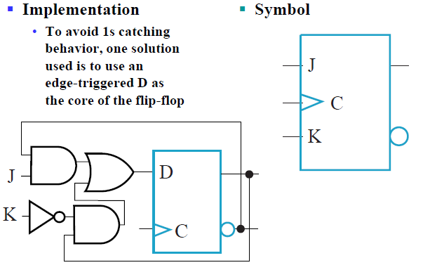
- Symbol
（三角表明是上升沿触发，若为圆圈则是下降沿触发）

#### T Flip-Flop
- Behavior
    - 类似 JK 触发器, 相当于$J=K=T$. 当$T=0$, 状态不变; 当$T=1$, 状态求反
    - 存在一次性采样的问题
    - 无法预置状态，因此需要一个 Reset 信号
- Implementation
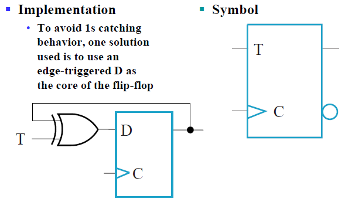

#### 标准图形符号
所有触发器和锁存器都用一个矩形块来表示，输入信号在左侧，输出信号在右侧。一个输出端用来标明触发器当前的正常状态，另一个带有小圆圈的输出端代表触发器当前的状态的非。在SR锁存器和SR触发器中，输入信号S,R标注在矩形内部，在$\overline{S}\overline{R}$锁存器的符号中，每个输入端都加了小圆圈，表示输入信号为0时置位和复位。D锁存器或D触发器中，输入信号D和C标注在矩形内部。
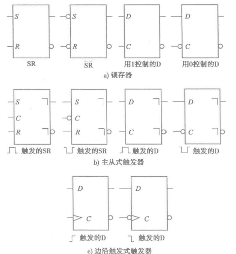
对于脉冲触发式触发器，在其输出端前面有一个直角符号，称之为延时输出指示器（Postponed output indicators），表四输出信号在脉冲的结尾发生改变。

#### 直接输入
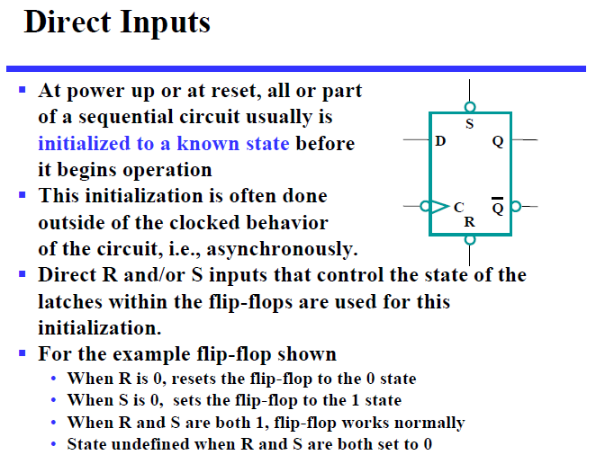
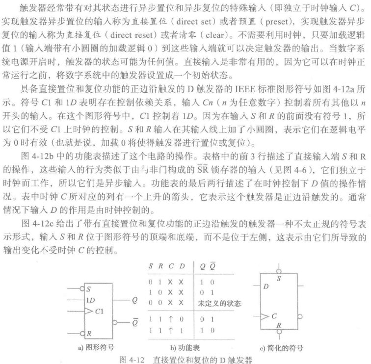

直接输入用来进行初始化，可以在时钟正常运行之前将书法其设置成一个初始状态。

### Analysis
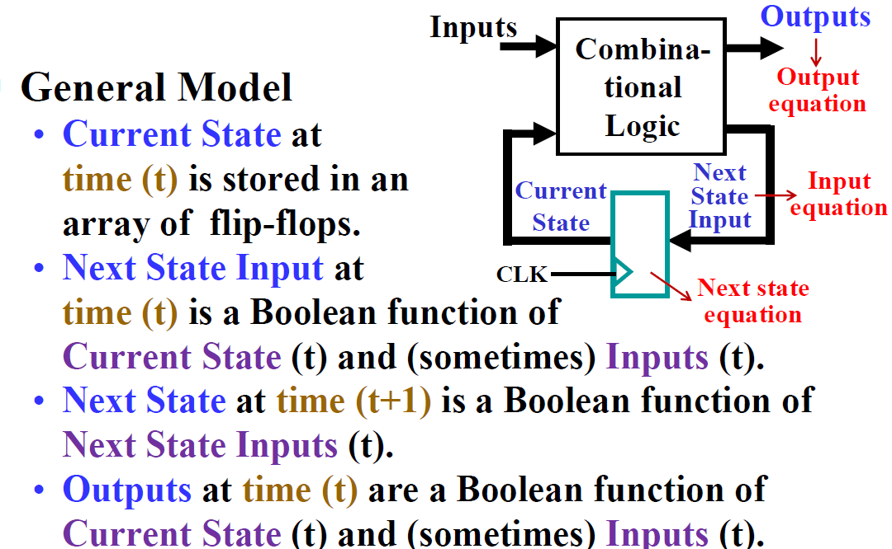
总模型
同步时序电路里 D 触发器的时钟输入端，统一接在一个系统时钟输入 CLK 信号上。（规定所有触发器何时进行状态改变，是额外提供的引脚，不属于整个系统的信号输入）

- **Current State** at time (t) is stored in an array of flip-flops.
- **Next State** at time (t+1) is a Boolean function of State and Inputs.
- **Outputs** at time (t) are a Boolean function of State (t) and (sometimes) Inputs (t).

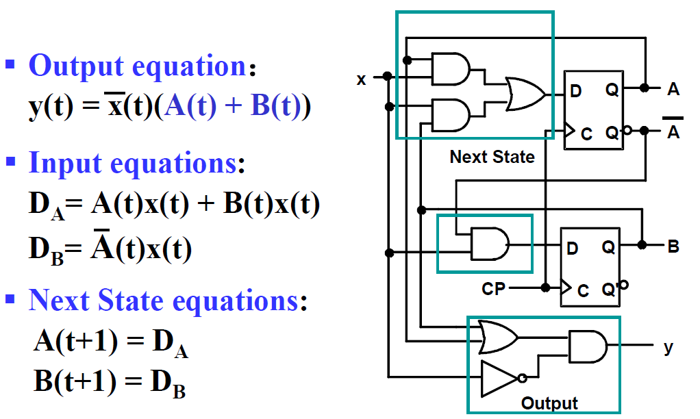
驱动方程是各触发器输入信号的逻辑函数式

分析过程：
1. Derive the input equations, next state equations and output equations
2. Derive the state table (truth table with state):
    - Inputs: inputs of circuit, present state of the circuit
    - Outputs: outputs of circuit, next state of all flip-fops
3. List the next state of the sequential circuit
4. Obtain a state diagram
5. Analyze the performance of the circuit
6. Verify the correctness of the circuit, check the self-recovery capability and draw the timing parameters

#### 1. State table
- State table – a multiple variable table with the following four sections:
    - Input – the input combinations allowed.
    - Present State – the values of the state variables for each allowed state.
    - Next-state – the value of the state at time (t+1) based on the present state and the input.
    - Output – the value of the output as a function of the present state and (sometimes) the input.
- From the viewpoint of a truth table:
    - the inputs are Input, Present State
    - the outputs are Output, Next State

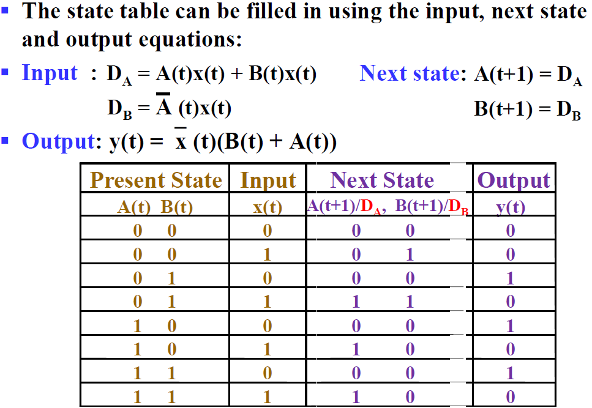

#### 2. State diagrams
- The sequential circuit function can be represented in graphical form as a state diagram with the following components:
    - A circle with the state name in it for each state每个状态都有一个带有状态名称的圆圈
    - A directed arc from the Present State to the Next State for each state transition每个状态转换的 “当前状态 ”到 “下一状态 ”的有向弧
    - A label on each directed arc with the Input values which causes the state transition, and A label:在每条有向弧上标注导致状态转换的输入值和标签：$X/Y$
    输出和输入是否有关，无关标在圈里面，有关标在外面
        - On each circle with the output value produced, or
        - On each directed arc with the output value produced.

- Moore type output depends only on state(输出画在圈里面) 只跟状态有关
- Mealy type output depends on state and input(输出画在有向弧上) 跟状态和输入有关
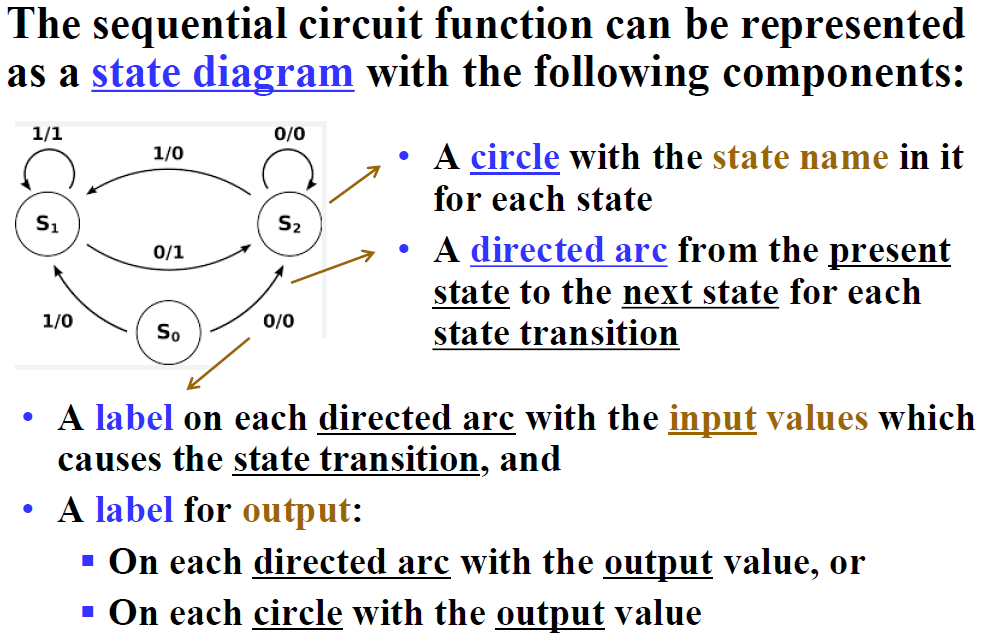
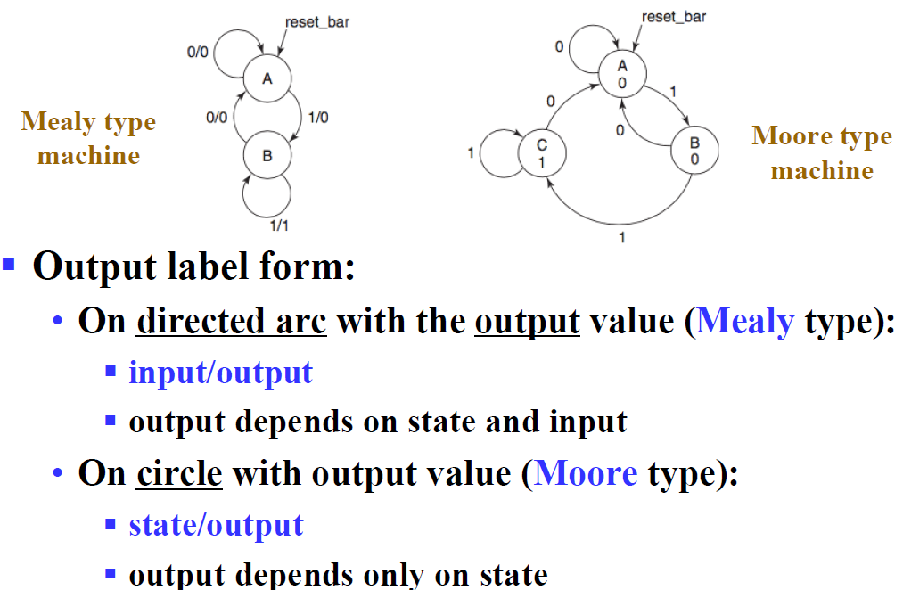

在状态转换图中以圆圈表示电路的各个状态， 以箭头表示状态转换的方向。同时， 还在箭头旁注明了状态转换前的输人变量取值和输出值。通常将输人变量取值写在斜线以上， 将输出值写在斜线以下。所示中电路没有输入逻辑变量， 所以斜线上方没有注字。
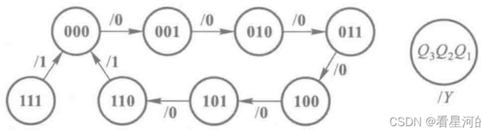

**Equivalent State Definitions**
两个状态，无论输入是什么，都会使这两个状态输出相同，次态也相同，那么这两个状态是等效状态。

#### 3. Flip-Flop Timing Parameters
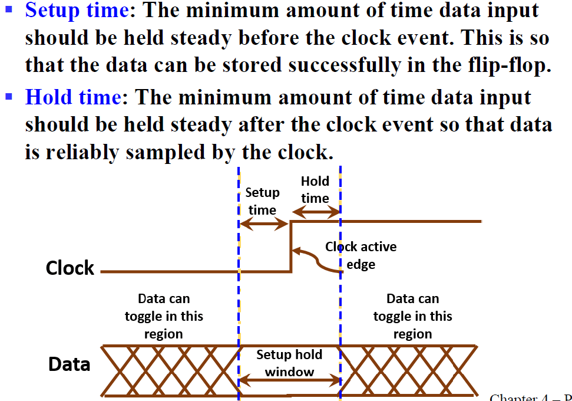
   建立时间（Tsu：set up time）：是指在触发器的时钟信号上升沿到来以前，数据稳定不变的时间，如果建立时间不够，数据将不能在这个时钟上升沿被稳定的打入触发器，Tsu就是指这个最小的稳定时间。时钟事件发生前，数据输入应保持稳定的最短时间。这样才能将数据成功存储到触发器中。
   保持时间（Th：hold time）：是指在触发器的时钟信号上升沿到来以后，数据稳定不变的时间，如果保持时间不够，数据同样不能被稳定的打入触发器，Th就是指这个最小的保持时间。时钟事件发生后，数据输入应保持稳定的最短时间，以便时钟能可靠地对数据进行采样。
   If the data changes within the "setup-hold-window", the output is unpredictable or metastable.输入数据必须在该段时间内保持稳定，不然会进入不稳定状态。
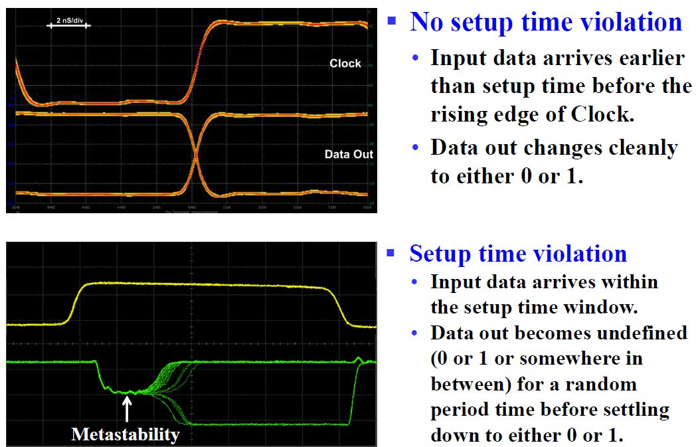
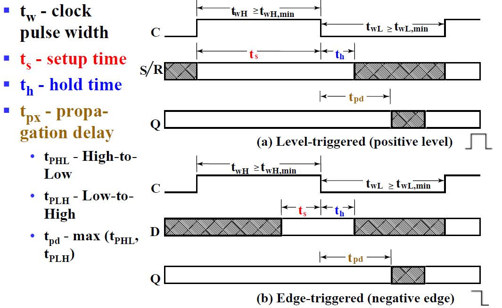
- $t_s$ - setup time
    - Master-slave - Equal to the width of the triggering pulse脉冲的宽度
    - Edge-triggered - Equal to a time interval that is generally much less than the width of the the triggering pulse小于脉冲宽度
- $t_h$ - hold time - Often equal to zero 近似等于0
- $t_{px}$ - propagation delay传输延迟
    - Same parameters as for gates except
    - Measured from clock edge that triggers the output change to the output change
#### 4. Timing Analysis of Sequential Circuits
The ultimate goal of timing analysis is to determine the **maximum clock frequency of the circuit**.
- Timing Constraints Components
    - $t_p$ - clock period - The interval between occurrences of a specific clock edge in a periodic clock
    - $t_{pd,FF}$ - **flip-flop propagation delay** - The amount of time from clock edge to when the flip-flop output becomes stable
    - $t_{pd,COMB}$ - **combinational logic delay** – The total delay of combinational logic along the path from flip-flop output to flip-flop input
    - $t_s$ – **flip-flop setup time** - The amount of time data input should be held steady before the clock event.
    - $t_{slack}$ - extra time in the clock period
    中间三个时间为路径上的时间延迟

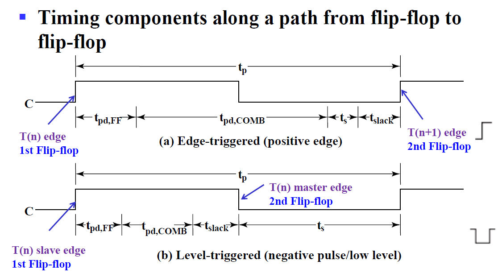

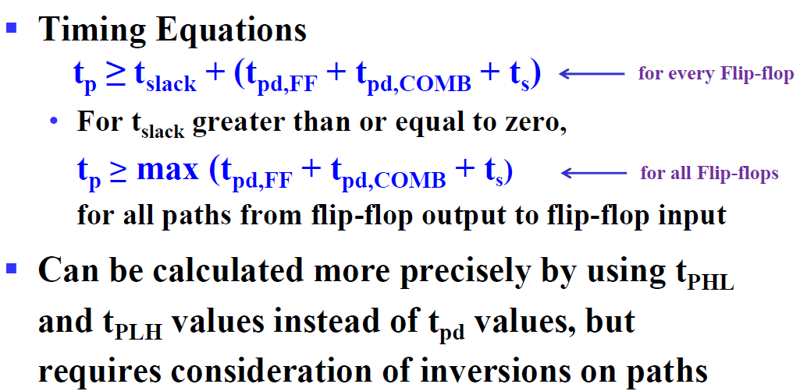
考虑$t_{stack}=0$,得到$$t_p>=Max(t_{pd,FF}+t_{pd,COMB}+t_s)$$这是所有路径中，信号从触发器传播到触发器的最长时间。
Flip-Flop的传播延迟时间$t_{pd}$(propagation delay)与保持时间$t_h$计时起点完全相同，但$t_{pd}$的时延一定大于$t_h$，所以在计算时钟边沿到时钟边沿的传播延迟时，只要考虑传播延迟时间$t_{pd}$，而不需要再次累加$t_h$。