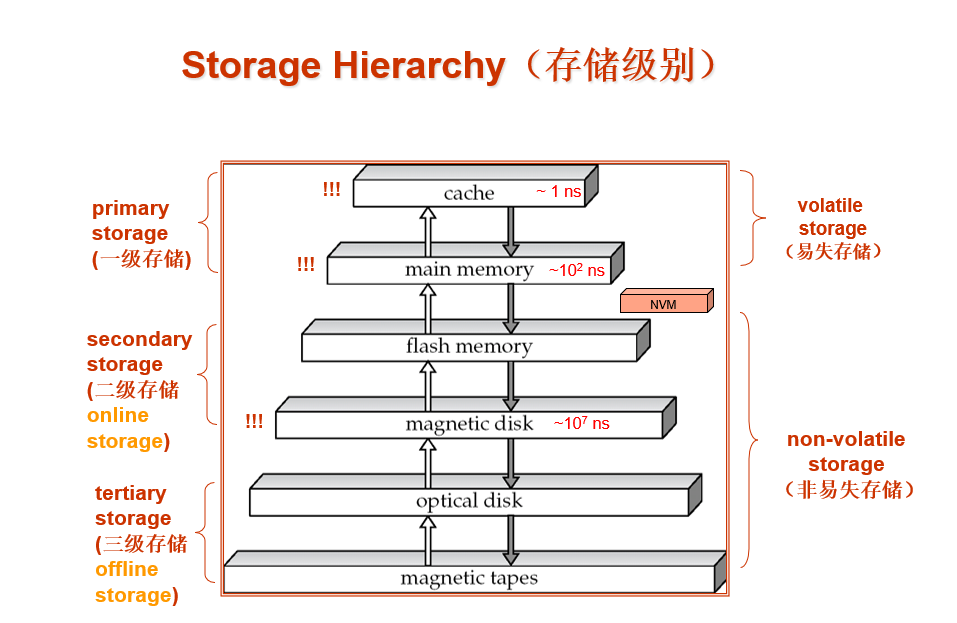
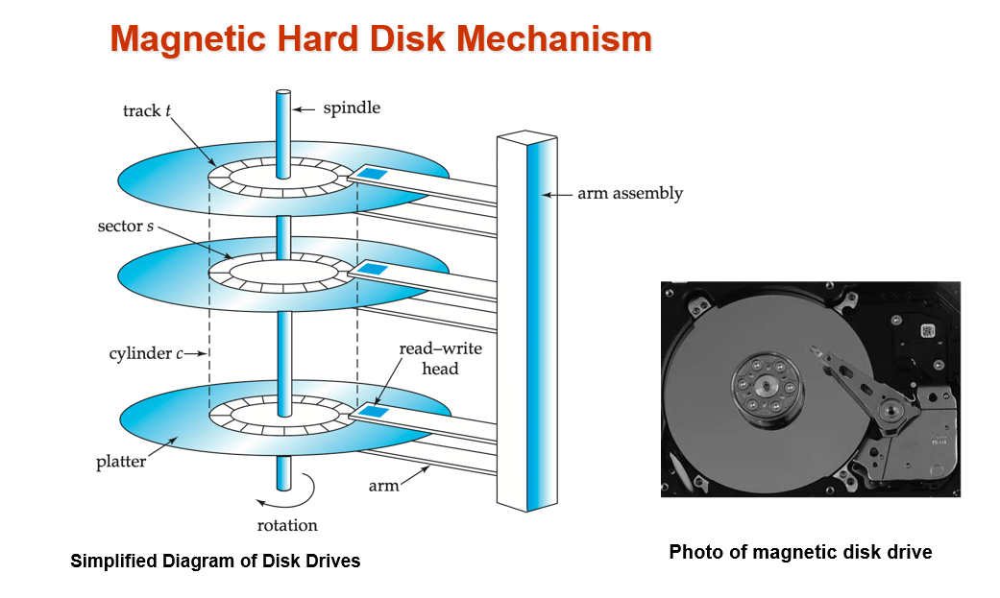
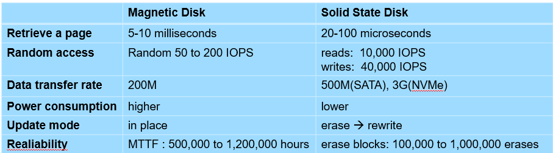
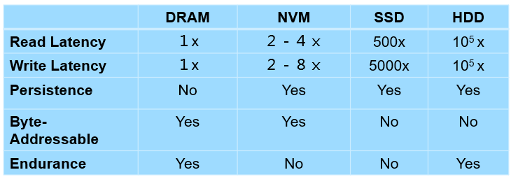

# Chapter 12: Physical Storage Systems
## 1. Classification of Physical Storage Media
- Can differentiate storage into:
    - volatile storage(易失存储): loses contents when power is switched off
    - non-volatile storage（非易失存储）: 
        - Contents persist even when power is switched off. 
        - Includes secondary and tertiary storage, as well as batter-    backed up main-memory.
- Speed with which data can be accessed
- Cost per unit of data
- Reliability
    - data loss on power failure or system crash
    - physical failure of the storage device

- 可将存储区分为
    - 易失存储（volatile storage）：关机时丢失内容
    - 非易失性存储（non-volatile storage）： 
        - 即使关闭电源，内容也会继续存在。
        - 包括二级和三级存储以及电池备份的主存储器。
- 访问数据的速度
- 单位数据成本
- 可靠性
    - 断电或系统崩溃时的数据丢失
    - 存储设备物理故障
## 2. Storage Hierarchy（存储级别）

The storage hierarchy is a layered model of storage devices. 
越顶层访问速度越快，cache层甚至能达到1ns访问时间。
越顶层每字节代价越高。
易失存储： 掉电易丢
非易失存储：掉电不丢

- Cache: 存储在CPU内部，用于加速CPU的访问。$1$ns  高速缓存，易失
- Main memory: 存储在CPU外部，用于存储CPU的指令和数据。$10^2$ns  主存，易失，RAM（Random Access Memory）是其中一种,随机访问存储器
- Flash memory:  闪存，非易失，被用来在USB闪存驱动器中存贮数据，固态硬盘（SSD）在内部使用**闪存**来存储数据
- Megnetic disk storage:也称**硬盘驱动器(HDD)**，非易失，存储在**磁盘**上，用于存储CPU的指令和数据。$10^7$ns  **磁盘存储器**
- Optical disk: 数字视频磁盘（DVD）是一种光存储介质，存储在光碟上  光驱存储器
- Megnetic tape: **磁带存储器**，用于备份数据和归档数据，被称为顺序访问存储器，而磁盘和SSD被称为直接访问存储器，可在任意位置读取数据

- ROM（read-only memory）只读存储器，非易失，无法修改

硬盘和内存的访问速度相差 10 万倍——也就是内存一秒，硬盘一天。因此两者之间有着天然的鸿沟。
因此，从硬盘中取数据是一个大忌，必须不惜代价用算法进行优化
Cache 和 Memory 之间的差异为 100 倍左右（具体和 cache 的级别有关）。相比硬盘和内存，cache miss 的惩罚要小得多。

- primary storage: Fastest media but volatile (**cache, main memory**). 一级存储
- secondary storage: next level in hierarchy, non-volatile, moderately fast access time 二级存储
    - also called on-line storage 
    - E.g. **flash memory, magnetic disks**
- tertiary storage: lowest level in hierarchy, non-volatile, slow access time 三级存储
    - also called off-line storage 
    - E.g. **magnetic tape, optical storage**

**Magnetic Hard Disk Mechanism**

机械运动
磁盘组成结构
- Read-write head 
    - Positioned very close to the platter surface (almost touching it)
    - Reads or writes magnetically encoded information.
- Surface of platter divided into circular tracks（磁道）
    - Over 50K-100K tracks per platter on typical hard disks
- Each track is divided into sectors（扇区）.  
    - A sector is the smallest unit of data that can be read or written.
    - Sector size typically 512 bytes
    - Typical sectors per track: 500 to 1000 (on inner tracks) to 1000 to 2000 (on outer tracks)
- To read/write a sector
    - disk arm swings to position head on right track
    - platter spins continually; data is read/written as sector passes under head
- Head-disk assemblies 
    - multiple disk platters on a single spindle (1 to 5 usually)
    - one head per platter, mounted on a common arm.
- Cylinder（柱面） i consists of ith track of all the platters 

- 读写头 
    - 位置非常靠近盘面（几乎接触盘面）
    - 读取或写入磁编码信息。
- 盘片表面被分割成圆形磁道（磁道）一个个圆圈
    - 典型硬盘的每个盘片有 50K-100K 多条磁道
- 每个磁道分为扇区（扇区）。 
    - 扇区是可读写数据的最小单位。
    - 扇区大小通常为 512 字节
    - 每个磁道的典型扇区 500 至 1000（内轨）至 1000 至 2000（外轨） 越往内半径越小周长越端扇区越少
- 读/写扇区
    - 磁盘臂摆动，将磁头定位在正确的轨道上
    - 盘片持续旋转；扇区经过磁头时读取/写入数据
- 磁头-磁盘组件 
    - 单个主轴上有多个磁盘盘片（通常为 1 到 5 个）
    - 每个盘片一个磁头，安装在一个共用臂上。
- 柱面（Cylinder） i 由所有盘片的第 i 个轨道组成 

## 3. Magnetic Disks 磁盘

- Disk controller(磁盘控制器)  – interfaces between the computer system and the disk drive hardware.
    - accepts high-level commands to read or write a sector 
    - initiates actions such as moving the disk arm to the right track and actually reading or writing the data
    - Computes and attaches **checksums** to each sector to verify that data is read back correctly
        - If data is corrupted, with very high probability stored checksum won’t match recomputed checksum
    - Ensures successful writing by reading back sector after writing it
    - Performs **remapping of bad sectors**

- 磁盘控制器 - 计算机系统与磁盘驱动器硬件之间的接口。
    - 接受读取或写入扇区的高级命令 
    - 启动操作，如将磁盘臂移动到正确的磁道，以及实际读取或写入数据
    - 计算并为每个扇区附加**校验和**，以验证数据是否正确读回
        - 如果数据损坏，存储的校验和很可能与重新计算的校验和不一致
    - 在写入扇区后回读，确保写入成功
    - 执行**坏扇区**重映射

#### Performance Measures of Disks 磁盘性能量度：容量，访问时间，数据传输率，可靠性
- Access time(访问时间) – the time it takes from when a read or write request is issued to when data transfer begins.  Consists of: 
    - Seek time（寻道时间） – time it takes to reposition the arm over the correct track. 
        - Average seek time is 1/2 the worst case seek time.
        - 4 to 10 milliseconds on typical disks
    - Rotational latency （旋转延迟）– time it takes for the sector to be accessed to appear under the head. 
        - Average latency is 1/2 of the worst case latency.
        - 4 to 11 milliseconds on typical disks (5400 to 15000 r.p.m.)

- 访问时间（Access time）--从发出读取或写入请求到开始数据传输所需的时间。 包括 
    - 寻道时间（Seek time） - 将机械臂重新定位到正确轨道上所需的时间。
        - 平均寻道时间是最坏情况下寻道时间的 1/2。
        - 在典型磁盘上为 4 至 10 毫秒
    - 旋转延迟（rotational latency）- 待访问扇区出现在磁头下方所需的时间。
        - 平均延迟为最坏情况延迟的 1/2。
        - 典型磁盘上为 4 至 11 毫秒（5400 至 15000 r.p.m.）
- 传输时间主要耗费在访问上，寻道加旋转，平均访问时间是5-20毫秒

- Data-transfer rate（数据传输率） – the rate at which data can be retrieved from or stored to the disk.
    - 25 to 100 MB per second max rate, lower for inner tracks
    - Multiple disks may share a controller, so rate that controller can handle is also important
        - E.g. SATA: 150 MB/sec, SATA-II 3Gb (300 MB/sec)
        - Ultra 320 SCSI: 320 MB/s, SAS (3 to 6 Gb/sec)
        - Fiber Channel (FC2Gb or 4Gb): 256 to 512 MB/s
- Disk block is a logical unit for storage allocation and retrieval
    - 4 to 16 kilobytes typically
        - Smaller blocks: more transfers from disk
        - Larger blocks:  more space wasted due to partially filled blocks
- Sequential access pattern(顺序访问模式)
    - Successive requests are for successive disk blocks
    - Disk seek required only for first block
- Random access pattern（随机访问模式）
    - Successive requests are for blocks that can be anywhere on disk
    - Each access requires a seek
    - Transfer rates are low since a lot of time is wasted in seeks

- 数据传输率（Data-transfer rate） - 从磁盘获取数据或向磁盘存储数据的速率。
    - 最大速率为每秒 25 到 100 MB，内部磁道的速率较低，因为扇区少
    - 多个磁盘可能共用一个控制器，因此控制器能处理的速率也很重要
        - 例如，SATA：150 MB/秒，SATA-II 3Gb（300 MB/秒）
        - 超 320 SCSI：320 MB/秒，SAS（3 至 6 Gb/秒）
        - 光纤通道（FC2Gb 或 4Gb）： 256 至 512 MB/秒
- 磁盘块是存储分配和检索的逻辑单位 disk block
    - 通常为 4 至 16KB,数据以块为单位在磁盘与主存间传输
        - 块越小：从磁盘传输的数据越多
        - 磁盘块越大：由于部分磁盘块被填满，浪费的空间越多
        - Page通常用来指块，在其他地方可能指不同东西
- 从磁盘请求块的序列可分为顺序访问模式和随机访问模式：
    - 顺序访问模式（Sequential Access Pattern）
        - 连续请求针对连续磁盘块，这些块位于相同磁道或相邻磁道
        - 磁盘寻道只针对第一个区块，后续请求不需要寻道。传输速率最高，因为寻道时间最短
    - 随机访问模式
        - 连续请求是针对磁盘上任何位置的数据块
        - 每次访问都需要寻道
        - 由于大量时间浪费在寻道上，因此传输速率较低

- **I/O operations per second** (IOPS ，每秒I/O操作数)
    - Number of random block reads that a disk can support per second
    - 50 to 200 IOPS on current generation magnetic disks
    - 磁盘每秒可支持的随机块访问次数，顺序访问可极大增加
    - 在当前一代磁盘上为 50 到 200 IOPS

- **Mean time to failure** (MTTF，平均故障时间) – the average time the disk is expected to run continuously without any failure. 这是磁盘可靠性的度量指标，指的是平均可以期望系统无任何故障连续运行的时间量
    - Typically 3 to 5 years
    - Probability of failure of new disks is quite low, corresponding to a “theoretical MTTF” of 500,000 to 1,200,000 hours （57 to 136 years）for a new disk
    - An MTTF of 1,200,000 hours for a new disk means that given 1000 relatively new disks, on an average one will fail every 1200 hours(50 days)
    - MTTF decreases as disk ages
    - 通常为 3 至 5 年
    - 新磁盘出现故障的概率很低，相当于新磁盘的 “理论 MTTF ”为 500,000 至 1,200,000 小时（57 至 136 年）。
    - 新磁盘的 MTTF 为 1,200,000 小时，这意味着在 1000 块相对较新的磁盘中，平均每 1200 小时（50 天）就会有一块出现故障。
    - MTTF 随磁盘老化而降低

#### Disk Interface Standards
- Disk interface standards families
    - SATA (Serial ATA) 
        - SATA 3 supports data transfer speeds of up to 6 gigabits/sec
    - SAS (Serial Attached SCSI)
        - SAS Version 3 supports 12 gigabits/sec
    - NVMe (Non-Volatile Memory Express) interface
        - Works with PCIe connectors to support lower latency and higher transfer rates
        - Supports data transfer rates of up to 24 gigabits/sec
- Disks usually connected directly to computer system
- In Storage Area Networks (SAN), a large number of disks are connected by a high-speed network to a number of servers
- In Network Attached Storage (NAS) networked storage provides a file system interface using networked file system protocol, instead of providing a disk system interface
磁盘及基于闪存的固态硬盘通过告诉互连连接到计算机系统。
- 磁盘接口标准系列
    - SATA（串行 ATA） 
        - SATA 3 支持高达 6 GB/s 的数据传输速度，实际上允许每秒最多传输600MB的数据
    - SAS（串行连接 SCSI），通常仅在服务器使用
        - SAS 第 3 版支持 12 千兆比特/秒
    - NVMe（Non-Volatile Memory Express）接口,为了更好支持SSD而开发的逻辑接口标准
        - 通常与 PCIe 连接器配合使用，支持更低的延迟和更高的传输速率
        - 支持高达 24 千兆比特/秒的数据传输速率
- 磁盘通常直接连接到计算机系统
- 在存储区域网络（SAN）中，大量磁盘通过高速网络连接到多个服务器上
- 在网络附加存储（NAS）中（一种SAN替代方案），网络存储使用网络文件系统协议提供文件系统接口，而不是提供磁盘系统接口

#### Optimization of Disk-Block Access 优化磁盘块访问
- **Buffering**: in-memory buffer to cache disk blocks 缓冲区缓存磁盘块
- **Read-ahead(Prefetch)**: Read extra blocks from a track in anticipation that they will be requested soon   从轨道中读取额外的区块，因为预计很快就会请求这些区块 提前读取
- **Disk-arm-scheduling** algorithms re-order block requests so that disk arm movement is minimized 
    - **elevator algorithm**: move arm to track with most requests
    - 磁盘臂调度算法重新安排块请求的顺序，以尽量减少磁盘臂的移动 
    - 提升算法：将磁盘臂移动到请求最多的轨道上
- **File organization**
    - Allocate blocks of a file in as contiguous a manner as possible
    - Allocation in units of **extents** (盘区)
    - Files may get **fragmented**
        - E.g., if free blocks on disk are scattered, and newly created file has its blocks scattered over the disk
        - Sequential access to a fragmented file results in increased disk arm movement
        - Some systems have utilities to defragment the file system, in order to speed up file access
    - 文件组织
    - 尽可能**连续**地分配文件块
    - 以 **盘区**为单位进行分配
    - 文件可能会**分散**
        - 例如，如果磁盘上的空闲区块分散，而新创建的文件的区块分散在磁盘上
        - 对碎片文件的顺序访问会导致磁盘臂移动增加
        - 有些系统有对文件系统进行碎片整理的实用程序，以加快文件访问速度
- **Nonvolatile write buffers （非易失性写缓存）** – speed up disk writes by writing blocks to a non-volatile RAM buffer immediately
    - Non-volatile RAM:  battery backed up RAM or flash memory
        - Even if power fails, the data is safe and will be written to disk when power returns
    - Controller then writes to disk whenever the disk has no other requests or request has been pending for some time
    - Database operations that require data to be safely stored before continuing can continue without waiting for data to be written to disk
    - Writes can be reordered to minimize disk arm movement
    - 通过将数据块立即写入非易失性 RAM 缓冲区，加快磁盘写入速度
    - 非易失性 RAM：电池备份 RAM 或闪存
        - 即使电源发生故障，数据也是安全的，并将在电源恢复时写入磁盘
    - 只要磁盘没有其他请求或请求已等待一段时间，控制器就会写入磁盘
    - 需要先安全存储数据才能继续的数据库操作可以继续进行，而无需等待数据写入磁盘
    - 可重新安排写入顺序，以尽量减少磁盘臂的移动
- **Log disk（日志磁盘）** – a disk devoted to writing a sequential log of block updates
    - Used exactly like nonvolatile RAM
        - Write to log disk is very fast since no seeks are required
        - No need for special hardware (NV-RAM)
    - 专门用于写入块更新顺序日志的磁盘
    - 使用方式与非易失性 RAM 完全相同
        - 由于无需寻道，写入日志磁盘的速度非常快
        - 无需特殊硬件（NV-RAM）
## 4. Flash Storage
- NAND flash - used widely for storage, cheaper than NOR flash
    - requires page-at-a-time read (page: 512 bytes to 4 KB)
        - Not much difference between sequential and random read
    - Page can only be written once
        - Must be erased to allow rewrite
    - NAND 闪存 - 广泛用于存储，比 NOR 闪存便宜
    - 需要逐页读取（页：512 字节至 4 KB）
        - **顺序读取和随机读取的区别不大**
    - 页只能写入一次
        - **必须擦除才能重写**，擦除耗时耗力
- SSD(Solid State Disks) 
    - Use standard block-oriented disk interfaces, but store data on multiple flash storage devices internally
    - 固态硬盘 
    - 使用标准的面向块的磁盘接口，但在内部将数据存储在多个闪存设备上
- 闪存和磁盘的区别：
  - 闪存的随机读和顺序读几乎没有差别（实际上，remapping 之后，顺序读和随机读在物理上并没有多大的区别）
  - 闪存的读和写有很大差别。我们要尽量防止反复写入。

- Erase happens in units of erase block 
    - Takes 2 to 5 milliseconds
    - Erase block typically 256 KB to 1 MB (128 to 256 pages)
    - After 100,000 to 1,000,000 erases, erase block becomes unreliable and cannot be used
- Remapping of logical page addresses to physical page addresses avoids waiting for erase
- Flash translation table tracks mapping
    - also stored in a label field of flash page
    - remapping carried out by flash translation layer
- wear leveling(磨损均衡)- evenly distributed erase operators across physical blocks
- 以擦除块为单位进行擦除 
    - 耗时 2 至 5 毫秒
    - 擦除块通常为 256 KB 至 1 MB（128 至 256 页）
    - 擦除 100,000 至 1,000,000 次后，擦除块变得不可靠，无法使用
- 将逻辑页地址重新映射到物理页地址可避免等待擦除
- 闪存转换表跟踪映射
    - 也存储在闪存页面的标签字段中
    - 由闪存转换层进行重新映射
- 磨损均衡(wear leveling)--在物理块中均匀分布擦除操作符
## 5. Storage Class Memory(NVM)
- 3D-XPoint memory technology pioneered by Intel
- Available as Intel Optane
    - SSD interface shipped from 2017
        - Allows lower latency than flash SSDs
    - Non-volatile memory interface announced in 2018
        - Supports direct access to words, at speeds comparable to main-memory speeds

NVM 非易失性存储器
可以看见：
- NVM 和 DRAM 是在同一量级上的，之间的差距并不大
- NVM 和 SSD 之间有天然的鸿沟，但是 SSD 的随机读写能力很强
- HDD 的速度最慢，但是便宜+endurance+persistence

