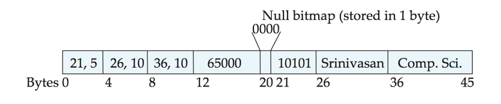
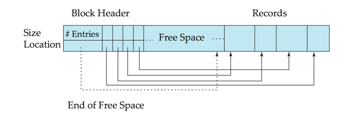
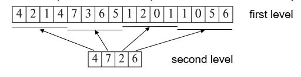

# Chapter13. Data Storage Structures
## 1. File Orginization
- The database is stored as a collection of files.  
- Each file is a sequence of records.  
- A record is a sequence of fields.
- One approach:
    - assume record size is fixed
    - each file has records of one particular type only 
    - different files are used for different relations
- This case is easiest to implement; will consider variable length records later. 
- We assume that records are smaller than a disk block
- 数据库以文件集合的形式存储。 
- 每个文件都是一系列记录。 
- 记录是字段的序列。
- 一种方法是
    - 假设记录大小固定
    - 每个文件只有一种特定类型的记录 
    - 不同的关系使用不同的文件
- 这种情况最容易实现；稍后将考虑长度可变的记录。
- 我们假设记录小于一个磁盘块
### Fixed-Length Records 定长记录
- Each record has a fixed length.  可当成 struct X array[N],每个array[i]占用相同大小
- Simple approach:
    - Store record i starting from byte $n*(i – 1)$, where n is the size of each record.从字节 $n*(i - 1)$ 开始存储记录 i，其中 n 是每个记录的大小。
    - Record access is simple but records may cross blocks 记录可能跨越数据块
        - Modification: do not allow records to cross block boundaries 修改：不允许记录跨越块边界
- Deletion of record i: 3 alternatives: 删除记录i **三种选择**
    -  move records i + 1, . . ., n  to i, . . . , n – 1
    -  move record n  to i
    -  do not move records, but link all free records on a free list 不移动记录，但将所有空闲记录连接到空闲列表中

### Variable-Length Records 可变记录
- Each record has a variable length.
- Variable-length records arise in database systems in several ways:
    - Storage of multiple record types in a file.
    - Record types that allow variable lengths for one or more fields such as strings (varchar)
    - Record types that allow repeating fields (used in some older data models).
- 数据库系统中出现变长记录有几种情况：
    - 在一个文件中存储多个记录类型。
    - 允许一个或多个字段（如字符串（varchar））长度可变的记录类型
    - 允许重复字段的记录类型（在某些旧数据模型中使用）。
- Attributes are stored in order 属性按顺序存储
- Variable length attributes represented by fixed size (offset, length), with actual data stored after all fixed length attributes
- Null values represented by null-value bitmap（空位图）
- 可变记录包含2部分，首先是定长信息的初始部分，其结构对于相同关系的所有记录都一样，接着是变长属性部分。
- 可变长度属性在记录的初始部分被表示为一个（偏移量、长度）对，偏移量表示在记录中该属性的数据开始位置，长度表示该属性的字节长度。实际数据存储在所有固定长度属性之后，变长属性是连续存储的
- 空值用空位图（null-value bitmap）表示
例子：Instructor(id，name, dept_name, salary) 

空位图（null bitmap）表示记录的哪个属性为空值。如果salary为控制，位图第四位被设为1，存储在12至19字节之间的salary值被忽略

**Slotted Page Structure** 分槽的页结构，一般用于在块中组织记录 （即数据块）

- Slotted page（分槽页） header contains:
    - number of record entries 记录数量
    - end of free space in the block 自由空间的末尾处
    - location and size of each record 一个由包含每条记录的位置和大小的项组成的数组
- Records can be moved around within a page to keep them contiguous with no empty space between them; entry in the header must be updated.
- Record pointers should not point directly to record — instead they should point to the entry for the record in header.
- 记录和自由空间都是连续的
- 记录可以在页面内移动，以保持它们之间没有空隙；必须更新块头中的条目。
- 记录指针不应直接指向记录，而应指向块头中的记录条目。

## 2. Organization of Records in Files 文件中记录的组织
1. Heap – record can be placed anywhere in the file where there is space 堆 - 记录可放置在文件中有空间的任何地方
2. Sequential – store records in sequential order, based on the value of the search key of each record 顺序--根据每条记录的搜索键值，按顺序存储记录
3. In a  multitable clustering file organization  records of several different relations can be stored in the same file
    - Motivation: store related records on the same block to minimize I/O
    - 在多表聚簇文件组织中，多个不同关系的记录可以存储在同一个文件中，实际上是一个文件中的相同块上，以便减少特定连接操作代价
    - 动机：将相关记录存储在同一数据块中，以尽量减少 I/O
4. B+-tree file organization
    - Ordered storage even with inserts/deletes 即使插入/删除也能有序存储
5. Hashing – a hash function computed on search key; the result specifies in which block of the file the record should be placed
    - 散列 - 对搜索键计算的散列函数；结果指定记录应放在文件的哪个块中

**Heap File Organization** 堆
- Records can be placed anywhere in the file where there is free space
- Records usually do not move once allocated
- Important to be able to efficiently find free space within file
- Free-space map
    - Array with 1 entry per block.  Each entry is a few bits to a byte, and records fraction of block that is free
    - In example below, 3 bits per block, value divided by 8 indicates 
    
    - Can have second-level free-space map
    - In example above, each entry stores maximum from 4 entries of first-level free-space map
- Free space map written to disk periodically, OK to have wrong (old) values for some entries (will be detected and fixed)

**Sequential File Organization**
- Suitable for applications that require sequential processing of the entire file 
- The records in the file are ordered by a search-key
*operations on the file*:
1. Deletion – use pointer chains
2. Insertion –locate the position where the record is to be inserted
    - if there is free space insert there 
    - if no free space, insert the record in an overflow block
    - In either case, pointer chain must be updated
3. Need to reorganize the file from time to time to restore sequential order

**Multitable Clustering File Organization**
- Store several relations in one file using a multitable clustering file organization
- good for queries involving join $department \Join instructor$, and for queries involving one single department and its instructors
- bad for queries involving only department
- results in variable size records
- Can add pointer chains to link records of a particular relation

**Table Partitioning**
- *Table partitioning*: Records in a relation can be partitioned into smaller relations that are stored separately
- E.g., transaction relation may be partitioned into $transaction\_2018, transaction\_2019$, etc.
- Queries written on transaction must access records in all partitions
    - Unless query has a selection such as year=2019, in which case only one partition in needed
- Partitioning 
    - Reduces costs of some operations such as free space management
    - Allows different partitions to be stored on different storage devices 
        - E.g., transaction partition for current year on SSD, for older years on magnetic disk
## 3. Data Dictionary Storage
The Data dictionary (also called system catalog) stores metadata; that is, data about data, such as:
- Information about relations
    - names of relations
    - names, types and lengths of attributes of each relation
    - names and definitions of views
    - integrity constraints
- User and accounting information, including passwords
- Statistical and descriptive data
    - number of tuples in each relation
- Physical file organization information
    - How relation is stored (sequential/hash/…)
    - Physical location of relation 
- Information about indices 

## 4. Storage Access
- Blocks are units of both storage allocation and data transfer.
- Database system seeks to minimize the number of block transfers between the disk and memory.  We can reduce the number of disk accesses by keeping as many blocks as possible in main memory.
- Buffer – portion of main memory available to store copies of disk blocks.
- Buffer manager – subsystem responsible for allocating buffer space in main memory.

