# Chapter 15.Query Processing
## 1. Basic Steps in Query Processing
- Parsing and translation 解析与翻译
    - translate the query into its internal form.  This is then translated into relational algebra.转化为关系代数表达式
    - Parser checks syntax, verifies relations
- Optimization
    - Amongst all equivalent evaluation plans choose the one with lowest cost. 
- Evaluation
    - The query-execution engine takes a query-evaluation plan, executes that plan, and returns the answers to the query.

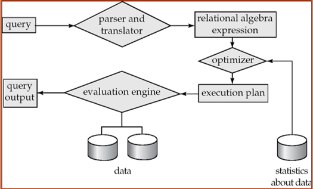
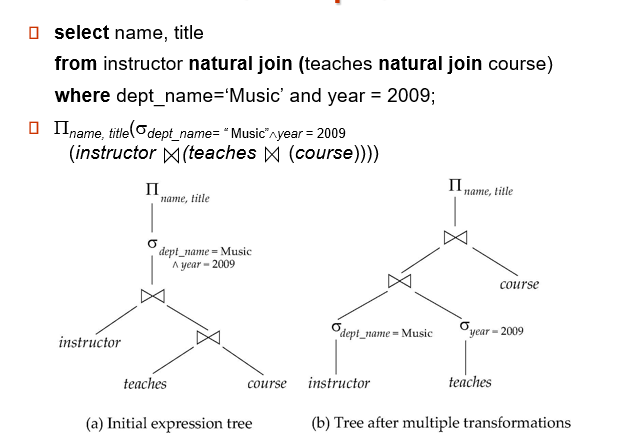
逻辑优化，筛选选择尽量先做

An evaluation plan defines exactly what algorithm is used for each operation, and how the execution of the operations is coordinated.
评估计划准确定义了每个操作使用的算法，以及如何协调操作的执行。
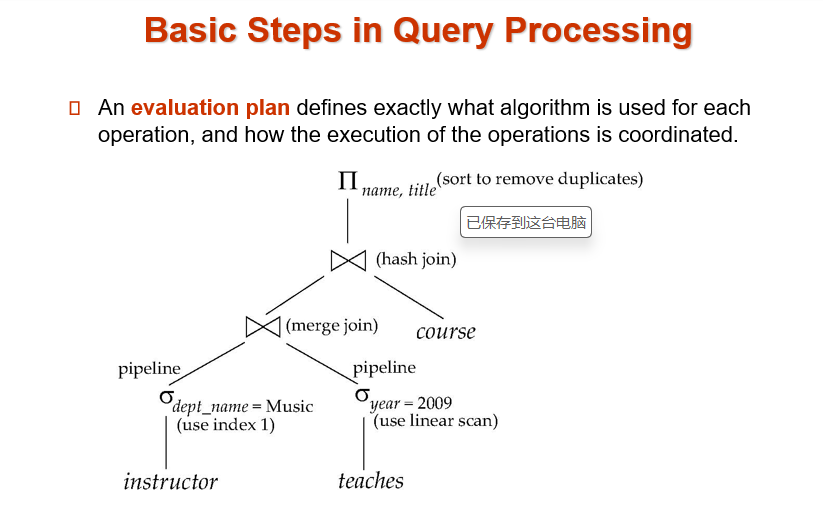
物理优化，条件筛选都有不同的算法，选择代价较小的

## 2.Viewing Query Evaluation Plans
- Most database support  explain \<query>
    - Displays plan chosen by query optimizer, along with cost estimates
    - Some syntax variations between databases
        - Oracle:  **explain plan for** \<query> followed by **select * from** table (*dbms_xplan.display*)
        - SQL Server:  **set showplan_text on**
- Some databases (e.g. PostgreSQL) support  explain analyse \<query>
    - Shows actual runtime statistics found by running the query, in addition to showing the plan 
- Some databases (e.g. PostgreSQL) show cost as   *f..l* 
    - *f* is the cost of delivering first tuple and *l* is cost of delivering all results 
## 3.Measures of Query Cost
- Cost is generally measured as total elapsed time for answering query
    - Many factors contribute to time cost
        - *disk accesses*, CPU, or even network communication
- Typically disk access is the predominant cost, and is also relatively easy to estimate.   
- Measured by taking into account
    - Number of seeks 寻道      * average-seek-cost
    - Number of blocks read   * average-block-read-cost
    - Number of blocks written * average-block-write-cost
        - Cost to write a block is greater than cost to read a block 
            - data is read back after being written to ensure that the write was successful

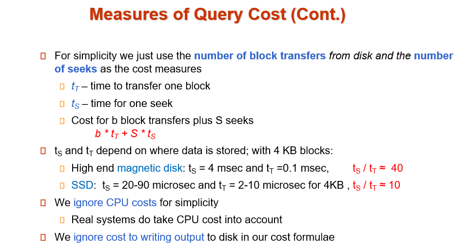
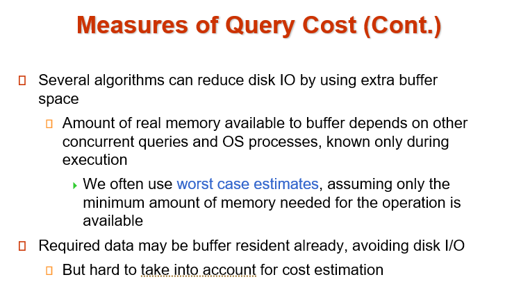

## 4. Operation
1. **Selection**:  selects tuples from relation that satisfy a given predicate
    - **File scan**
        - **Algorithm A1** (linear search).  Scan each file block and test all records to see whether they satisfy the selection condition.
            - **worst cost = $b_r * t_T + t_S$** 
            $b_r$  denotes number of blocks containing records from relation r
            - If selection is on a **key attribute**, can stop on finding record
            **average cost = $(b_r /2) t_T + t_S$** 
            - Linear search can be applied regardless of 
                - selection condition or
                - ordering of records in the file, or 
                - availability of indices
            - Note: binary search generally does not make sense since data is not stored consecutively
                - except when there is an index available, 
                - and binary search requires more seeks than index search
    - **Index scan**
        search algorithms that use an index
        - selection condition must be on search-key of index   
        - **A2 (primary B+-tree index / clustering B+-tree index, equality on key).**  
        Retrieve a single record that satisfies the corresponding equality condition  
           **Cost = $(h_i + 1) * (t_T + t_S)$**
           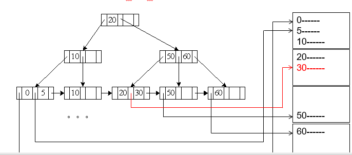
        - **A3 (primary B+-tree index/ clustering B+-tree index, equality on nonkey)**
        Retrieve multiple records. 
        Records will be on consecutive blocks
        Let b = number of blocks containing matching records
            **Cost = $h_i * (t_T + t_S) + t_S + t_T * b$**

        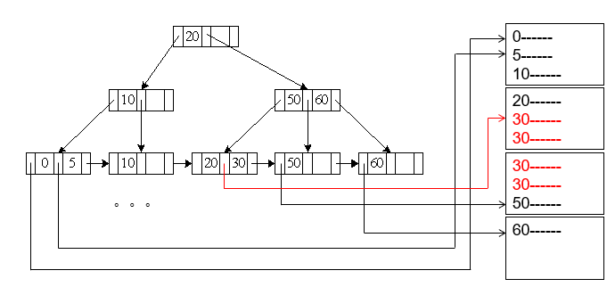
        - **A4 (secondary B+-tree index , equality on key)**
        $Cost = (h_i + 1) * (t_T + t_S)$
        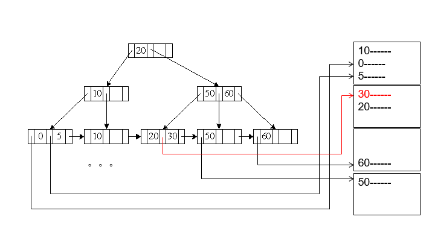
        - **A4’ (secondary B+-index on nonkey, equality)**
            - Each of n matching records may be on a different block
            - $n$ pointers may be stored in $m$ blocks  
            - $Cost =  (h_i + m+ n) * (t_T + t_S)$ 
                - Can be very expensive!

        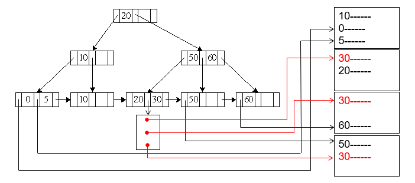 有个指针块
2. **Comparisons**
    - Can implement selections of the form AV (r) or A  V(r) by using
     a linear file scan or binary search,
     or by using indices in the following ways:
    - **A5 (primary B+-index / clustering B+-index index, comparison)**
        - (Relation is sorted on A)
        - For A  V(r)  use index to find first tuple  v  and scan relation sequentially  from there. 
        - Cost is identical to the case of A3  
        $Cost=h_i * (t_T + t_S) + t_S + t_T * b$
        - For AV (r) just scan relation sequentially till first tuple > v; do not use index
        
    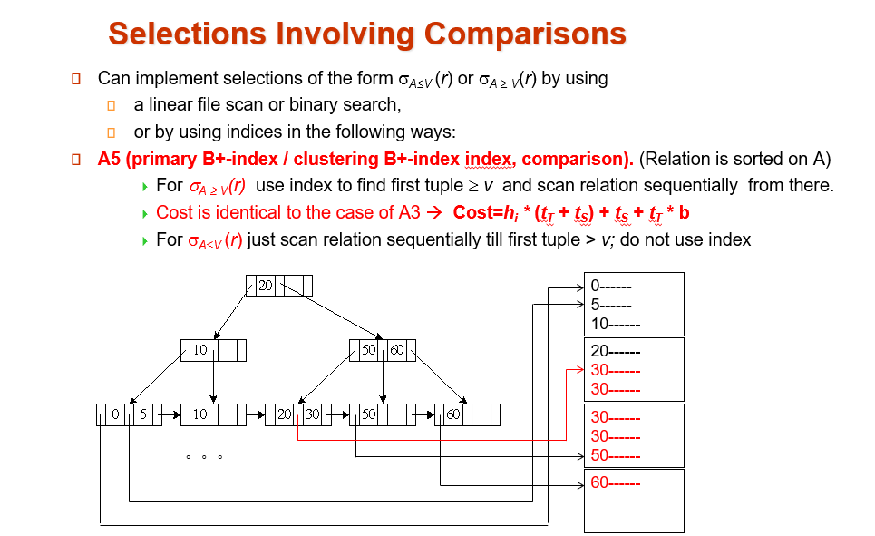
    - **A6 (secondary B+-tree index, comparison)** 
        - For A  V(r)  use index to find first index entry  v and scan index sequentially  from there, to find pointers to records.
        - For AV (r) just scan leaf pages of index finding pointers to records, till first entry > v
        - In either case, retrieve records that are pointed to
            - requires an I/O for each record
            - Linear file scan may be cheaper

    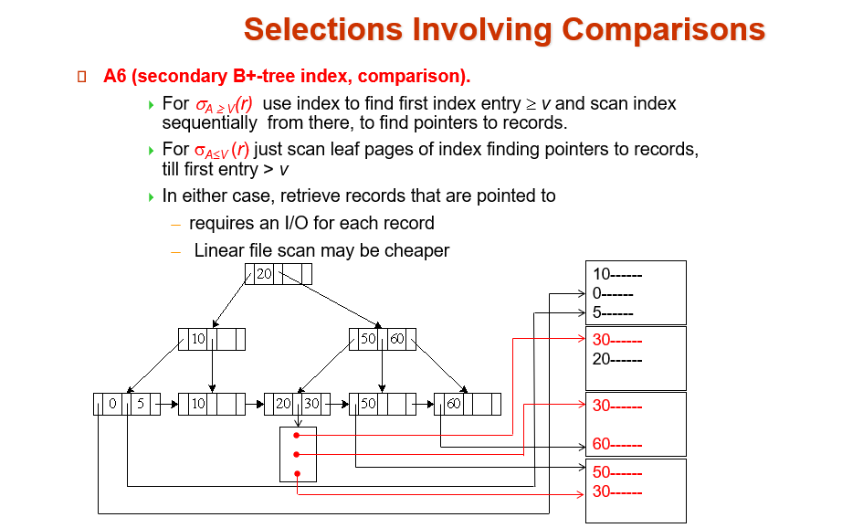
3. **Complex Selections**
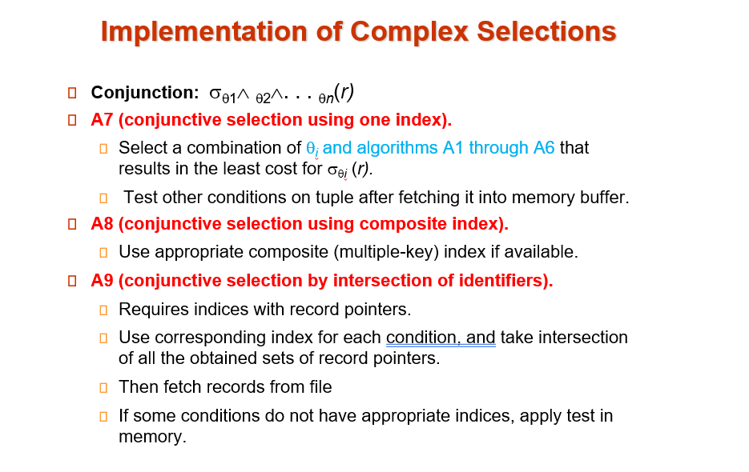
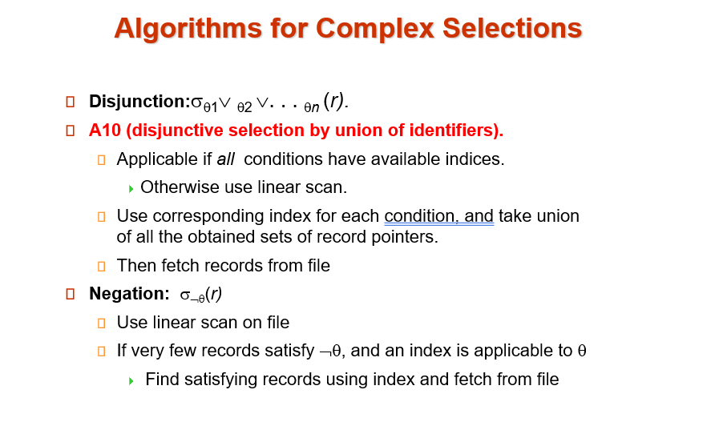

4. **Sorting**
- We may build an index on the relation, and then use the index to read the relation in sorted order.  May lead to one disk block access for each tuple.
- For relations that fit in memory, techniques like quicksort can be used.  
- For relations that don’t fit in memory, 
    - external sort-merge is a good choice. 

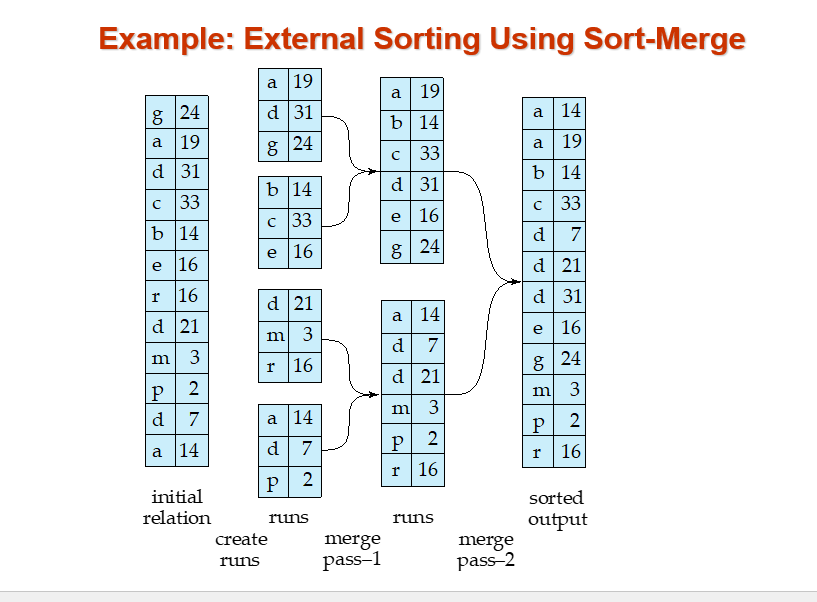

**External Sort-Merge**
Let M denote memory size (in pages). 
1. Create sorted runs(归并段 ).  
    Let i be 0 initially.  
    Repeatedly do the following till the end of the relation:     
        (a)  Read M blocks of relation into memory     
        (b)  Sort the in-memory blocks     
        (c)  Write sorted data to run Ri; increment i.

    Let the final value of i be N
2. Merge the runs (N-way merge). 
- IF N < M,  single merge pass is required
    (如果归并段少于可用内存页)
    1. Use N blocks of memory to buffer input runs, and 1 block to buffer output. Read the first block of each run into its buffer page
    2. repeat
        1. Select the first record (in sort order) among all buffer pages
        2. Write the record to the output buffer.  If the output buffer is full write it to disk.
        3. Delete the record from its input buffer page. If the buffer page becomes empty then read the next block (if any) of the run into the buffer. 
    3. until all input buffer pages are empty:

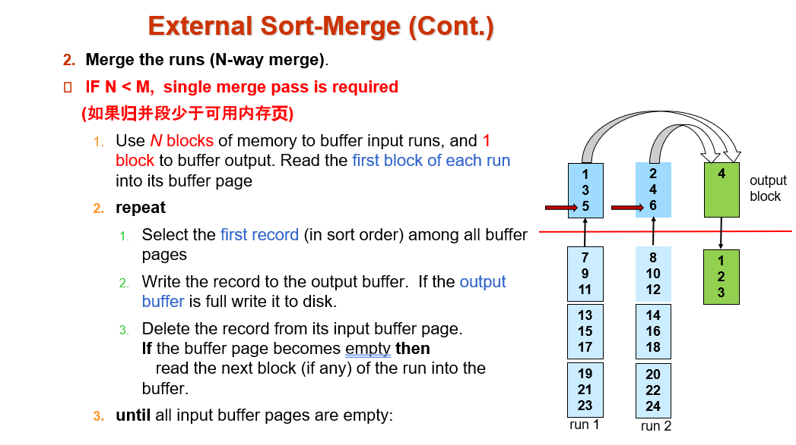
- If N >= M, several merge passes are required.
    - In each pass, contiguous groups of M - 1 runs are merged. 
    - A pass reduces the number of runs by a factor of M -1, and creates runs longer by the same factor. 
        - E.g.  If M=11, and there are 90 runs, one pass reduces the number of runs to 9, each 10 times the size of the initial runs
    - Repeated passes are performed till all runs have been merged into one.
- Cost analysis: (simple version)
    - Total number of runs :  br /M.
    - Total number of merge passes required: log M–1(br /M).
    - Block transfers for initial run creation as well as in each pass is 2br
        - for final pass, we don’t count write cost 
            we ignore final write cost for all operations since the output of an operation may be sent to the parent operation without being written to disk
        - Thus total number of block transfers for external sorting:		

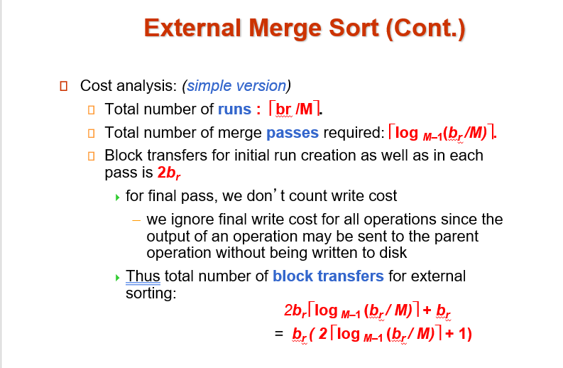
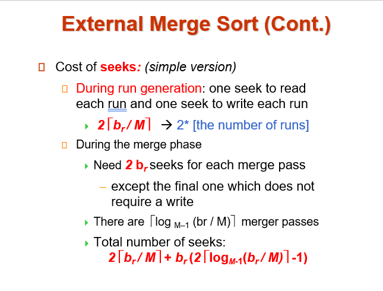
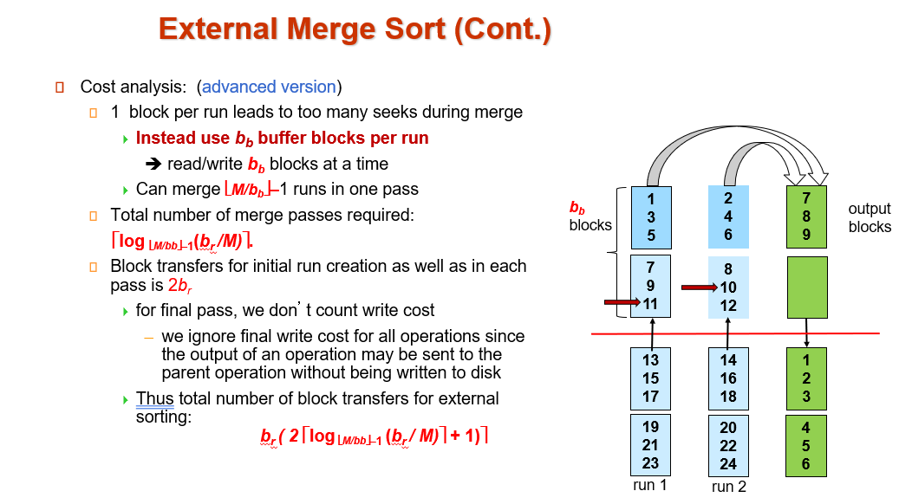
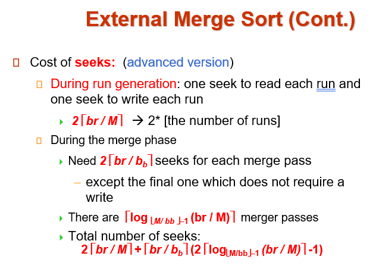	

5. **Join Operation**
- Several different algorithms to implement joins
    - Nested-loop join
    - Block nested-loop join
    - Indexed nested-loop join
    - Merge-join
    - Hash-join
- Choice based on cost estimate
- Examples use the following information
    - Number of records of student:  5,000  ,   takes: 10,000
    - Number of blocks of   student:     100  ,   takes:      400
6. **Other Operations**
- Duplicate elimination can be implemented via hashing or sorting.
    - On sorting duplicates will come adjacent to each other, and all but one set of duplicates can be deleted.  
    - Optimization: duplicates can be deleted during run generation as well as at intermediate merge steps in external sort-merge.
    - Hashing is similar – duplicates will come into the same bucket.
- Projection:
    - perform projection on each tuple 
    - followed by duplicate elimination. 
- Aggregation can be implemented in a manner similar to duplicate elimination.
    - Sorting or hashing can be used to bring tuples in the same group together, and then the aggregate functions can be applied on each group. 
    - Optimization: combine tuples in the same group during run generation and intermediate merges, by computing partial aggregate values
        - For count, min, max, sum: keep aggregate values on tuples found so far in the group.  
            - When combining partial aggregate for count, add up the aggregates
        - For avg, keep sum and count, and divide sum by count at the end
- Set operations (,  and ):  can either use variant of merge-join after sorting, or variant of hash-join.
- E.g., Set operations using hashing:
    1. Partition both relations using the same hash function
    2. Process each partition i as follows.  
        1. Using a different hashing function, build an in-memory hash index on ri.
        2. Process si as follows
            - r 并 s:  
                1. Add tuples in si to the hash index if they are not already in it.  
                2. At end of si add the tuples in the hash index to the result.

      

        
   
