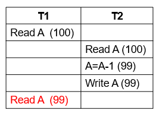
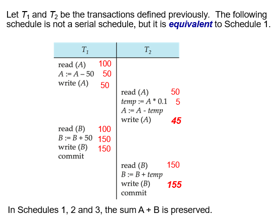

# transcations

## Basics
事务保证ACID原则实现：
- 原子性atomic：事务中的所有操作都成功，或者失败。
- 一致性consistency：事务执行之前和执行之后，数据库的状态都是合法的。（i.e. 满足trigger等约束）
- 隔离性isolation：事务执行过程中（在数据未提交之前），不能被其他事务干扰（其他事务不可见）。
   - 也就是说，对于每一对事务 Ti 和 Tj，对 Ti 来说，要么是 Tj 在 Ti 开始执行之前完成了执行，要么是 Tj 在 Ti 完成之后开始执行。
- 持久性durability：事务执行成功后，对数据库改变的结果是永久的，即使系统崩溃、断电、重启等。

两个主要解决问题：
- 硬件故障和系统崩溃等各种故障
- 并发执行多个事务
- Failures of various kinds, such as hardware failures and system crashes
- Concurrent execution of multiple transactions

## A Simple Transaction Model

仅考虑read和write操作，不考虑其他操作。
- read(X)：将数据库中的数据项 X 转移到主内存中属于执行读操作的事务工作区的变量（也称为 X）中。
- write(X)：将执行写操作的事务主内存工作区中变量 X 的值传输到数据库中的数据项 X。

##  Example: Fund Transfer

如果要把 50 元从 A 的账户转到 B 的账户，那么就需要经历 6 步操作，其中涉及四次读/写操作。

Consistency 有两种约束：
- 显式explicit：就是内蕴于数据库的，一般而言是比较基础的约束，比如 primary key, foreign key, unique 等等。
- 隐式implicit：就是只能用过与数据库交互的程序来实现的，统称为 integrity constraints。
  - 例如：所有账户余额之和减去贷款金额之和必须等于库存现金的价值

During transaction execution the database may be temporarily inconsistent(不一致性).
When the transaction completes successfully the database must be consistent. Erroneous transaction logic can lead to inconsistency
在事务执行期间，数据库可能会暂时不一致。
当事务成功完成时，数据库必须保持一致。错误的事务逻辑会导致不一致

**Isolation requirement** — if between steps 3 and 6, another transaction T2 is allowed to access the partially updated database, it will see an inconsistent database (the sum  A + B will be less than it should be).
如果在第 3 步和第 6 步之间，另一个事务 T2 被允许访问部分更新的数据库，它将看到一个不一致的数据库（A + B 的总和将小于应有的值）

解决Isolation问题有一个很简单的办法，就是串行 (serial，onee by one)。当然这个策略是低效的。

## Transaction State
- A  transaction must be in one of the following states:
  - **Active** – the initial state; the transaction stays in this state while it is executing 正在执行·
  - **Partially committed** – after the final statement has been executed. 所有行执行完毕，待提交
  - **Failed** -- after the discovery that normal execution can no longer proceed. 正在执行或已执行完毕待提交时发现错误，无法继续执行或提交。
  - **Aborted** – after the transaction has been rolled back and the database restored to its state prior to the start of the transaction.  Two options after it has been aborted:事务回滚，数据库恢复到事务开始前的状态。 事务中止后的两个选项：
    - restart the transaction 重新开始事务
    - kill the transaction 结束事务
  - **Committed** – after successful completion 已提交

## Concurrent Executions
并发执行
好处：
1. (if multicore) reduce overall execution time
  - 如果有多核 CPU，那么就可以在任务层面真·并行，减少执行时间
2. increased processor and disk utilization提高处理器和磁盘利用率，从而提高交易吞吐量
  - 即使只有单核，如果能够分时伪·并行，那么还是可以更加充分地利用资源（参考 CPU 流水线，比如 1 任务使用 CPU 的时候，2 任务正在写入/读取磁盘）
3. reduced average response time
  - 即使只有单核，如果将任务按照（预期）任务执行时间由小到大排一下，可以保证较短的任务不用等待前面的长任务

### Anomalies in Concurrent Execution(异常情况)
1. Lost update 修改丢失
2. Dirty read 读脏数据
3. Unrepeatable read 不可重复读
4. Phantom read 幻读/幽灵问题

#### 1. Lost update 丢失更新

如果一个事务在正常完成了写操作之后，却在 commit 之前，写入的值被篡改了，就称为 lost update。

#### 2. Dirty read 读脏数据

一个事务读了另一个事务未提交的数据，就是 dirty read。

#### 3. Unrepeatable read 不可重复读

如果一个事务在不同时间读取同一个数据，读到的 value 可能不同，那么就称为 unrepeatable read。//违反isolation requirement,事务间影响

#### 4. Phantom read 幻读/幽灵问题

如果一个事务在不同时间进行同样的查询，查询的行数不一样。

幻读，并不是说两次读取获取的结果集不同，幻读侧重的方面是某一次的 select 操作得到的结果所表征的数据状态无法支撑后续的业务操作。 更为具体一些：select 某记录是否存在，不存在，准备插入此记录，但执行 insert 时发现此记录已存在，无法插入，此时就发生了幻读。

## Schedules(调度)

采用合适的调度，可以避免上面的部分或者所有的 anomalies。

- Schedule – a sequences of instructions that specify the chronological order in which instructions of concurrent transactions are executed
  - a schedule for a set of transactions must consist of all instructions of those transactions
  - must preserve the order in which the instructions appear in each individual transaction.
- A transaction that successfully completes its execution will have a commit instructions as the last statement 
  - by default transaction assumed to execute commit instruction as its last step
- A transaction that fails to successfully complete its execution will have an abort instruction as the last statement 

- 调度 - 规定并发事务指令执行时间顺序的指令序列
  - 一组事务的调度必须由这些事务的所有指令组成
  - 必须保持指令在每个事务中出现的顺序。
- 成功完成执行的事务的最后一条语句是提交指令 
  - 默认情况下，事务假定执行提交指令作为其最后一步
- 未能成功完成执行的事务的最后一条语句是中止指令（abort/rollback回滚）

### Schedule 1
串行调度serial schedule

串行的方法，必然可以保证上面的异常情况都不存在。
### Schedule 2
A serial schedule where $T_2$ is followed by $T_1$

### Schedule 3
交替调度，it is equivalent to Schedule 1.

如果处理得当（i.e. 实际执行过程中是写后读），那么交替执行也是可以的。
### Schedule 4
The following concurrent schedule does not preserve the value of (A + B ).	

由于处理不当，使得本来应该的写后读顺序变成了读后写，从而结果不对。

## Serializability(可串行化)

- Basic Assumption – Each transaction preserves database consistency.
- Thus serial execution of a set of transactions preserves database consistency.
- A (possibly concurrent) schedule is serializable if it is equivalent to a serial schedule.  
- Different forms of schedule equivalence give rise to the notions of:
  - conflict serializability(冲突可串行化 )
  - view serializability（视图可串行化）

- 基本假设 - 每个事务都能保持数据库的一致性。
- 因此，一组事务的串行执行会保持数据库的一致性。
- 如果一个（可能并发的）计划表等同于一个串行计划表，那么它就是可串行化的。
- 不同形式的计划等价产生了以下概念：
  - 冲突可串行化
  - 视图可串行化

如果每一个 transaction 都能 preserve db consistency，那么串行执行这些 transactions 之后，consistency 也可以保持。

而我们的目标，就是找到这样的 schedule，使得它和 serial schedule 是 equivalent 的。

### Conflict Serializability(冲突可串行化)

> 注：两个事务$T_i,T_j$中的两个 instructions $l_i,l_j$之间冲突，意思就是两个 instructions 之间
> 1. 至少有一个是 WRITE 操作
> 2. 作用于同一个对象Q

直观地说，$l_i$ 和 $l_j$ 之间的冲突会强制它们之间的（逻辑）时间顺序。  
- 如果 $l_i$ 和 $l_j$ 在schedule中是的，而且它们之间没有冲突，那么即使它们在计划表中互换，结果也会保持不变。

如果一个 schedule 可以通过 a series of swaps of non-conflicting instructions，那么就称 S and S' are conflict serializable.这个 swap，不能改变任何 conflict pairs 执行的先后顺序
如果计划表 S 与串行计划表的冲突等价，我们就说它是可冲突串行化的

通过一系列不冲突指令的交换，附表 3 可以转化为附表 6，即 T2 紧随 T1 之后的serial schedule。 因此，附表 3 是可冲突序列化的

#### precedence graph
- 我们可以用一个 precedence graph 来判断几个事务之间是否是冲突的：a directed graph where the vertices are the transactions (names).

- 如果两个事务发生冲突，而 Ti 访问了早先发生冲突的数据项，我们就从 Ti 画弧到 Tj。

- 当且仅当一个计划表的先例图是无环图的，它才是可冲突序列化的。

- If precedence graph is acyclic, the serializability order can be obtained by a topological sorting of the graph

如图：
1. 由于 T1 read(Y) 先于 T2 write(Y)，因此 T1 → T2
2. 由于 T1 read(Z) 先于 T3 write(Z)，因此 T1 → T3
3. 由于 T1 read(Y/Z) 先于 T4 write(Y/Z)，因此 T1 → T4
4. 由于 T2 read/write(Y) 先于 T4 read/write(Y)，因此 T2 → T4
5. 由于 T3 write(Z) 先于 T4 write(Z)，因此 T3 → T4

可得一种拓扑序列：$T_1,T_2,T_3,T_4$

### View Serializability(视图可串行化)
- same data content of  the corresponding read （Q） operations 
- same data content （Q） of  the final write （Q） operations 

1. View 只需要：Read 的值是一样的；Write 的值也是一样的
- Let S and S´ be two schedules with the same set of transactions.  S and S´ are view equivalent if the following three conditions are met, for each data item Q, 
  - If in schedule S, transaction Ti reads the initial value of Q, then in schedule S’ also transaction Ti  must read the initial value of Q.
  - If in schedule S transaction Ti executes read(Q), and that value was produced by transaction Tj  (if any), then in schedule S’ also transaction Ti must read the value of Q that was produced by the same write(Q) operation of transaction Tj .
  - The transaction (if any) that performs the final write(Q) operation in schedule S must also perform the final write(Q) operation in schedule S’.

- 让 S 和 S´ 是具有相同事务集的两个schedule。 如果满足以下三个条件，对于每个数据项 Q，S 和 S´ 是视图等价的、
  - 如果在计划表 S 中，事务 $T_i$ 读取了 $Q$ 的初始值，那么在计划表 S' 中，事务 $T_i$ 也必须读取 $Q$的初始值。
  - 如果在计划表 S 中，事务 $T_i$ 执行了 read(Q)，而该值是由事务 $T_j$（如果有）产生的，那么在计划表 S' 中，事务 $T_i$ 也必须读取由事务 $T_j$ 的同一写入（Q）操作产生的 Q 值。
  - 在计划表 S 中执行最后写（Q）操作的事务（如果有）也必须在计划表 S' 中执行最后写（Q）操作。

- Every conflict serializable schedule is also view serializable.冲突的条件比view更加严格。

如图，上图和 T27-T28-T29 串行执行是等价的，因为：

1. 全局唯一一个 Read（i.e. T27 的 Read(Q)）读到的值，就是初始值，这和 T27-T28-T29 中 T27 的 Read 读到的一样
2. 全局最后写的值，就是 T29 的值，这和 T27-T28-T29 中最后写的一样
因此，是等价的。

>注意：如果没有 T29，那么就不 view serializability。本质上还是因为 T29 覆写了 Q 的值。

### Other Notions of Serializability

如图，T1, T5 并不 conflict serializable，因为不论是 T1-T5 还是 T5-T1，都无法将交错在一起的 T5 和 T1 之间的块分开。

同样，也不 view serializable，因为 T1 read(B) 读到的是 T2 write(B)，T2 read(A) 读到的是 T1 write(A)。但是，串行化后，T1 read(B) 和 T2 read(A) 至少有一个必须读到 original value。因此也不行。

但是，实际上，当前的 schedule，执行结果就和串行后的执行结果一样（无论是 T1-T2 or T2-T1）。

因此，上述的两个 serializability check，实际上是一个 must analysis。也就是，如果分析下来是 serializable 的，那么 must be serializable，但是分析下来不是的，不一定不是（比如说上图）。

## Recoverable Schedules

>在已有的 READ, WRITE 两个操作的基础上，再加一个 COMMIT

- Recoverable schedule（可恢复调度） — if a transaction $T_j$ reads a data item previously written by a transaction $T_i$ , then the commit operation of $T_i$  appears before the commit operation of $T_j$.

如果 A 读取了 B 产生的数据，那么就必须保证 B 在 A 之前 commit。否则，如果 B 回滚，而 A 已经 commit 了，就可能造成数据不一致。

## Cascading Rollbacks
级联回滚--单个事务失败会导致一系列事务回滚。 请看下面的计划表，其中还没有任何事务提交（因此计划表是可恢复的）

在 recoverable schedule 的基础上（i.e. 如果 A 读取了 B 产生的数据，那么就必须保证 B 在 A 之前 commit），每一次 "rollback" 某个事务的时候，都可能需要同时 rollback 其它受到影响的事务。我们希望尽量减少其它受到影响的事务。

如图，如果 T10 rollback 了，那么 T11, T12 都需要 rollback。如果有更多的 TXs 需要级联回滚的话，这样会导致开销非常的大。

### Solution: Cascadeless Schedule

- Cascadeless schedules（无级联调度） — cascading rollbacks cannot occur; for each pair of transactions Ti and Tj such that Tj  reads a data item previously written by Ti, the commit operation of Ti  appears before the read operation of Tj.
- Every cascadeless schedule is also recoverable
- It is desirable to restrict the schedules to those that are cascadeless

- 无级联调度 - 对于每一对事务 Ti 和 Tj，如果 Tj 读取了 Ti 之前写入的数据项，Ti 的提交操作就会出现在 Tj 的读取操作之前。
- 每个无级联计划表也都是可恢复的
- 最好将时间表限制为无级联的时间表

等待 T10 commit 之后，T11 再进行 read(A) 操作；等待 T11 回滚之后，T12 在进行 read(A) 操作。

当然，这样做也自然会导致并发度降低，since everything is tradeoff 有舍才有得

### Which One to Choose?
部分情况下，默认一个操作回滚概率低，从而采用冒险激进的策略，实在要回滚了，反正也只有很少的次数，占用资源不多。

当然，有时候，回滚不一样是“推倒重来”，还可以用“补偿操作”。比如订票系统中，我们可以一次处理多张订票，之后一起 commit。如果有之前的订票取消了，我们无需将该次订票之后的订票回滚，而只需要
另外的情况下，默认一个操作有不小的可能会回滚，从而采用“解决方法”中的策略，虽然造成并发度降低，但是起码不会造成更多的回滚。

- 数据库必须提供一种机制，确保所有可能的计划表都是 可冲突或可视图serializable，并且可恢复，**最好是无级联的**
- 在计划执行后才测试其可序列化性，有点为时过晚！
- 目标--开发并发控制协议，确保可序列化。
- 并发控制协议允许并发调度，但要确保调度冲突/视图可序列化，并且可恢复和无级联。
- 并发控制协议通常不会在创建优先级图时对其进行检查。
  - 相反，协议会强制规定避免出现不可序列化的时间表。
- 不同的并发控制协议会在允许的并发量和产生的开销之间做出不同的权衡。
- 可序列化测试有助于我们理解并发控制协议的正确性。

- 有些应用程序愿意接受较弱的一致性，允许不可序列化的时间表
  - 例如，只读事务希望获得所有账户的近似总余额 
  - 例如，为优化查询而计算的数据库统计数据可以是近似值 
  - 此类事务相对于其他事务无需可序列化
- 权衡准确性与性能

## Transaction Isolation Levels
- 隔离级别
  - **Serializable** — default
  - **Repeatable read** — only committed records to be read, repeated reads of same record must return same value.  However, a transaction may not be serializable – it may find some records inserted by a transaction but not find others.只有提交的记录才能被读取，重复读取同一记录必须返回相同的值。 不过，事务可能不是可序列化的--它可能会找到事务插入的某些记录，但找不到其他记录。
  - **Read committed** — only committed records can be read, but successive reads of record may return different (but committed) values.只能读取已提交的记录，但连续读取记录可能会返回不同的（但已提交的）值。
  - **Read uncommitted** — even uncommitted records may be read.甚至可以读取未提交的记录。

## Concurrency Control Protocols
- Lock-Based Protocols
  - Lock on whole database vs lock on items
  - How long to hold lock?
  - Shared vs exclusive locks
- Timestamp-Based  Protocols
  - Transaction timestamp assigned e.g. when a transaction begins
  - Data items store two timestamps
    - Read timestamp
    - Write timestamp
  - Timestamps are used to detect out of order accesses
- Validation-Based  Protocols
  - Optimistic concurrency control 
  - Low rate of conflicts among transactions
  - Each transaction must go through 3 phases:
    - Read phase  Validation phase  Write phase

- 基于锁的协议
  - 锁定整个数据库与锁定项目
  - 锁定多长时间？
  - 共享锁与独占锁
- 基于时间戳的协议
  - 分配事务时间戳，如事务开始时
  - 数据项存储两个时间戳
    - 读取时间戳
    - 写入时间戳
  - 时间戳用于检测不按顺序的访问
- 基于验证的协议
  - 优化并发控制
  - 事务冲突率低
  - 每个事务必须经过 3 个阶段：
    - 读取阶段>验证阶段>写入阶段

前两种是悲观的（i.e. 默认有不小概率回滚），第三种是乐观的（i.e. 默认回滚概率极低）。

