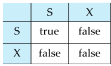
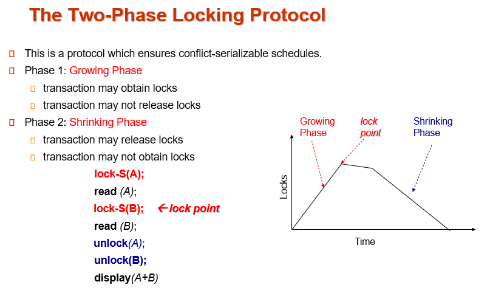
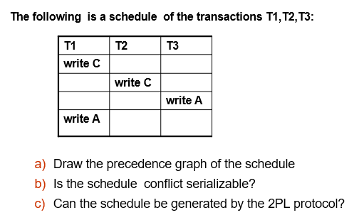
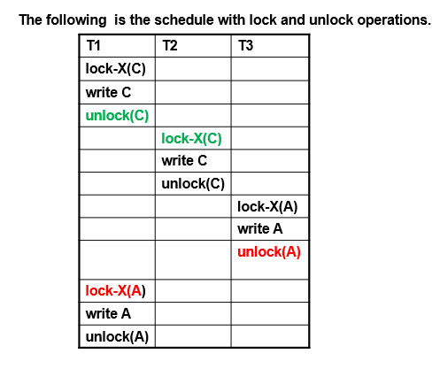
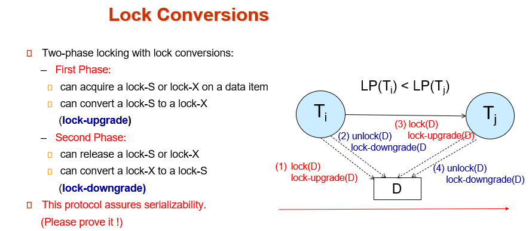
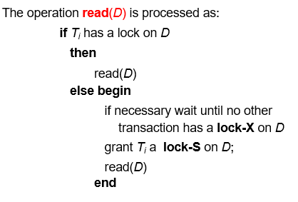
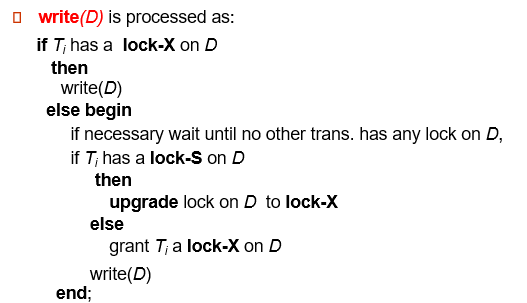
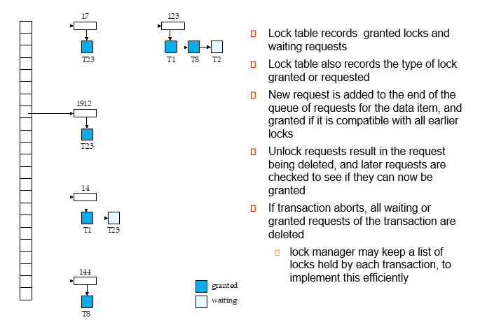

# chapter18 Concurrency Control 
## lock-based protocols
A lock is a mechanism to control concurrent access to a data item
锁是一种控制并发访问数据项的机制。
锁分为2种：
- shared lock (简称lock-S,shared (S) mode)： data item can only be read. 只允许事务读取。
- exclusive lock (简称lock-X,exclusive (X) mode)： data item can be both read as well as written. 允许事务读写。

Lock requests are made to concurrency-control manager. Transaction can proceed only after request is granted.

- A transaction may be granted a lock on an item if the requested lock is compatible with locks already held on the item by other transactions
- Any number of transactions can hold shared locks on an item, 
  - but if any transaction holds an exclusive on the item no other transaction may hold any lock on the item.
- If a lock cannot be granted, the requesting transaction is made to wait till all incompatible locks held by other transactions have been released.  The lock is then granted
- 如果一个事务请求的锁与其他事务已持有的锁兼容，则该事务可被授予其他项目上的锁。
- 任何数量的事务都可以在一个项目上持有共享锁、 
  - 但如果有一事务持有该项目的独占锁，则其他事务不得持有该项目的**任何锁**。
- 如果锁不能被授予，提出请求的事务将等待其他事务**释放所有不兼容的锁**。 然后再授予锁

- 如果一个 shared lock 占据一个表项，那么其它 TXs 就无法获得 exclusive lock，但是可以获得 shared lock
  - 多个 TXs 可以同时读
- 如果一个 exclusive lock 占据一个表项，那么其它 TXs 就无法获得该表项任意 lock
  - 只有一个 TX 可以写

- A **locking protocol** is a set of rules followed by all transactions while requesting and releasing locks. 
- Locking protocols **enforce serializability** by restricting the set of possible schedules.

## Two-Phase Locking Protocol(2PL)

在一个事务中，分为加锁和解锁阶段，所有lock操作都在unlock操作之前。
1. 增长阶段：事务从lockmanager请求lock，**不能释放任何锁**。
2. 缩减阶段：事务只能释放锁或降级锁，不能获取任何新锁。

2PL 本身可以保证调度是 conflict serializability 的，因为其生成的事务依赖图无环，但会产生级联回滚的问题。
例如，上述例子中修改后的 T1 和 T2 的执行就是两阶段锁。两阶段锁协议确保冲突可串行化。**一个事务最后获取锁的位置（增长阶段的结束）称为 lock point**，多个事务按其 lock point 排序其实就是这些事务的串行化顺序。
简单来说：**对于每一个 TX 而言，必须先上锁、把所有该做的事情都做完之后，才能一一把上的锁解开**。也就是说，不能在使用完了一个资源之后，就解锁，而是要等到使用完了所有该使用的资源之后，才能解锁。

上面的 two-phase protocol 只能保证 serializability，但是无法保证可恢复性。也就是说：没法保证如果 TX A 读取了 TX B 的数据，TX A 就必须在 TX B 之后 commit。因此引入更加严格的locking:
1. Strict 2PL（严格两阶段封锁）: a transaction must hold all its exclusive locks till it commits/aborts.
  - Ensures recoverability and avoids cascading roll-backs
  - 如果 TX B READ 了 TX A WRITE 的数据，那么，由于 TX A WRITE 需要用到 exclusive lock，因此在 TX B READ 的那一刻，由该规则可知，TX A 已经 commit/abort 了。因此是可恢复的。
  同时，因为 TX A 已经 commit/abort 了，因此假如 TX A 是 abort——也就是回滚，那么由于 TX B 是在 TX A 回滚之后读取的数据，因此 TX B 必然无需回滚。也就是，级联回滚可以避免，cascadeless。

2. Rigorous 2PL（强两阶段封锁）: a transaction must hold all its locks till it commits/aborts.
  - Transactions can be serialized in the order in which they commit
  - 对于“可串行化”事务隔离级别，strict two-phase locking 用的是最广泛的。

- Two-phase locking is not a necessary condition for serializability.
- There can be conflict serializable schedules that cannot be obtained if two-phase locking is used.  
- However, in the absence of extra information (e.g., ordering of  access to data), two-phase locking is needed for conflict serializability .
两阶段锁定并不是可序列化的必要条件。
如果使用两阶段锁定，可能无法获得可冲突序列化的时间表。 
然而，在没有额外信息（如访问数据的顺序）的情况下，两阶段锁定是冲突可序列化的必要条件。

### **例子**
> 
> 显然precedence graph:$T_3 \rightarrow T_1 \rightarrow T_2$，显然是 conflict-serializable。
但是实现上表顺序就要按照以下执行：
1. lock $C(T_1)$
2. unlock $C(T_1)$
3. lock $C(T_2)$
4. unlock $C(T_2)$
5. lock $A(T_3)$
6. unlock $A(T_3)$
7. lock $A(T_1)$
8. unlock $A(T_1)$
>如下所示：
>
>其中，unlockC(T1) 在 lockC(T1) 和 lockA(T1) 之间，违反了 two-phase locking protocol。也就是说，**一个 conflict-serializable 的 schedule 违反了 two-phase locking protocol**。因此，**two-phase locking protocol is not necessary**.

### Two-Phase Protocol with Fined-Grained Lock Management
  

>所谓 fined-grained，就是在 lock-X 和 lock-S 之外，另外加了一个 lock-U。
That is，上图的 upgradable lock-S，其实还有一个称呼就是 lock-U(pgradable)。
也就是说，如果我们不知道我们之后只是读某个数据、还是要写某个数据，那么可以申请 U 锁，然后按需升级至 lock-U。
同样，如果我们写完了，但是之后可能还需要读，那么可以先将 lock-X 降级至 lock-U，这样的话，就可以将资源更早地释放出去。

## Automatic Acquisition of Locks
在数据库中，我们并不手动管理锁，DBMS 会帮我们管理，i.e. 锁是自动获得的。下面就是 READ 和 WRITE 的伪代码：

简单来说：有锁就用，没锁就申请，申请不了就等待。
All locks are released after commit or abort

## Lock Table
- A lock manager can be implemented as a separate process to which transactions send lock and unlock requests
- The lock manager replies to a lock request by sending a lock grant messages (or a message asking the transaction to roll back, in case of  a deadlock)
- The requesting transaction waits until its request is answered
- The lock manager maintains a data-structure called a lock table to record granted locks and pending requests
- The lock table is usually implemented as an in-memory hash table indexed on the name of the data item being locked
锁管理器可以作为一个单独的进程来实现，由事务向其发送锁定和解锁请求。
锁管理器通过发送锁授予消息（或在死锁情况下发送要求事务回滚的消息）来回复锁请求
提出请求的事务等待，直到其请求得到回复
锁管理器维护一个称为锁表的数据结构，记录已授予的锁和待处理的请求
锁表通常以内存中的哈希表的形式实现，并以被锁定数据项的名称为索引

- Lock table records  granted locks and waiting requests
- Lock table also records the type of lock granted or requested
- New request is added to the end of the queue of requests for the data item, and granted if it is compatible with all earlier locks
- Unlock requests result in the request being deleted, and later requests are checked to see if they can now be granted
- If transaction aborts, all waiting or granted requests of the transaction are deleted 
  - lock manager may keep a list of locks held by each transaction, to implement this efficiently

锁表记录获准的锁和等待的请求
锁表还记录获准或请求的锁类型
新请求会被添加到数据项请求队列的末尾，如果它与所有先前的锁兼容，则会被批准
解锁请求会导致请求被删除，随后的请求会被检查以确定是否可以被批准
如果事务中止，事务中所有等待或已获准的请求都会被删除 
锁管理器可以保存每个事务持有的锁的列表，以有效地实现这一点

我们使用 lock table 来管理锁。如图，lock table 可以作为 OOP 中的一个对象，有至少两个 methods： 
1. Lock(Txn *tx, Obj *to_be_locked /* maybe row, table, column, etc */, LockType locktype, Lock *lock) 
2. Unlock(Txn *tx, Lock *lock)
返回值可以是 bool，意思是是否上锁成功。

## Deadlock

## COmpatible Locks
