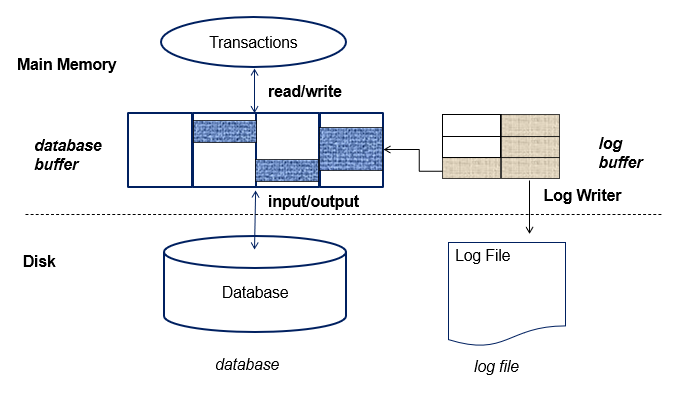
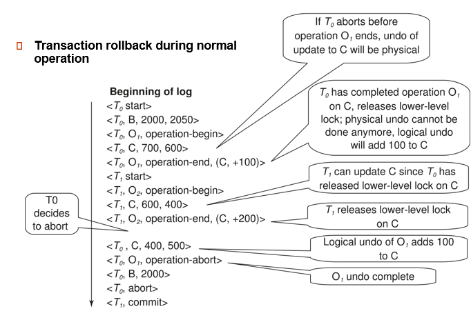

# Chapter 19 Recovery System
## Failure Classification

- 事务失败 Transaction failure：
  - 逻辑错误：由于某些内部错误情况，事务无法完成
  - 系统错误：数据库系统必须由于错误情况（例如，死锁）而终止活动事务
- 系统崩溃 System crash：电源故障或其他硬件或软件故障导致系统崩溃。
  - 故障停止假设：假定非易失性存储内容不会因系统崩溃而损坏
  - 数据库系统具有大量完整性检查，以防止磁盘数据损坏
- 磁盘故障 Disk failure：磁头崩溃或类似的磁盘故障会破坏全部或部分磁盘存储
  - 假定破坏是可检测到的：磁盘驱动器使用校验和来检测故障

## Storage Structure
### 分类
- Volatile storage:
  - does not survive system crashes
  - examples: main memory, cache memory
- Nonvolatile storage:
  - survives system crashes
  - examples: disk, tape, flash memory,                non-volatile (battery backed up) RAM 
  - but may still fail, losing data
- Stable storage:
  - a mythical form of storage that survives all failures
  - approximated by maintaining multiple copies on distinct nonvolatile media

- 易失性储存： 无法在系统崩溃后存活
  - 示例：主内存、缓存内存
- 非易失性存储：
  - 在系统崩溃中幸存下来
  - 示例：磁盘、磁带、闪存、非易失性（备用电池）RAM
  - 但可能仍然会失败，丢失数据
- 稳定储存：
  - 一种神话般的存储形式，可在所有故障中幸存下来
  - 通过在不同的非易失性介质上维护多个拷贝来近似

### Database Recovery
恢复算法是在发生故障时确保数据库一致性以及事务原子性和持久性的技术。
- 恢复算法由两部分组成:
  - 在正常事务处理期间为确保存在足够的信息以从故障中恢复而采取的操作
  - 在无法将数据库内容恢复到确保原子性、一致性和持久性的状态时执行的操作

我们假设严格的两相锁定可确保没有脏读。
- Idempotent（幂等性） ：如果多次执行恢复算法与执行一次结果相同，则称为幂等。

## Log-Based Recovery
### Log Records

- 为了确保故障发生时的原子性，我们首先将描述修改的信息（日志）输出到稳定存储器stable storage，而不修改数据库本身。
- 日志保存在稳定存储器中。
  - 日志是一系列日志记录，保存着数据库更新活动的记录。
- 当事务 Ti 启动时，它会通过写入一条 “启动 ”日志记录来注册自己：       <Ti start>。
- 在 Ti 执行 write(X) **之前**，写入 “更新 ”日志记录：<Ti, X, V1, V2>，其中 V1 是写入前 X 的值（旧值）、V2 是要写入 X 的值（新值）。
- 当 Ti 完成最后一条语句时，写入 “提交 ”日志记录：<Ti commit> （提交）
- Ti 完成回滚时，写入 “abort ”日志记录：<Ti abort>。

每一条日志对应每一个block的update,insert等操作。

### Write-Ahead Logging（WAL，先写日志原则）
Before a data in main memory is output to the database, the log records pertaining to data must have been output to stable storage. 
在将主内存中的数据输出到数据库之前，必须将与数据相关的日志记录输出到稳定存储中。

- 如果 block 操作尚未写到硬盘中，那么日志不一定要写进 stable storage
- 如果 block 操作写进了硬盘中，那么日志必须已经写入了 stable storage
- 不然可能会造成这样的情况：事务 4 在硬盘中已经 start、尚未 commit，但是日志的 stable storage 连事务 4 的 start 都没有记录。然后就会造成事物 4 在恢复过程中，根本没有被回滚，从而造成数据库的不一致性。

### Transactions Commit
- 当事务的提交日志记录输出到稳定存储时，称为已提交：
日志已经记录 commit, 说明事务已经提交。（因为后续可以根据这个恢复状态了）
但此时数据不一定已经写回到数据库里（不一定高效）
- 事务的所有先前日志记录必须已输出
- 当事务提交时，事务执行的写入可能仍在缓冲区中，并且可能在以后输出:不一定在磁盘。如果立刻将 block 写回磁盘可能引起大量 I/O 操作。

- A transaction is said to have committed when its commit log record is output to stable storage 
  - all previous log records of the transaction must have been output already 
- Writes performed by a transaction may still be in the buffer when the transaction commits, and may be output later

### Undo撤销 and Redo重做 Operations
对于一句<Ti, X,  V1,  V2>日志记录，
- 撤消日志记录将旧值 V1 写入 X
- 重做日志记录将新值 V2 写入 X
- 撤消和重做事务：
  - undo（Ti）：将 Ti 更新的所有数据项的值**恢复到其旧值**，从 Ti 的**最后一个日志记录**向后倒退 ，**每当数据项 X 恢复到其旧值 V**时，都会写出一条特殊的日志记录 – compensation log（补偿日志）,最后可能有一句<Ti,abort>(有<Ti.start>)
  当事务撤消完成时，将写出日志记录。
  - redo（Ti）：从 Ti 的**第一个日志记录**开始，将 Ti 更新的所有数据项的值设置为新值， 在这种情况下，**不执行日志记录。**

- Note that If transaction Ti was undone earlier and the <Ti abort> record written to the log, and then a failure occurs, on recovery from failure Ti  is redone
  - such a redo redoes all the original actions including the steps that restored old values
    - Known as repeating history（重复历史）
    - Seems wasteful, but simplifies recovery greatly

- 请注意，如果事务 Ti 在之前被撤销undo，<Ti abort> 记录被写入日志，然后发生故障，那么在故障恢复时，Ti 将被重做redo。
  - 这种重做将重做所有原始操作，包括恢复旧值的步骤。
    - 称为重复历史（重复历史）
    - 看似浪费，却大大简化了恢复工作

### Checkpoints
- 重做/撤消日志中记录的所有事务可能非常缓慢
  - Output all log records currently residing in main memory onto stable storage.
  日志不是生成就往内存写，而是有一个日志缓冲区。 确保把日志项写到日志中去了。
  - Output all modified buffer blocks to the disk. 把 buffer 里所有数据都刷写一遍。
  - Write a log record <checkpointL> onto stable storage where L is a list of all transactions active at the time of checkpoint.
  写一个日志的标记（新的日志类型）. L 是当前正在工作的事务的表。（用来做 undo list 的初始化列表）
  - All updates are stopped while doing checkpointing!!! 做 checkpoint 的时候其他活跃事务都要停下来。

- checkpoint 是确认之前的操作都已经反映到数据库里去了，这样重演的时候就可以直接从 checkpoint 开始。
  
- During recovery we need to consider only the most recent transaction Ti that started before the checkpoint, and transactions that started after Ti. 
  - Scan backwards from end of log to find the most recent <checkpoint L> record 
  - Only transactions that are in L or started after the checkpoint need to be redone or undone
  - Transactions that committed or aborted before the checkpoint already have all their updates output to stable storage.
- Some earlier part of the log may be needed for undo operations
  - Continue scanning backwards till a record <Ti start> is found for every transaction Ti  in L.
  - Parts of log prior to earliest <Ti start> record above are not needed for recovery, and can be erased whenever desired.

- 在恢复过程中，我们只需要考虑在检查点**之前开始的最近事务 Ti**，以及在 Ti 之后开始的事务。
  - 从日志末尾向前扫描，找到最近的 < 检查点 L> 记录 
  - 只有**在 L 中**或**在检查点后开始的事务**才需要重做或撤销
  - 在检查点之前提交或中止的事务已将其所有更新输出到稳定存储区。
- 撤销操作可能需要日志的某些早期部分
  - 继续向前扫描，直到为 L 中的每个事务 Ti 找到 <Ti start> 记录。
  - 上述**最早**的 <Ti 开始> 记录之前的日志部分不需要恢复，可以随时删除。
- 重做操作，从checkpoint开始向后扫描，重做至crash处

> Example:

重演历史从最近的 checkpoint 重演. {T2 T4} 作为 undo list 的初始化值。

没做完的undo,在checkpoint后做完的redo,在checkpoint前做完的忽略

**Recovery Algorithm**:
- Recovery from failure: Two phases
  - Redo phase:  replay updates of all transactions, whether they committed, aborted, or are incomplete –repeating history !!!
  - Undo phase: undo all incomplete transactions
- Redo phase:
  - Find last <checkpoint L> record, and set undo-list to L.
  - Scan forward from above <checkpoint L> record
    1. Whenever a  record <Ti, Xj,  V1,  V2> is found, redo it by writing V2  to Xj 
    2. Whenever a  (compensation) log record <Ti, Xj, V2> is found, redo it by writing V2  to Xj 
    3. Whenever a log record <Ti  start> is found, add Ti  to undo-list
    4. Whenever a log record <Ti  commit> or <Ti abort> is found, remove Ti  from undo-list
- Undo phase: 
  - Scan log backwards from end 
    1. Whenever a log record <Ti, Xj,  V1,  V2> is found where Ti is in undo-list perform same actions as for transaction rollback:
      1. perform undo by writing V1 to Xj.
      2. write a log record <Ti , Xj,  V1>
    2. Whenever a log record <Ti start> is found where Ti is in undo-list, 
      1. Write a log record <Ti  abort> 
      2. Remove Ti  from undo-list
    3. Stop when undo-list is empty
       - i.e. <Ti start> has been found for every transaction in undo-list
- After undo phase completes, normal transaction processing can commence

- 从失败中恢复： 两个阶段
  - 重做阶段：重放所有事务的更新，无论其提交、中止或未完成--重复历史！！
  - 撤销阶段：撤销所有未完成的事务
- 重做阶段：
  - 查找最后一条 < 检查点 L> 记录，并将undo列表设置为 L。
  - 从上面的 < 检查点 L> 记录向后扫描(从checkpoint L开始扫描，包括这条)
    1. 每找到一条记录 <Ti、Xj、V1、V2>，就将 V2 写入 Xj 以重做该记录 
    2. 每当发现（补偿）日志记录 <Ti、Xj、V2>，就将 V2 写入 Xj 重做一次 
    3. 每当发现日志记录 <Ti start> 时，将 Ti 添加到撤销列表中.
    4. 每当发现日志记录 <Ti commit> 或 <Ti abort>，就将 Ti 从撤销列表中删除
- 撤销阶段： 
  - 从结束处向前扫描日志 
    1. 只要发现日志记录 <Ti、Xj、V1、V2>，其中 Ti 在撤销列表中，就执行与事务回滚相同的操作：
       - 执行撤销操作，将 V1 写入 Xj。
       - 写入日志记录 <Ti , Xj, V1>
    2. 每当发现日志记录 \<Ti start> 且 Ti 在撤销列表中时、 
       - 写入日志记录 \<Ti abort> 
       - 从撤销列表中删除 Ti
    3. 当撤销列表为空时停止
        - 即在撤销列表中的每个事务中都发现了 \<Ti start> 记录
- 撤销阶段完成后，可以开始正常的事务处理

### Log Buffer & Database Buffer

- 日志记录缓冲：日志记录在**主内存**中缓冲，而不是直接输出到稳定存储器。
  - 当缓冲区中的日志记录块已满或执行日志强制操作时，日志记录会被输出到稳定存储区。
- 日志强制提交是通过将事务的所有日志记录（包括提交记录）强制存储到稳定存储区来提交事务。
- 分组提交：可使用单个输出操作输出多个日志记录，从而降低 I/O 成本。
- 如果日志记录被缓冲，则必须遵守以下规则：
  - 日志记录按**创建顺序输出**到稳定存储区。
  - 只有当日志记录 <Ti commit> 已输出到稳定存储区（disk中）时，事务 Ti 才会进入提交状态。
  - 在将主内存中的数据块输出到数据库之前，与该数据块中数据有关的所有日志记录必须已输出到稳定存储区。
  - 这一规则称为先写日志或 WAL 规则
  - 严格来说，WAL 只要求输出undo信息

- 数据库维护数据块的内存缓冲区buffering
  - 当需要新块时，如果缓冲区已满，则需要从缓冲区中删除现有块，如果选择删除的块已更新，则必须将其输出到磁盘
- 恢复算法支持无强制策略（non-force policy）：即在事务提交时，更新的块不需要写入磁盘
force policy（强制）：要求在提交时写入更新的块 ，提交成本高
好的恢复算法：我事务 commit 了但不强制日志刷写出去。
- 恢复算法支持窃取策略（steal strategy）：即包含未提交事务更新的块可以写入磁盘，甚至在事务提交之前

### Fuzzy Checkpointing

- 为避免在检查点期间长时间中断正常处理，允许在检查点期间进行更新
- 模糊检查点(fuzzy checkpointing)的完成方式如下：
  - 暂时停止按事务进行的所有更新
  - 写入日志记录并强制日志到稳定存储
  - 标记已修改缓冲区块的列表 M
  - 现在允许事务继续其操作
  - 输出到磁盘列表 M 中所有修改的缓冲区块
    - 块在输出时不应更新
    - 遵循 WAL：在输出块之前，必须输出与块相关的所有日志记录
  - 将指向检查点记录的指针存储在磁盘上的固定位置last_checkpoint

- 使用模糊检查点恢复时，请从last_checkpoint指向的检查点记录开始扫描
- last_checkpoint之前的日志记录的更新将反映在磁盘上的数据库中，无需重做(因为只有内容写到磁盘中后，才改变last_checkpoint指向的位置（之前日志已经写出去了，但last_checkpoint指针指向的位置还没有改变)。
//

- 在 checkpoint 定时器到时的时候，与往常的将 log 写入 stable storage、将所有脏页写入磁盘不同，我们这里：
- 先标记一个 checkpoint，但是只将 log 写入，磁盘数据先不动。此时，这个 checkpoint 是 invalid
- 然后，记录下当前磁盘的脏页——这些脏页，就是 what makes the checkpoint invalid and what should all be flushed into disk in order to make the checkpoint valid
- 然后，从现在开始，就允许事务正常进行。同时，开始将这些脏页 flush into 磁盘中。
- 由于事务和 flush 脏页是并行的，因此 flush 脏页并不会对事务造成过大的影响
- 等到所有脏页都被 flushed into 磁盘之后，我们就标记：这个 checkpoint 被执行完毕。具体方法是：记录一个指向 checkpoint 标记的指针

## Recovery with Early Lock Release and Logical Undo Operations

### Logical Undo Logging
如果早放锁，后续恢复为 old value 可能没有意义。比如存款 100, 转入 100. 那么我们恢复为 100(物理撤销) 就没有意义。这个时候应该采用逻辑撤销，即如果 a+=100, 恢复时就应该 a-=100.

- Operation logging is done as follows:
  - When operation starts, log <Ti, Oj,  operation-begin>. Here Oj is a unique identifier of the operation instance.
  - While operation is executing, normal log records with physical redo and physical undo information are logged. 
  - When operation completes, <Ti, Oj,  operation-end, U> is logged, where U contains information  needed to perform a logical undo information.
- 操作日志记录方法如下：
  - 操作开始时，记录 <Ti，Oj，operation-begin>。这里 Oj 是操作实例的唯一标识符。
  - 操作执行期间，记录包含物理重做和物理撤销信息的普通日志记录。
  - 操作完成时，记录 <Ti、Oj、操作结束、U>，其中 U 包含执行逻辑undo信息所需的信息。
- 事务 Ti 的回滚步骤如下： 
- 向前扫描日志 
  - 如果发现日志记录 <Ti、X、V1、V2>，则执行撤销并记录 <Ti、X、V1>。
  - 如果发现 <Ti、Oj、operation-end、U> 记录
    - 使用撤销信息 U 以逻辑方式回滚操作。
    - 在回滚过程中执行的更新会被记录下来，就像在正常操作执行过程中一样。 
    - 在操作回滚结束时，不记录操作结束记录，而是生成一条记录 <Ti，Oj，operation-abort>。
  - 跳过 Ti 前面的所有日志记录，直到找到记录 <Ti, Oj, operation-begin>

>Example
insert of (key,record-id) pair (K5,RID7) into index l9
 <T1, O1, operation-begin>
 <T1,X,10,K5>
 <T1,Y,45,RID7>
 <T1,O1,operation-end,(delete l9,K5,RID7)>

逻辑上某个数加上多少或减去多少，而不是物理上某个数变成某个数。

若是undo时已有operation-end,则要<Ti,X,v1,v2>这么写，没有的话就<Ti,x,v2>(不管是否已有operation-begin)
## ARIES Recovery Algorithm
- ARIES is a state of the art recovery method 
  - Incorporates numerous optimizations to reduce overheads during normal processing and to speed up recovery 
  - The recovery algorithm we studied earlier is modeled after ARIES, but greatly simplified by removing optimizations
- Unlike the recovery algorithm described earlier, ARIES 
  - Uses log sequence number (LSN) to identify log records
    - Stores LSNs in pages to identify what updates have already been applied to a database page
  - Physiological redo
  - Dirty page table to avoid unnecessary redos during recovery
  - Fuzzy checkpointing that only records information about dirty pages, and does not require dirty pages to be written out at checkpoint time
    - More coming up on each of the above …

- ARIES 是最先进的恢复方法 
  - 包含大量优化，以减少正常处理过程中的开销并加快恢复速度 
  - 我们之前研究的恢复算法以 ARIES 为模型，但由于取消了优化而大大简化。
- 与前面介绍的恢复算法不同，ARIES 
  - 使用**日志序列号**（LSN）来识别日志记录
    - 在页面中存储 LSN，以识别哪些更新已应用于数据库页面
  - 物理重做redo
  - 脏页面表，以避免恢复过程中不必要的重做
  - 模糊检查点只记录脏页面的信息，不要求在检查点时写出脏页面
    - 有关上述各项的更多信息...

- 物理重做
  - 受影响页面已物理识别，页面内的操作可以是逻辑操作
    - 用于减少记录开销
      - 例如，当删除一条记录时，必须移动所有其他记录以填补漏洞
        - 物理重做只需记录删除记录 
        - 物理重做需要记录大部分页面的新旧值
    - 要求以原子方式将页面输出到磁盘
      - 使用硬件 RAID 很容易实现，某些磁盘系统也支持此功能
      - 不完整的页面输出可通过校验和技术检测到、 
        - 但需要额外的恢复操作 
        - 被视为介质故障

ARIES 使用多种数据结构
- 日志序列号 (LSN) 标识每条日志记录
  - 必须按顺序**递增**
  - 通常是日志文件开头的偏移量，以便快速访问
    - 易于扩展，可处理多个日志文件
- Page LSN
- 多种不同类型的日志记录
- 脏页面表 DirtyPageTable