# Chapter6 E-R Model
实体（entity）：指代任何可明确识别的个体。
关系（relationship）
属性（attribute）

在一个数据库模式设计中，必须确保避免2个主要缺陷：冗余Redundancy，不完整Incompleteness

## 设计过程
数据库设计是指对于一个给定的应用环境，构造最优的数据库模式，建立数据库及其应用系统，使之能够有效地存储数据，满足各种用户的应用需求（信息要求和处理要求）。
数据库是信息系统的核心和基础，它把信息系统中大量的数据按一定的模型组织起来，并提供存储、维护、检索数据的功能，最终使信息系统可以方便、及时、准确地从数据库中获得所需的信息。即数据库的设计目标是：为用户和各种应用系统提供一个信息基础设施和高效率的运行环境，这里的高效率代表的是冗余少、易维护和便于使用。

数据库设计大致可分为如下几个阶段：
- 需求分析 → 概念设计 → 逻辑设计 → 物理设计 → 数据库实现 → 运行与维护阶段。

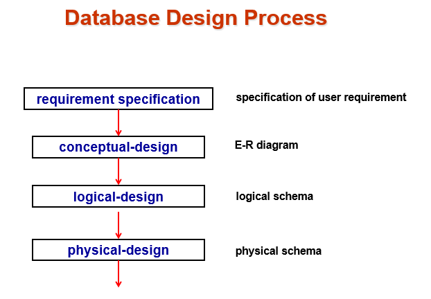

其中每一步间是独立的。比如，使用 ER diagram 进行概念设计的时候，不需要考虑是关系型数据库，还是面向对象数据库，还是任何数据库。
- 我们只需要在具体的 logical design 中，进行 logical schema 的 design

## 设计方法

- Entity Relationship Model 
  - Models an enterprise as a collection of entities and relationships
    - Entity: a “thing” or “object” in the enterprise that is distinguishable from other objects
      - Described by a set of attributes
    - Relationship: an association among several entities
  - Represented diagrammatically by an entity-relationship diagram:

  将企业建模为实体和关系的集合
    - 实体：企业中可与其他对象区分开来的 “事物 ”或 "对象”
      - 由一组属性描述
    - 关系：若干实体之间的关联
  - 用实体-关系图表示：
  
- Normalization Theory (Chapter 7)
  - Formalize what designs are bad, and test for them
  - 正式确定哪些设计不好，并进行测试

## E-R Diagram

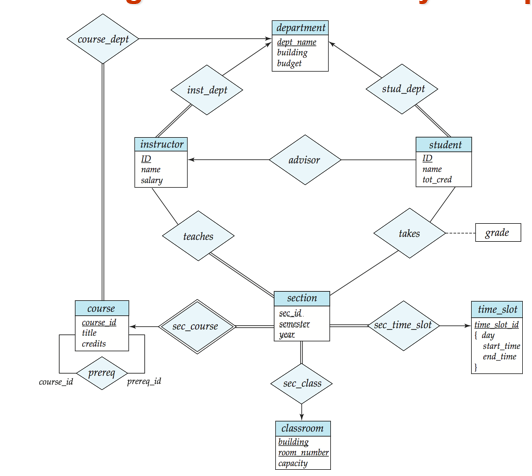

- 实体集
  - 实体（entity）:是现实世界中可区别于其他所有对象的一个事物或对象。例如大学中每个人都是一个实体。每个实体有一组性质，并且某些性质的集合值必须唯一标识一个实体。例如一个人具有$person_id$性质，其值唯一标识这个人。
  - 实体集（entity set）:实体的集合，是共享相同性质或属性的具有相同类型的实体集合。例如一所大学中所有老师的集合可定义为$instructor$实体集。
  - 实体通过一组属性表示。属性是实体集中每个成员所拥有的描述性性质。属性可以是复合，多值的。
  - 每个实体在它每个属性上都有一个值value
  - 实体集在ER图中用一个矩形表示，矩形分为2部分：
    - 一部分为实体集的名称（可能有颜色）
    - 一部分为实体集所有属性的名称。作为主码（primary key）部分的属性被加了下划线。

- 联系集
  - 联系（relationship）:是多个实体间的相互关联。例如可以定义Katz教师和Shankar学生的$advisor$联系。表明。。是。。的导师。
  - 联系集（relationship set）:相同类型联系的集合。考虑$instructor$和$student$2个实体集，定义的联系集为$advisor$来表示学生和他们导师之间的关联。
  - 联系集在ER图中用一个菱形表示，菱形通过线连接到多个不同的实体集（矩形），可以超过2个实体集。
  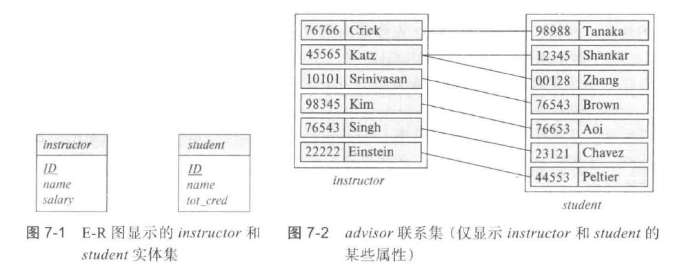

  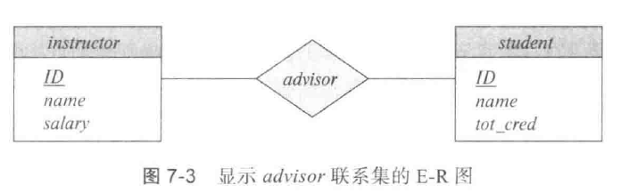

- 联系实例（relationship instance）:表示在所建模的现实企业中被命名的实体之间的一种关联。例如，一位教师ID为45565的$instructor$实体Katz和一名学生ID为123456的$student$实体Shankar，都参与到advisor的一个联系实例中。表示。。在大学中指导。。

形式化来说：
- 联系集是在$n\geq 2$个（可能相同）实体集上的数学关系。如$E_1,E_2,\ldots,E_n$为实体集，$R$为联系集，则联系集$R$是：
$$\{(e_1,e_2,\ldots,e_n)|e_i\in E_i,\forall i\in\{1,2,\ldots,n\}\}$$
即$$E_1\times E_2\times\cdots\times E_n$$
的一个子集，其中$(e_1,e_2,\ldots,e_n)$是一个联系实例。
- 实体集之间的关联称为参与，即实体集$E_1,E_2,\ldots,E_n$参与（participate）联系集$R$.
- 实体在联系中扮演的功能称为实体的角色（role）。同一实体集可以以不同角色多次参与一个联系集。
- 联系可以具有被称为描述性属性（descriptive attributes）的属性。(即单独连到菱形上的未分割的矩形，不是实体集，用虚线连接)
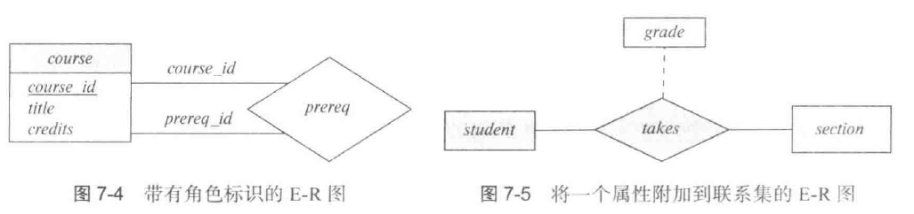

- 联系集的度：参与联系集的实体集数目。二元联系集为2，$advisor$联系集就是二元联系集。

### **复杂属性**：
- 对于每个属性都有一个可取值的集合，称为域或值集（value set）
- 简单属性：它们不能被划分为子部分。
- 复合属性：它们可以被划分为子部分（即其他属性）。例如，$name$属性可被构建为一个包括$first_name, middle_initial, last_name$的复合属性。
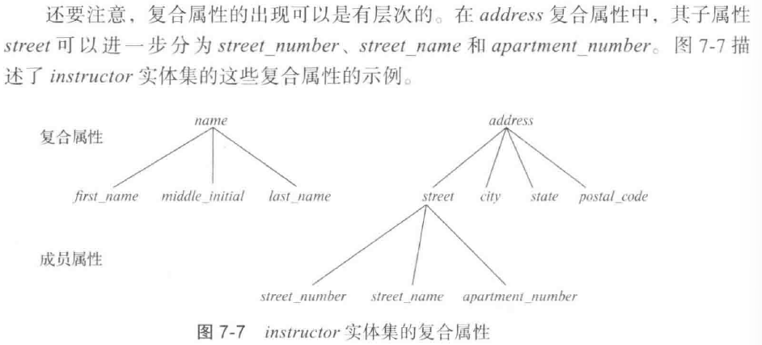
- 单值和多值属性（single-valued, multivalued）。例如，$student_id$只对应一个学生ID，单值；$phone_number$对应多个电话号码，多值。
- 派生属性（derived attribute）。这类属性的值可以从其他相关属性或实体的值派生出来。例如，假设$instructor$实体集有一个$student_advised$属性，它表示一位教师指导了多少名学生。我们可以通过统计与一位教师相关联的所有$student$实体的数目来导出这个属性的值。
  - 当实体在某个属性上没有值时认为该属性取空（null）值。空值可以表示不适用，即该实体的这个值不存在、缺失的、不知道（不确定是否存在）。

### 映射基数约束
mapping cardinality constraints
表示一个实体能通过一个联系集关联的另一些实体的数量。在描述二元联系集时最有用。
- 一对一 one to one $A$中的一个实体至多与$B$中一个实体相关联，并且$B$中一个实体也至多与$A$中的一个实体相关联。 ER模型中，从联系集到相关实体集之间个画一条有向线段
- 一对多 one to many $A$中的一个实体可以与$B$中任意数量的（0个或多个）实体相关联，但$B$中一个实体至多与$A$中的一个实体相关联。一条有向线段，一条无向线段，无向线段侧表示可以选择多个。
- 多对一 many to one $A$中的一个实体至多与$B$中的一个实体相关联，但$B$中的一个实体可以与$A$中任意数量的（0个或多个）实体相关联。
- 多对多 many to many $A$中的一个实体可以与$B$中任意数量的（0个或多个）实体相关联，$B$中的一个实体也可以与$A$中任意数量的（0个或多个）实体相关联。

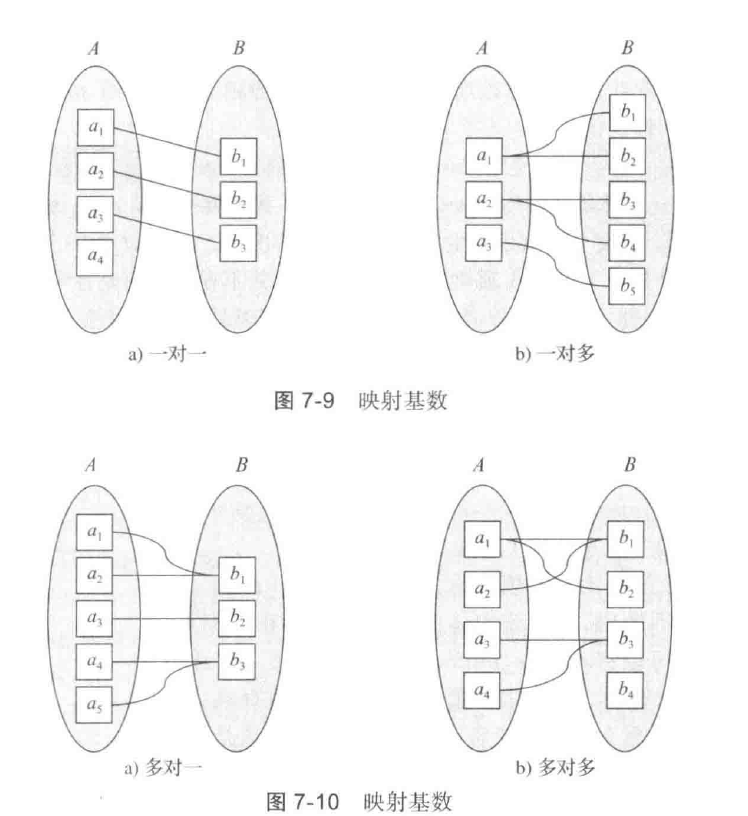

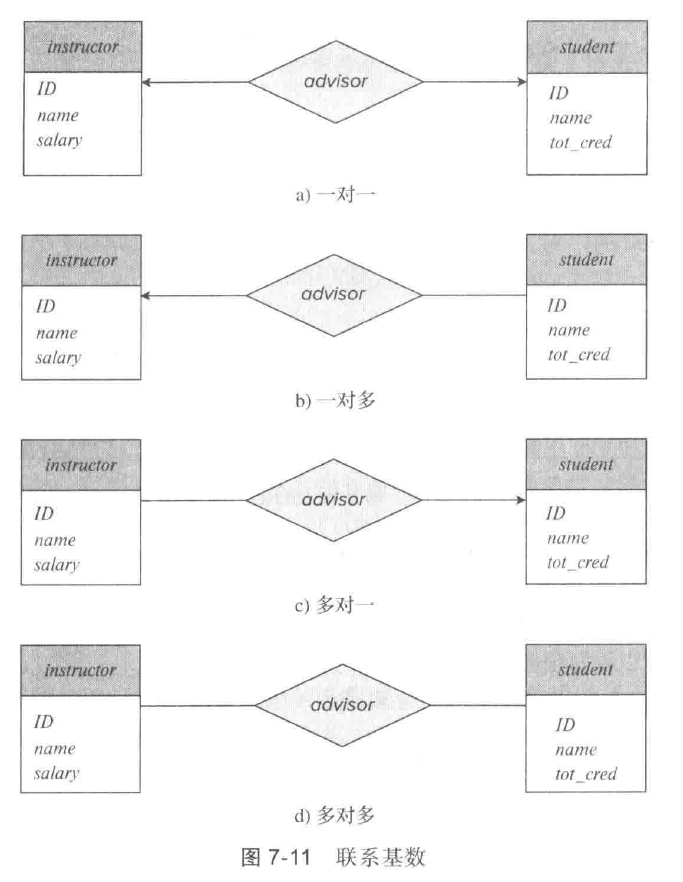

- 如果实体集E中每个实体都必须参与到联系集R中至少一个联系，那么这种参与称为全部的
-  如果实体集E中一些实体可能不参与到联系集R的任意联系，那么这种参与称为部分的
- 用双线表示全部参与。

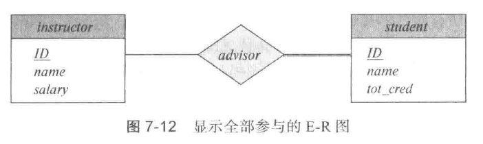
表示学生必须拥有导师。

**更复杂的表示约束的方法**：
这种约束限制了每个实体参与联系集中的联系次数。线段上有一个关联的最大和最小基数，用$l..h$表示。
最小值为1表示实体集全部参与联系集，即实体集每个实体在该联系集中的至少一个联系中出现。最大值为1表示实体至多参与一个联系，而最大值为*代表没有限制。

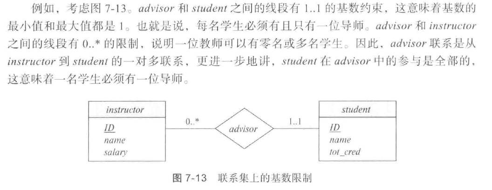

- 超码：能够唯一标识一条记录的属性或属性集
  - 标识性：一个数据表的所有记录都具有不同的超键
  - 非空性：不能为空
- 候选码：能够唯一标识一条记录的最小属性集(不含多余属性)
  - 标识性：一个数据表的所有记录都具有不同的候选键
  - 最小性：候选键的任何子集都不能唯一标识一个记录
  - 非空性：不能为空
- 主码：某个能够唯一标识一条记录的最小属性集（候选码中的“人选之子”）
  - 唯一性：一个数据表只能有一个主键
  - 标识性：一个数据表的所有记录都具有不同的主键取值
  - 非空性：不能为空

## 主码
primary key
- 实体集：
  - 实体的码是一个足以将实体彼此区分开来的属性集。能够唯一标识实体。
- 联系集：
  - 需要一种机制来区分联系集中不同的联系。
  - 设$R$是涉及实体集$E_1，E_2，...，E_n$的联系集，设$primary-key(E_i)$为$E_i$的主码的属性集合。
    - 如果没有属性与联系集关联，那么属性集合$$primary-key(E_1)\cup primary-key(E_2)\cup...\cup primary-key(E_n)$$描述了集合R的一个单独联系
    - 如果有属性$a_1,a_2...a_m$与联系集关联，那么属性集合$$primary-key(E_1)\cup primary-key(E_2)\cup...\cup primary-key(E_n)\cup \{a_1,a_2...a_m\}$$描述了集合R的一个联系
    - 这构成了联系集的一个超码
- 二元联系集主码选择取决于联系集的映射基数。
  - 对于多对多关系，前述主码的并集是最小的超码，并选作联系集的主码。
  - 对于一对多和多对一关系，多方的主码是最小的超码，并用作联系集的主码。
  - 对于一对一关系，任意实体集的主码都是最小超码，可选一个作为联系集的主码。

## 弱实体集
weak entity set
- 弱实体集存在依赖于另一个实体集，称为标识性实体集（discriminator entity set），我们使用标识性实体集上的主码以及称为分辨符属性（discriminator attribute）的额外属性来唯一标识弱实体，而不是将弱实体与主码关联。非弱实体集为强实体集。
- 弱实体集存在依赖（existence dependent）于标识性实体集。标识性实体集称为拥有(own)弱实体集。将弱与标识性实体集关联的联系称为标识性联系（identifying relationship）
- 标识性练习是从弱实体集到标识性实体集的多对一联系，并且弱实体集参与是全部的

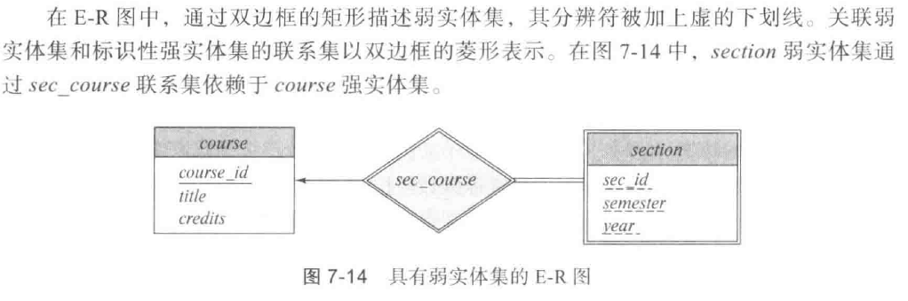

## E-R 图转化为关系模式
