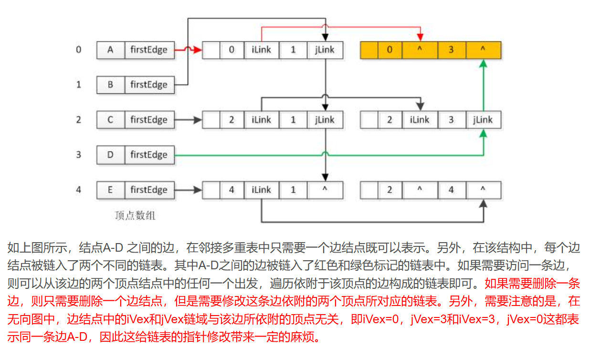
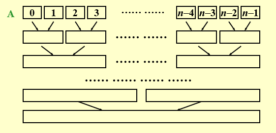

# FDS(数据结构基础)

## 1.算法基础  

---

## 2.表，栈，队列

---

## 3.树

---

## 4.优先队列（堆）

### 4.1 模型 
至少完成以下两种的数据结构：Insert ，DeleteMin（此时为最小堆，最小元素位于顶层，优先出列）


### 4.2 简单实现
- 二叉堆
  - 结构性质  
  是一颗被完全填满的二叉树，底层元素从左到右填入，称为完全二叉树（complete binary tree）

  
  易证高为h的完全二叉树有2^h^到2^h+1^-1个节点，故h=log2(N)向下取整，是O（log N）  

  它可以用数组表示，而不需要指针，对任一i，其左子节点为2i，右子节点为2i+1，其父节点为i/2向下取整。该数组的0位置为空（不存放有效值），1位置为根节点，2位置为根节点的左子节点，依次类推。
  
  - 堆序性质（最小堆）
  对于任一节点X，其父节点小于（或等于）其中的关键字，根节点除外。
  ```c
  struct PriorityQueue{
    int capacity;
    int size;
    ElementType *Eelements;
  };//堆的抽象数据类型声明

  PriorityQueue *CreatePriorityQueue(int MaxElements){
    PriorityQueue *Q;
    if(MaxElements<MinQOSize) Error("Priority Queue is too small");
    Q = (PriorityQueue*)malloc(sizeof(struct PriorityQueue));
    if(Q==NULL) Error("Out of space!!!");
    Q->Elements = (ElementType*)malloc((MaxElements+1)*sizeof(ElementType));
    if(Q->Elements==NULL) Error("Out of space!!!");
    Q->Capacity = MaxElements;//最大容量
    Q->Size = 0;
    Q->Elements[0] = MinData;//0位置为空
    return Q;
  }//创建一个优先队列
  ```
### 4.3 堆的基本操作
- **Insert**
  - 堆的插入操作，将新元素插入到堆的末尾，然后通过上浮操作（percolateUp）调整堆的堆序性质。
  ```c
  H->Elements[0] is a sentinel(标记，足够小，类似于链表中头节点)
  void Insert(ElementType X,PriorityQueue *Q){
    int i;
    if(Q->Size == Q->Capacity) Error("Priority Queue is full");
    for(i=Q->Size+1;Q->Elements[i/2]>X;i/=2){
        Q->ELements[i]=Q->Elements[i/2];
    }
    Q->Elements[i] = X;
  }//T(N)=O(logN)
  ```  
- **DeleteMin**
  - 堆的删除操作，删除堆顶元素，然后通过下沉操作（percolateDown）调整堆的堆序性质。将两个Child中较小的一个与其交换，将空位向下移。（需要考虑只有一个孩子节点的情况）
  ```c
  ElementType DeleteMin(PriorityQueue *Q){
    int i,child;
    ElementType MinElement,LastElement;
    if(IsEmpty(Q)){
        Error("Priority Queue is empty");
        return Q->Elements[0];
    }
    MinELement = Q->Elements[1];
    LastElement = Q->Elements[Q->Size--];//[Q->Size],Size--,把最后以为移至第一位
    for(i=1;i*2<=Q->Size;i=child){
        child = i*2;
        if(child!=Q->Size && Q->Elements[child+1]<Q->Elements[child]) child++;
        if(LastElement>Q->Elements[child]) Q->Elements[i] = Q->Elements[child];
        else break;
    }
    Q->Elements[i] = LastElement;
    return MinElement;
  }///T(N)=O(logN)，被放到根处的元素几乎都下移到底层
  ```
- **其他堆操作**
  - **DecreaseKey**
  减小堆元素，上移调整堆的堆序性质。
  - **IncreaseKey**
  增大堆元素，下移调整堆的堆序性质。
  - **Delete**
  先通过执行**DecreaseKey**操作，将目标点移至堆顶，再执行**DeleteMin**操作。
  - **BuildHeap**
  堆的建立操作，将数组中的元素依次插入堆中（从上到下，从左到右），不管正确性，然后通过倒序下沉操作处理所有“根”调整堆的堆序性质。
  ---

## 5.并查集
  并查集（disjoint-set），又称不相交集
### 1.等价关系
  若对于每一对元素（a,b），a,b属于S, aRb或为true或为false,则称在集合S上定义关系R。如果aRb是true,则说a与b有关系。
  等价关系是满足下列三个性质的关系R：
  1. 自反性(reflexive)，对于所有a属于S，aRa是true。
  2. 对称性(symmetric)，对于所有a,b属于S，如果aRb是true，则bRa是true。（aRb当且仅当bRa）。
  3. 传递性(transitive)，对于所有a,b,c属于S，如果aRb是true且bRc是true，则aRc是true。（若aRb且bRc，则aRc）。
  
  例如<=不是等价关系，虽然是自反，传递的，却不是对称的。
### 2.动态等价性
  Given an equivalence relation ~, decide for any a and b if a ~ b.
  举例子，设存在一个含5个元素的集合（a1...a5）上定义一个等价关系。此时存在25对元素，它们每一对或有关系或无关系。然而，信息a1~a2, a3~a4, a5~a1, a4~a2意味着每一对元素都有关系。
  一个元素a属于S的等价类是S的一个子集，它包含所有与a有关系的元素。注意，等价类形成对S的一个划分：S中每一个元素都恰好属于一个等价类。所以判断a与b是否有关只需验证a和b是否出现ge在一个等价类中。
  输入数据最初是N个集合，即每个集合只含一个元素。此时允许两种运算进行。这种算法称为不相交集的Union/Find算法。
  - Find（查），它返回给定元素的集合（等价类）的名字。
  - Union（并），它给两种元素添加关系，使处于同一个等价类中。
  
  这种算法是dynamic的，还是on-line的：当Find执行时，它必须给出答案算法才能继续进行。另一种是off-line的:该算法需要观察全部Union和Find序列，它对每一个Find的答案必须与所有执行到改Find的Union一致。差别类似参加笔试与口试（笔试脱机，只能在给定时间内给出答卷，口试联机，只能回答当前问题。然后才能回答下一个）。  
### 3.基本数据结构
  使用树来表示每一个集合（树上所有节点有一个相同的根，可以用来命名集合，Find返回，树的集合是森林），树不一定是二叉。
  可以使用数组来存放，每一个成员P[i]表示元素i的父亲。如果i是根节点，则P[i]为0。
  一开始所有的集合都是独立的，即P[i]为0。
  

  执行Union操作，使一个节点的根节点指向另一个树的根节点。
  例如Union(5,6)，将6连接到5上，5作根。
  Union(X,Y)后新根是X（前一个），均是对树根进行操作。
  

  Find（X）操作通过返回包含X的树的根节点。执行这次操作的花费时间与X的节点深度成正比。
  ```c
  #ifndef _DisjSet_H
  #define _DisjSet_H

  typedef int DisSet[NUmSize+1];
  typedef int SetType;
  typedef int ElementType;

  void SetUnion(DisSet S,SetType X,SetType Y){S[Y]=X;}//不是最好的算法
  SetType Find(ElementType X,DisSet S){for(;S[x]>0;x=S[X]);return X;} 
  //返回根节点的name，用index表示

  #endif
  ```
### 4.灵巧求并算法
  1. Union by size--Always change the smaller tree : S[Root]=-size;//initialized to be -1;
  如果T是一个按大小并的有N个节点的树，那么
  $$height（T）\le \left \lfloor \log_{2}{N}  \right \rfloor +1$$
  Time complexity of *N* Union and *M* Find operations is now $$O( N + M\log_{2}{N} )$$.

  2. Union by height--Always change the shallow tree : S[Root]=-height;//initialized to be -1;
  when the tree has only 1 node, it is the root. the value of S[Root] is 0. 
  ```c
  void SetUnion(DisSet S,SetType X,SetType Y){
    if(S[Y]<S[X]) S[X]=Y;
    else {
      if(S[X]==S[Y]) S[X]--;
      S[Y]=X;
    }
  }//Union by Height(rank)
  ```
### 5.路径压缩
  1. 路径压缩：在Find（X）操作中，将X到root路径上的所有节点都指向根节点。
  ```c
  SetType  Find ( ElementType  X, DisjSet  S )
  {
      if ( S[ X ] <= 0 )    return  X;
      else    return  S[ X ] = Find( S[ X ], S );
  }//唯一变化是使S[X]等于Find返回值


  SetType  Find ( ElementType  X, DisjSet  S )
  {   ElementType  root,  trail,  lead;
      for ( root = X; S[ root ] > 0; root = S[ root ] )
          ;  /* find the root */
      for ( trail = X; trail != root; trail = lead ) {
         lead = S[ trail ] ;   
         S[ trail ] = root ;   
      }  /* collapsing */
      return  root ;
  } 
  //Slower for a single find, but faster for a sequence of  find operations.
  //Note: Not compatible with union-by-height since it changes the heights.  Just take “height” as an estimated rank.  
  ```
### 6.按秩求并和路径压缩的最坏情形
  【Lemma (Tarjan)】Let T( M, N ) be the    maximum time required to process an intermixed sequence of *M <= N* finds and *N-1* unions.  Then:  $$k_{1} M\alpha (M,N)\le T(M,N)\le k_{2} M\alpha (M,N)$$for some positive constants k1 and k2 .

---

## 6. 图论算法
  
### 1. 定义
  一个图$G=(V,E)$由顶点集V（vertex）和边集E(edge)组成。顶点集V由n个顶点组成，顶点V={v1,v2,...,vn}。边集E由m条边组成，边集E={e1,e2,...,em}。每条边e=(v1,v2)由两个顶点v1和v2组成（v1,v2属于V）。有时把边称为弧（arc）。顶点$v,w$邻接（adjacent）当且仅当$(v,w) belongE$(邻接有方向).
  在一个具有边（v,w）从而具有边（w,v）的无向图中，w和v邻接且v和w邻接。有时边有第三种成分（权weight或值cost）.
  - 有向图（digraph）：点对有序,$<v_i,v_j>!=<v_j,v_i>$,$<v_i,v_j>=>v_i->v_j$
  - 无向图（undigraph）：点对无序,$(v_i,v_j)==(v_j,v_i)$,$(v_i,v_j)=>v_i<->v_j$
  - 路径（path）:一个顶点序列$v_1,v_2,...,v_k$，其中$(v_i,v_{i+1})belongE$。路径长(length)等于路径上的边数。一个顶点到自身的路径不包含边，长为0。如果一个图有这样$(v,v)$的边，那么这称为一个环（loop/self loop）。**在此讨论的图均为无（自）环**
  - 简单路径：路径上所有顶点互异，但头尾顶点可相同。
  - 圈（cycle）:一个顶点序列$v_1,v_2,...,v_k$，其中$(v_i,v_{i+1})belongE$且$v_1=v_k$。长度至少为1。在无向图中，要求边互异，故$v,w,v$不认为是圈。而在有向图中中，允许边顶点重复，故$v,w,v$认为是圈。
  - 无圈的（acyclic）：一个有向图无圈。一个有向无圈图有时简称DAG。
  - tree：连通无圈的图。（即边数最少的连通图）
  - 子图（subgraph）: 一个图$G$的一个子图$G'$，其中包含一个子集$V(G')（V(G')⊆V(G)）$和子集E(G')（E(G')⊆E(G)）的集合。
  - 连通的（connected）:如果一个无向图从每个顶点到其余顶点都存在一条路径，则该图是连通的。具有这样性质的有向图为强连通的（strongly connected）。如果一个有向图不是强连通，但其基础图（underlying graph,即边上去掉方向）是连通的，则该图是弱连通的（weakly connected）。
  - 完全图（complete graph）:如果一个图每对顶点间都有边（边数最大），则该图是完全图。
  - (Connected) Component of an undirected G（无向图G的连通分量） ::= the maximal connected subgraph（最大的连通子图）
  - 度（degree）:number of edges incident to v.For a directed G, we have in-degree(指向它) and out-degree（向外指）. degree(v) = in-degree(v) + out-degree(v)。总边数等于度的总数的一半。


  >**限制**
  >在此不考虑自环与多图
  >- Self loop is illegal.
  #### 1.1 图的表示
  - **邻接矩阵**（adjacency matrix）:二维数组adj_met[n][n].adj_met[i][j] = 1 if there is an edge **from i to j**, otherwise adj_met[i][j] = 0.若有权值，可用权值表示adj_met[i][j]，用很大或很小的值表示无边。
  如果是无向图，则该矩阵为symmetric。因此可以只用一半矩阵来表示。
  空间需求为$O(|V|^2)$
  - **邻接表**（adjacency list,存放顶点）:用链表表示。
  若图为稀疏的，则邻接矩阵的存储空间浪费很多，adjacency list则比较节省空间。
  用链表代替每一行，每个链表中元素个数即为链在该顶点上的度（out-degree）
  Degree( i ) = number of nodes in graph[ i ] (if G is undirected).
  $T$ of examine $E(G) = O( n + e )$
  如果是有向图，in-degree也可以求：
    - 1 add inverse adjacency list for each edge. **像邻接表一样，给出指向该顶点的链表。**
    如下图：
    
    - 2 Multilist representation of adj_mat[i][j]. 二维链表
  
  例如：链表数组
   
   **Note:the order of nodes in each list does not matter!!!**   
  - **邻接多重表**（adiacency multilist）:每个节点表示**一条边**，主要用于**存储无向图**。

  

  边节点结构：
    
  mark(例如是否遍历过bool), ivex, ilink, jvex, jlink, info(such as weight)

  顶点表节点：
  data, ptr to first edge
  用数组存储顶点表，链表存储边表。

  举例：
  
  
    

  **代码定义**
  ```cpp
  #define MaxVertexTypeNum 100
  typedef char VertexType;		
  typedef int EdgeType;	

  typedef struct ArcNode{					//边表节点 
    int ivex,jvex;						//边的俩个节点			
    struct ArcNode *ilink , *jhink;		//维护俩个节点的边表 
    //InfoType info; 					//权值 
    //bool mark;						//标记位 
  }ArcNode;								//边表节点的类型 

  typedef struct VNode{					//顶点表节点 
    VertexType data;					//顶点的数据 
    ArcNode *firstedge;					//边表的头指针 
  }VNode;									// 邻接表类型 

  typedef struct{							//十字链表 
    VNode adjmulist[MaxVertexTypeNum];	//所有结点的数据 
    int vexnum,arcnum;					//节点数和边数 
  }ALGraph;								//十字链表的类型 
  ```
  空间复杂度：$O(|V|+|E|)$

### 2. 拓扑排序
  - **拓扑排序**：一种线性排列，使得**有向无圈图**中的任意一条边$(u,v)$都满足$u$在$v$之前。**注意：如果图有环，则拓扑排序不存在。拓扑排序不一定是唯一的。**
  - **AOV(activity on vertex) Network**(一种图) ::= digraph $G$ in which $V( G )$ represents activities ( e.g.  the courses ) and $E(G)$ represents precedence relations ( e.g.  $C_1 ->C_3$  means that C1 is a prerequisite course of C3 ).
  Feasible AOV network must be a dag (directed acyclic graph).
  - i  is a predecessor of j ::= there is a path from i  to j.
  i  is an immediate predecessor of  j ::= < i,  j > $ E( G )$ Then j is called a successor ( immediate successor ) of i.
  - Partial order ::= a precedence relation which is both transitive ( i -> k, k -> j  =>  i -> j ) and irreflexive ( i -> i is impossible ).不能自反

  **拓扑排序算法**
  1. 从DAG图中选择一个没有前驱（入度为0）的顶点并输出。
  2. 从图中删除该顶点和所有以它为起点的有向边。
  3. 重复步骤1和2直到当前DAG图为空或当前图中无不存在前驱的顶点为止。后一种说明有环。
  
  伪代码：
  ```c
  void Topsort( Graph G ){   
    Queue  Q;
    int  Counter = 0;
    Vertex  V, W;
    Q = CreateQueue( NumVertex );  MakeEmpty( Q );
    for ( each vertex V )
      if ( Indegree[ V ] == 0 )   Enqueue( V, Q );
    while ( !IsEmpty( Q ) ) {
      V = Dequeue( Q );
      TopNum[ V ] = ++ Counter; /* assign next */
      for ( each W adjacent from V )
        if ( – – Indegree[ W ] == 0 )  Enqueue( W, Q );
    }  /* end-while */
    if ( Counter != NumVertex )
      Error( “Graph has a cycle” );
    DisposeQueue( Q ); /* free memory */
  }
  ```
  
### 3. 最短路径算法
  **definition**: Given a digraph G = ( V, E ), and a cost function c( e ) for $e \in E( G )$.   The length of a path P from source to destination is                  (also called weighted path length).
#### 1. 单源最短路径
  **definition**: Given a directed weighted graph G = ( V, E ), and a distinguished vertex $s$, find the shortest weighted path from $s$ to every other vertex in G.   
  
  **note**: If there is no negative-cost cycle, the shortest path from s to s is defined to be zero.

#### 2. 无权最短路径：
  Breadth-first search:
  按层处理节点：距开始点最近的顶点首先被赋值，而最远的最后赋值。
  ```cpp
  Table[ i ].Dist ::= distance from s to vi  /* initialized to be $\infty$ except for s*/
  Table[ i ].Known ::= 1 if vi is checked; or 0 if not
  Table[ i ].Path ::= for tracking the path   /* initialized to be 0 */
  ```
  ```cpp
  void Unweighted( Table T )
  {   int  CurrDist;
      Vertex  V, W;
      for ( CurrDist = 0; CurrDist < NumVertex; CurrDist ++ ) {
        for ( each vertex V )
          if ( !T[ V ].Known && T[ V ].Dist == CurrDist ) {
            T[ V ].Known = true;
            for ( each W adjacent from V )
              if ( T[ W ].Dist == Infinity ) {
                T[ W ].Dist = CurrDist + 1;
                T[ W ].Path = V;
              } /* end-if Dist == Infinity */
            } /* end-if !Known && Dist == CurrDist */
      }  /* end-for CurrDist */
  }
  ```
  improvement:
  ```cpp
  void Unweighted( Table T ){   /* T is initialized with the source vertex S given */
    Queue  Q;
    Vertex  V, W;
    Q = CreateQueue (NumVertex );  MakeEmpty( Q );
    Enqueue( S, Q ); /* Enqueue the source vertex */
    while ( !IsEmpty( Q ) ) {
      V = Dequeue( Q );
      T[ V ].Known = true; /* not really necessary */
      for ( each W adjacent from V )
        if ( T[ W ].Dist == Infinity ) {
          T[ W ].Dist = T[ V ].Dist + 1;
          T[ W ].Path = V;
          Enqueue( W, Q );
        } /* end-if Dist == Infinity */
    } /* end-while */
    DisposeQueue( Q ); /* free memory */
  }
  ```
#### 3. 赋权图
  Dijkstra算法：
  ```cpp
  //声明
  typedef int Vertex;
  struct TableEntry{
    List Header;//Adjacency List
    int Known;
    DistType Dist;
    Vertex Path;
  };

  //Vertices are numbered from 0
  #define NotAVetyex (-1)
  typedef struct TableEntry Table[NumVertex];
  
  //表初始化
  void InitTable(Vertex Start,Graph G, Table T){
    int i;
    ReadGraph(G,T);
    for(int i=0;i<NumVertex;i++){
      T[i].Known=false;
      T[i].Dist=Infinity;
      T[i].Path=NotAVetyex;
    }
    T[Start].Dist=0;
  }

  //显示实际最短路径
  void PrintPath(Vertex V,Table T){
    if(T[V].Path!=NotAVetyex){
      PrintPath(T[V].Path,T);
      printf(" to");
    }
    printf(" %d",V);
  }

  //Dijkstra算法
  void Dijkstra(Table T){
    Vertex V,W;
    for(;;){
      V= smallest unknown distance vertex;
      if(V==NotAVetyex) break;
      T[V].Known=true;
      for each W adjacent to V{
        if(!T[W].Known){
          if(T[V].Dist+Cvw<T[W].Dist){
            Decrease(T[W].Dist to T[V].Dist+Cvw);
            T[W].Path=V;
          }
        }
      }

    }
  }
  ```
#### 4. Graphs with negative Edge Costs
  ```cpp
  void  WeightedNegative( Table T )
  {   /* T is initialized */
      Queue  Q;
      Vertex  V, W;
      Q = CreateQueue (NumVertex );
      MakeEmpty( Q );
      Enqueue( S, Q ); /* Enqueue the source vertex */
      while ( !IsEmpty( Q ) ) {
        V = Dequeue( Q );
        for ( each W adjacent from V )
          if ( T[ V ].Dist + Cvw < T[ W ].Dist ) {
            T[ W ].Dist = T[ V ].Dist + Cvw;
            T[ W ].Path = V;
            if ( W is not already in Q )
              Enqueue( W, Q );
          } /* end-if update */
      } /* end-while */
      DisposeQueue( Q ); /* free memory */
  }
  ```

#### 5. Acyclic Graphs(无环图)
  If the graph is acyclic, vertices may be selected in topological order since when a vertex is selected, its distance can no longer be lowered without any incoming edges from unknown nodes.
  - Application:**AOE(Activity on Edge) Networks**
  AOE 是带权值的有向图，以顶点表示事件，以边表示活动，边上的权值表示活动的开销（如项目工期）。 AOE 是建立在子过程之间的制约关系没有矛盾的基础之上，再来分析整个过程需要的开销。所以如果给定AOV网中各顶点活动所需要的时间，则可以转换为AOE 网，较为简单的方法就是把每个顶点都拆分成两个顶点，分别表示**活动的起点和终点**
  
  把上图转换成一般的 AOE 图如下
  
  计算出的路径称为关键路径（critical path）
### 4.Network Flow Problems
#### 1.定义
带权的有向图G=(V,E)，满足以下条件，则称为网络流图
- 仅有一个入度为0的顶点s，称s为源点 source
- 仅有一个出度为0的顶点t，称t为汇点 sink
- 每条边的权值都为非负数，称为该边的**容量**，记作c(i,j)
- 弧的流量:通过容量网络G中每条弧< u,v>,上的实际流量(简称流量),记为f(u,v)
**最大流问题**: Determine the maximum amount of flow that can pass from s to t.
#### 2. 性质
对于任意一个时刻，设f(u,v)实际流量，则整个图G的流网络满足3个性质：
- 容量限制：对任意u,v∈V，f(u,v)≤c(u,v)
- 反对称性：对任意u,v∈V，f(u,v) = -f(v,u)。从u到v的流量一定是从v到u的流量的相反值
- 流守恒性：对任意u，若u不为S或T，一定有∑f(u,v)=0，(u,v)∈E。即u到相邻节点的流量之和为0，因为流入u的流量和u点流出的流量相等，u点本身不会”制造”和”消耗”流量。
#### 3. 算法
1. 一种简单的最大流算法（有缺陷）
- $G$：原图，每条边代表容量
- $G_f$:流图，表示算法在任意结段已经达到的流。开始时所有边都没有流量，即$G_f$为空。
- $G_r$:残余图（residual graph）,表示每条边还能加上多少流，对于每条边，可以用容量减去当前的流得到。
**Step 1:**  Find any path $s ->  t$ in $G_r$ ;
**Step 2:**  Take the minimum edge on this path as the amount of flow and add to $G_F$
**Step 3:**  Update $G_r$ and remove the 0 flow edges;
**Step 4:**  If (there is a path s -> t in $G_r$) Goto Step 1;
2. A Solution-allow the algorithm to undo its decsions
For each edge ( v, w ) with flow $f_{v,w}$ in $G_f$ , add an edge ( w, v ) with flow $f_{v,w}$ in  $G_r$.
对于流图中具有流$f_{v,w}$的每一边（v,w），在残余图中添加一条容量未$F_{v,w}$的边(w,v)

3. Analysis(If the capacities are all integers)
An augmenting path can be found by, e.g., a depth first search algorithm.
$T=O(f|E|)$, where $f$ is the maximum flow.
Always choose the augmenting path that allows the largest increase in flow.


### 5. Minimum Spanning Tree
#### 1.Definition
**无向图中**
A spanning tree of a graph $G$ is a tree which consists of $V(G)$ and a subset of $E(G)$

**Note:**  
> - The minimum spanning tree is a tree since it is acyclic -- the number of edges is |V| – 1.
> - It is minimum for the total cost of edges is minimized.
> - It is spanning because it covers every vertex.
> - A minimum spanning tree exists iff G is connected.
> - Adding a non-tree edge to a spanning tree, we obtain a cycle.
#### 2. Algorithm
Greedy Method
Make the best decision for each stage, under the following constrains :
> (1)  we must use only edges within the graph;
> (2)  we must use exactly |V| 1 edges;
> (3)  we may not use edges that would produce a cycle.

1. Prim's Algorithm - grow a tree
/* very similar to Dijkstra’s algorithm */
在算法任意时刻，都有一个已经添加到书上的顶点集，而其余顶点未加上。此时通过选择边（u,v），使得(u,v)的值是所有u在树上而v不在树上的最小者，而找出一个新的顶点加到树中。
2. Kruskal's Algorithm - maintain a forest
连续的选择所有边中值最小的边，并且当所选的边不产生圈时就把它作为取定的边。
```c
void Kruskal ( Graph G ){   
  T = { } ;
  while  ( T contains less than |V|-1 edges && E is not empty ){
    choose a least cost edge (v, w) from E ;
    delete (v, w) from E ;
    if ( (v, w) does not create a cycle in T)     
      add (v, w) to T ;
    else     
      discard (v, w) ;
  }
  if  ( T contains fewer than |V|-1 edges )
    Error ( “No spanning tree” ) ;
}
```
$T=O(|E|\log|E|)$

### 6. Applications of Depth-First Search
/* a generalization of preorder traversal */
(前序遍历的一般化)
```c
void DFS ( Vertex V )  /* this is only a template */
{   visited[ V ] = true;  /* mark this vertex to avoid cycles */
    for ( each W adjacent to V )
        if ( !visited[ W ] )
  DFS( W );
} /* T = O( |E| + |V| ) as long as adjacency lists are used */
```

#### 1. Undirected Graphs
无向图是连通的，当且仅当从任一节点开始的DFS遍历能访问所有节点。

```c
void ListComponents ( Graph G ) {   
  for ( each V in G ) 
    if ( !visited[ V ] ) {
      DFS( V );
      printf(“\n”);
      }
}
```


- depth-first spanning tree:深度优先生成树。用DFS算法顺序获取的树。

例如上图，我们从A开始，标记A访问过并递归调用DFS（B），DFS（B）标记B并递归调用DFS（C），DFS（C）标记C并递归调用DFS（D），DFS（D）标记D并返回至DFS（C），因为邻接的AB都已标记。DFS（C）看到B为邻接点并忽略它，并发现没看到的E，因此调用DFS（E）。DFS（E）标记E，忽略AC，返回DFS（C），DFS（C）返回到DFS（B），DFS（B）忽略AD并返回DFS（A），DFS（A）忽略DE返回（实际上每条边都接触2此，一次（v,w）,一次（w,v）,但实际上是每个邻接表项接触一次。）
所以该图深度优先生成树：根为A，图中每一条边（v,w）都出现在树上。如果我们处理（v,w）时发现w未标记，或当我们处理（w,v）发现v是未标记的，那么就用树的一条边表示它。如果处理时发现已被标记，就画一条虚线（背向边back edge）

#### 2.Binconnectivity  双连通性
- 如果一个连通的无向图中任一顶点删除后，剩下的图仍然连通，那么称为双连通的。G is a biconnected graph if G is connected and has no articulation points.
- 割点（articulation point）: 如果一个图不是双连通的，那么，将其删除后不再连通的那些顶点叫做割点。v is an articulation point if G’ = DeleteVertex( G, v ) has at least 2 connected components.可将图分割成两个或两个以上的连通分量。

例如上图，不是双连通的，顶点C,D删除后使图不连通，故为割点。
- A biconnected component is a maximal biconnected subgraph.

- NOTE: No edges can be shared by two or more biconnected components.  Hence E(G) is partitioned by the biconnected components of G.

**Finding the biconnected components of a connected undirected G**
1. Use depth first search to obtain a spanning tree of G
2. Find the articulation points in G
   - **The root is an articulation point iff it has at least 2 children**如果根至少有 2 个子节点，那么它就是一个割点
   - Any other vertex u is an articulation point iff u has at least 1 child, and it is impossible to move down at least 1 step and then jump up to u’s ancestor.任何其他顶点 u 都是割点，如果 u 至少有一个子节点，而且不可能向下移动至少一步，然后再向上跳到 u 的祖节点。


首先从图中任一一点开始DFS，并在顶点被访问时给它们编号，对于每个顶点v称其先序编号为$Num(v)$。然后，对于树上每个顶点v，计算编号最低的顶点称为$Low(v)$,该点从v开始，通过0条或多条边且可能还有一条背向边而达到。
- $Low(u)$：表示顶点u及其子树中的点，通过反向边，能够回溯到的最早的点（Num(u)最小）的Num值

- $Low(u)=Min(Num(u),Min(Low(w)|w\ is\ a\ child\ of\ u),Min(Num(w)|(u,w)\ is\ a\ back\ edge))$
- Therefore, $u$ is an **articulation point** iff
(1) $u$ is the root and has at least 2 children;  or
(2)  $u$ is not the root, and has at least 1 child such that  $Low( child ) \geq Num( u )$.

#### 3.Euler Circuits
- **Euler tour**--Draw each line exactly once without lifting your pen from the pape.欧拉路径
- **Euler curcuit**--Draw each line exactly once without lifting your pen from the paper, AND finish at the starting point.欧拉回路
- 对于无向图
  - 欧拉回路：终点在起点上的欧拉回路只有当图连通且每个顶点度为偶数才可能存在。（实际上所哟顶点度为偶数的任何连通图必然有欧拉回路）
  - 欧拉路径：从奇数点到另一个奇数点，终点不一定回到起点。奇数点不能多于2个，否则不存在。奇度点数为0或2个。
- 对于有向图
  - 欧拉路径：除去起点和终点，所有点的出度与入度相等。起点出度比入度大1，终点入度比出度大1。
  - 欧拉回路：起点终点出入度也相同。

算法：先从起点出发，给出一个只访问图的一部分而提前返回到起点的路径。然后找出尚未访问的边的路径上的第一个顶点，并执行另一次深度优先搜索，给出另一个回路，将它拼接到原来的回路上，继续该过程知道所有边都被遍历到为止。


- The path should be maintained as a linked list.
- For each adjacency list, maintain a pointer to the last edge scanned.
- $T = O( |E| + |V| )$


## 7. SORTING 排序
```c
void X_Sort(ElementType A[],int N)
```
- ‘>’ and ‘<’ operators exist and are the only operations allowed on the input data.都是基于比较的排序算法。Comparison-based sorting
- N是一个合法整数。
- 由于简单性，考虑整数数组
- 只考虑内部排序The entire sort can be done in main memory
### 1. Insertion Sort
插入排序由$N-1$趟（pass）排序组成。对于P=1趟到P=N-1趟，插排保证从位置0到位置P上的元素为已排序状态。插排利用了这样的事实：位置0到位置P-1的元素是已排序的。
在第P趟，我们将位置P的元素向左移动到它在前P+1（0到P有P+1个元素）个元素中正确的位置。位置P上的元素存于Tmp，而（在位置P前）所有更大的元素都被向右移动一个位置，然后Tmp被插入到正确的位置。
```c
void InsertionSort ( ElementType A[ ], int N ) 
{ 
  int  j, P; 
  ElementType  Tmp; 

  for ( P = 1; P < N; P++ ) { 
    Tmp = A[ P ];  /* the next coming card */
    for ( j = P; j > 0 && A[ j - 1 ] > Tmp; j-- ) 
      A[ j ] = A[ j - 1 ]; /* shift sorted cards to provide a position for the new coming card */
    A[ j ] = Tmp;  /* place the new card at the proper position */
  }  /* end for-P-loop */
}
```
最差情况倒叙(reverse order)排列，一个一个换过取$T(N)=O(N^2)$
最好情况，已排好，$T(N)=O(N)$
### 2. A Lower Bound for Simple Sorting Algorithms 一些简单排序算法的下界
- inversion（逆序）：指数组中具有性质$i<j$,$A[i]>A[j]$的序偶$（A[i],A[j]）$，ordered pairs$(i,j)$。
逆序数正好是需要由插入排序（非直接）执行的交换次数。因为交换两个不按原序排列的相邻元素恰好消除一个逆序，而排好的没有逆序。由于算法中还有$O(N)$项其他工作，因此插入排序的运行时间为$O(N+I)$,$I$为原始数组中逆序数。若逆序数为$O(N)$，则插入排序以线性时间运行。
- 【定理1】:$N$个互异数的数组的平均逆序数为$N(N-1)/4$
  - 意味着插排平均是二次的
- 【定理2】:通过交换相邻元素进行排序的任何算法平均需要$\Omega(N^2)$
### 3. Shell Sort - by Donald Shell
希尔排序是插入排序的改进版本。可冲击二次时间屏障。又称缩小增量排序（diminishing increment sort）
希尔排序使用一个增量序列（increment sequence）$(h_1,h_2,h_3,\dots,h_i)(h_1=1)$。
在使用增量$h_k$进行一趟排序后，对于每一个i，有$A[i]\leq A[i+h_k]$，即所有相隔$h_k$的元素都被排序，此时称为$h_k-sorted$.
- **一个$h_k$排列的数组在$h_{k-1}$排列后保持$h_k$排列性。**
- $h_t=\lfloor N/2 \rfloor$,$h_k=\lfloor h_{k+1}/2 \rfloor$ 常用取法
```c
void Shellsort( ElementType A[ ], int N ) 
{ 
  int  i, j, Increment; 
  ElementType  Tmp; 
  for ( Increment = N / 2; Increment > 0; Increment /= 2 )  
  /*h sequence */
    for ( i = Increment; i < N; i++ ) { /* insertion sort */
      Tmp = A[ i ]; 
      for ( j = i; j >= Increment; j - = Increment ) 
        if( Tmp < A[ j - Increment ] ) 
          A[ j ] = A[ j - Increment ]; 
        else 
          break; 
      A[ j ] = Tmp; 
    } /* end for-I and for-Increment loops */
}
```
- 最差情况：使用希尔增量时希尔排序运行时间为$\Theta(N^2)$
  - 这些增量未必互质，一次较小的增量可能影响较小。
- Hibbard's increments: $h_k=2^k-1$，这些增量没有公因子。
  - 此时最差情况：$T(N)=\Theta (N^{3/2})$ 
  - 平均情况$T_{avg}(N)=O(N^{5/4})$
- Sedgewick's increments: ${1,5,19,41,109,\dots}$，这些项时$9\times 4^i-9\times2^i+1$或$4^i-3\times2^i+1$。
  - 最差情况$O(N^{4/3})$,平均情况$O(N^{7/6})$

### 4. Heap Sort
优先队列可用于花费$O(N\log N)$的时间对数组进行排序。堆排序。
建立$N$个元素的二叉堆花费$O(N)$时间，然后执行N此DeleteMin操作，将这些元素记录到第二个数组得到排序。每个DeleteMin操作花费$O(\log N)$时间。因此堆排序的运行时间为$O(N\log N)$。
主要问题是使用一个附加数组，存储需求加倍。
```c
Algorithm 1:
{
  BuildHeap( H );
  for ( i=0; i<N; i++ ) 
    TmpH[ i ] = DeleteMin( H );
  for ( i=0; i<N; i++ ) 
    H[ i ] = TmpH[ i ];
}
```
```c
Algorithm 2:
#define LeftChild( i ) (2*(i)+1)

void PercDown( ElementType A[ ], int i, int N ){
  int Child;
  ElementType Tmp;
  for(Tmp=A[i];LeftChild(i)<N;i=Child){
    Child=LeftChild(i);
    if(Child!=N-1 && A[Child]<A[Child+1])
      Child++;
    if(Tmp<A[Child]){
      A[i]=A[Child];
    }
    else
      break;
  }
  A[i]=Tmp;
}

void HeapSort( ElementType A[ ], int N ){
  int i;
  for(i=N/2-1;i>=0;i--)//建立堆
    PercDown(A,i,N);
  for(i=N-1;i>0;i--){
    Swap(&A[0],&A[i]);//删最大
    PercDown(A,0,i);
  }
}
```
HeapSort data start from position 0.
- 【定理】：对N个互异项的随机排列进行堆排序，所用的比较平均次数为$2N\log N-O(N\log N)$
- 虽然 Heapsort 的平均时间最短，但在实际应用中，它比使用 Sedgewick 增量序列的 Shellsort 版本要慢。
### 5. MergeSort 归并排序
最坏情况$O(N\log N)$
1. Merge two sorted lists
$T(N)=O(N)$,每比较一次，将一个元素放入新列表，所以时间复杂度是$O(N)$

2. MergeSort
```c
void MSort( ElementType A[ ], ElementType TmpArray[ ], int Left, int Right ) 
{ int  Center; 
  if ( Left < Right ) {  /* if there are elements to be sorted */
    Center = ( Left + Right ) / 2; 
    MSort( A, TmpArray, Left, Center ); 	/* T( N / 2 ) */
    MSort( A, TmpArray, Center + 1, Right ); 	/* T( N / 2 ) */
    Merge( A, TmpArray, Left, Center + 1, Right );  /* O( N ) */
  } 
} 

void Mergesort( ElementType A[ ], int N ) 
{ ElementType  *TmpArray;  /* need O(N) extra space */
  TmpArray = malloc( N * sizeof( ElementType ) ); 
  if ( TmpArray != NULL ) { 
    MSort( A, TmpArray, 0, N - 1 ); 
    free( TmpArray ); 
  } 
  else  FatalError( "No space for tmp array!!!" ); 
}

/* Lpos = start of left half, Rpos = start of right half */ 
void Merge( ElementType A[ ], ElementType TmpArray[ ], int Lpos, int Rpos, int RightEnd ) 
{ int  i, LeftEnd, NumElements, TmpPos; 
  LeftEnd = Rpos - 1; 
  TmpPos = Lpos; 
  NumElements = RightEnd - Lpos + 1; 
  while( Lpos <= LeftEnd && Rpos <= RightEnd ) /* main loop */ 
    if ( A[ Lpos ] <= A[ Rpos ] ) 
      TmpArray[ TmpPos++ ] = A[ Lpos++ ]; 
    else 
      TmpArray[ TmpPos++ ] = A[ Rpos++ ]; 
  while( Lpos <= LeftEnd ) /* Copy rest of first half */ 
    TmpArray[ TmpPos++ ] = A[ Lpos++ ]; 
  while( Rpos <= RightEnd ) /* Copy rest of second half */ 
    TmpArray[ TmpPos++ ] = A[ Rpos++ ]; 
  for( i = 0; i < NumElements; i++, RightEnd-- ) 
    /* Copy TmpArray back */ 
    A[ RightEnd ] = TmpArray[ RightEnd ]; 
}
```
- 分析：
  - $T(1)=1,T(N)=2T(N/2)+O(N)$
  - $T(N)=O(N+N\log N)=O(N\log N)$
  - Mergesort requires linear extra memory, and copying an array is slow.  It is hardly ever used for internal sorting, but is quite useful for external sorting.



**Stable**:
稳定是指相同的元素在排序前后的顺序是不变的。
凡是有前后两个元素交换的算法都是不稳定的。
所以，shell sort是不稳定的，而mergesort是稳定的，它只有数据的赋值。

### 6. QuickSort 快速排序
在练习中已知最快的算法.$T=O(N\log N)$
**最坏情况为$O(N^2)$,已排好序列，且挑选的基准值是(排好后)左边的元素。**
快速排序是一种类似于二叉树结构的排序方法。其基本思想为从待排序序列中任取一个元素作为基准值（枢纽元，pivot），按照该基准值将待排序序列分割成两个子序列，左子序列中所有元素的值均小于基准值，右子序列中所有元素的值均大于基准值，左右子序列重复该过程，直到待排序序列有序。


递归实现快速排序可以使用二叉树的前序遍历的方式。
```c
void QuickSort(int* a, int begin, int end)
{
	if (begin >= end)
		return;
 
	int keyi = PartSort(a, begin, end);
 
	// [begin, keyi-1] keyi [keyi+1, end]
	QuickSort(a, begin, keyi - 1);
	QuickSort(a, keyi + 1, end);
}

void Quicksort ( ElementType A[ ], int N )
{
  if ( N < 2 )  return;
  pivot = pick any element in A[ ]; 
  Partition S = { A[ ] \ pivot } into two disjoint sets:
    A1={ a属于S | a <= pivot } and A2={ a属于S | a >= pivot };
  A = Quicksort ( A1, N1) U { pivot } U Quicksort ( A2, N2);
}

```
- begin > end的时候，说明区间不存在；begin == end的时候，说明待排序序列中只有一个值；此时，都可以直接返回。
- PartSort函数根据基准值完成左右子序列的划分，并将基准值存放在正确的位置上。返回值为正确的索引值。并将基准值调整到正确位置。
- 然后递归左子序列，再递归右子序列，完成同样的功能。

实现快速排序的重点就放在这个PartSort函数上面了，也就是如何根据基准值将区间划分成左右子区间。

#### 选取基准值pivot
1. Wrong way:通常没经过充分考虑的抉择是选择待排序序列的第一个元素作为基准值。pivot=a[0]
2. Safe Maneuver:一种安全的方针是随机选择基准值，一般来说很安全。pivot=random select a[i] 随机数产生耗时耗力 random number generation is expensive.
3. Median of Three Partitioning:三数中值分割法：基准值最好的选择是数组的中值。所以选择左端，右端和中间三个元素中的中值作为基准值。pivot=mid{a[begin], a[end], a[(begin+end)/2]}大概能提高5%的运行时间

#### 分割策略 Partitioning Strategy
假设元素互异,就是要将所有小元素移到左边，所有大元素移到右边。相对基准值而言。
1. 首先将基准值与数组最后元素交换位置，使基准值脱离排序序列。
2. 从右边开始找小于基准值的元素，找到后暂停,指针j。
3. 从左边找大于基准值的元素，找到后暂停，指针i。
4. 找到这两个元素之后(i,j停止时)，如果i在j的左边，交换这两个元素的值。
5. 当left/i和right/j交错之后，交换left/i（指的是比基准值大的数）和基准值所在位置的值。（left>right）

考虑有重复元素存在，即同一元素有多个时，当指针遇到与基准值相同的元素时，指针是否停止移动。
最终得出结论，**需要对相同值停止**，使产生两个几乎相等的子数组。

#### Small Arrays
**Problem**: Quicksort is slower than **insertion sort** for small $N ( \leq 20 )$.
**Solution**: Cutoff(截止) when N gets small ( e.g. N = 10 ) and use other efficient algorithms (such as insertion sort). 不递归地使用快速排序，使用诸如插入排序等对小数组有效的排序算法。

#### Implementation
```c
void  Quicksort( ElementType A[ ], int N ) 
{ 
  Qsort( A, 0, N - 1 ); 
  /* A: 	the array 	*/
  /* 0: 	Left index 	*/
  /* N – 1: Right index	*/
}

/* Return median of Left, Center, and Right */ 
/* Order these and hide the pivot */ 
ElementType Median3( ElementType A[ ], int Left, int Right ) 
{ 
  int  Center = ( Left + Right ) / 2; 
  if ( A[ Left ] > A[ Center ] ) 
    Swap( &A[ Left ], &A[ Center ] ); 
  if ( A[ Left ] > A[ Right ] ) 
    Swap( &A[ Left ], &A[ Right ] ); 
  if ( A[ Center ] > A[ Right ] ) 
    Swap( &A[ Center ], &A[ Right ] ); 
  /* Invariant: A[ Left ] <= A[ Center ] <= A[ Right ] */ 
  Swap( &A[ Center ], &A[ Right - 1 ] ); /* Hide pivot */ 
  /* only need to sort A[ Left + 1 ] … A[ Right – 2 ] ,A[Left]<pivot,A[Right]>pivot,both in correct position,and pivot is on A[Right-1]*/
  return  A[ Right - 1 ];  /* Return pivot */ 
}

#define Cutoff (3)
void  Qsort( ElementType A[ ], int Left, int Right ) 
{  int  i,  j; 
  ElementType  Pivot; 
  if ( Left + Cutoff <= Right ) {  /* if the sequence is not too short */
    Pivot = Median3( A, Left, Right );  /* select pivot */
    i = Left;     j = Right – 1;  /* why not set Left+1 and Right-2? */
    for( ; ; ) { 
      while ( A[ + +i ] < Pivot ) { }  /* scan from left */
      while ( A[ – –j ] > Pivot ) { }  /* scan from right */
      if ( i < j ) 
        Swap( &A[ i ], &A[ j ] );  /* adjust partition */
      else  break;  /* partition done */
    } 
    Swap( &A[ i ], &A[ Right - 1 ] ); /* restore pivot */ 
    
    Qsort( A, Left, i - 1 );      /* recursively sort left part */
    Qsort( A, i + 1, Right );   /* recursively sort right part */
  }  /* end if - the sequence is long */
  else /* do an insertion sort on the short subarray */ 
    InsertionSort( A + Left, Right - Left + 1 );
}// 将ij初始化为比它们的正确范围超出1，使得不需要考虑特殊情况
```

#### Analysis
$T(N)=T(i)+T(N-i-1)+cN$
$T(0)=T(1)=1$
1. worst case:$T(N)=T(N-1)+cN$
$T(N)=O(N^2)$
2. best case:$T(N)=2T(N/2)+cN$
$T(N)=O(N\log N)$
3. average time:$T(N)=O(N\log N)$

可解决选择问题：找到第k大的数
用优先队列$O(N+k\log N)$

### 7. Sorting Large Structures
- **Problem**: Swapping large structures can be very much expensive.
- **Solution**: Add a pointer field to the structure and swap pointers instead – indirect sorting.  Physically rearrange the structures at last if it is really necessary.


### 8. A General Lower Bound for Sorting
- **【Theorem】**
Any algorithm that sorts by comparisons only must have a worst case computing time of $\Omega( N \log N )$.任何只用到比较的算法在最坏情况下需要。。。次比较。

可以进一步证明在平均情况下只用到比较的任一算法在最坏情况下都需要进行这么多次比较。


### 9. Bucket Sort
其算法原理是将数组分到有限数量的桶里，再对每个桶分别排好序（可以是递归使用桶排序，也可以是使用其他排序算法将每个桶分别排好序），最后一次将每个桶中排好序的数输出。
桶排序的思想就是把待排序的数尽量均匀地放到各个桶中，再对各个桶进行局部的排序，最后再按序将各个桶中的数输出，即可得到排好序的数。

1. 首先确定桶的个数。因为桶排序最好是将数据均匀地分散在各个桶中，那么桶的个数最好是应该根据数据的分散情况来确定。首先找出所有数据中的最大值$max$和最小值$min$；
  - 根据$max$和$min$确定每个桶所装的数据的范围 size，有$size = (max - min) / n + 1$，n为数据的个数，需要保证至少有一个桶，故而需要加个1；
  - 求得了size即知道了每个桶所装数据的范围，还需要计算出所需的桶的个数cnt，有$cnt = (max - min) / size + 1$，需要保证每个桶至少要能装1个数，故而需要加个1；
2. 求得了size和cnt后，即可知第一个桶装的数据范围为 [min, min + size)，第二个桶为 [min + size, min + 2 * size)，…，以此类推
因此步骤2中需要再扫描一遍数组，将待排序的各个数放进对应的桶中。
3. 对各个桶中的数据进行排序，可以使用其他的排序算法排序，例如快速排序；也可以递归使用桶排序进行排序；
4. 将各个桶中排好序的数据依次输出，最后得到的数据即为最终有序。

- Suppose that we have N students, each has a grade record in the range 0 to 100 (thus there are M = 101 possible distinct grades).  How to sort them according to their grades in linear time?(max=100, min=0)
```c
Algorithm
{
  initialize count[ ];
  while (read in a student’s record)
    insert to list count[stdnt.grade];
  for (i=0; i<M; i++) {
    if (count[i])
      output list count[i];
  }
}
```
$T(N, k) = O( k+N )$(k为桶数)

### 10. Radix Sort
基数排序也是**非比较**的排序算法，对每一位进行排序，从最低位开始排序，复杂度为$O(kn)$,$n$为数组长度，$k$为数组中的数的**最大的位数**；

基数排序是按照低位先排序，然后收集；再按照高位排序，然后再收集；依次类推，直到最高位。有时候有些属性是有优先级顺序的，先按低优先级排序，再按高优先级排序。最后的次序就是高优先级高的在前，高优先级相同的低优先级高的在前。基数排序基于分别排序，分别收集，所以是稳定的。

- 取得数组中的最大数，并取得位数；
- arr为原始数组，从最低位开始取每个位组成radix数组；
- 对radix进行计数排序（利用计数排序适用于小范围数的特点）；

基数排序有两种方法：
- **MSD** 从高位开始进行排序
- **LSD** 从低位开始进行排序


## 8. Hashing

### 1. 哈希表
哈希表，也称散列表（hash table），是一种数据结构。它通过把关键字值映射到表中一个位置来访问记录，以加快查找时间。散列是一种用以常数平均时间执行插入，删除和查找的技术。
- 支持查找关键字是否在表中、查询关键字、插入关键字、删除关键字等操作
- 关键字也称为标识符（identifier）

理想的散列表是一个包含关键字的具有固定大小的数组，关键字的散列值作为索引，关键字本身作为数组元素值。
我们把表大小记为$TableSize$,将其理解为散列数据结构的一部分而不是浮动于全局的某个变量。通常是让表从0到TableSize-1变化。
每个关键字被映射到从0到TableSize-1这个范围的某个数，并放到适当单元中，这个映射就是散列函数（hash function）。理想情况下它应该运算简单并将任何2个不同的关键字映射到不同的单元。实际上不可能，所以要找到一个函数使在单元间均匀分配关键字。

- 通常用一个数组来实现，也可以有多个槽（slot），即多个关键字对应同一个单元时，将不同关键字存在同一个单元的不同槽中。
- 对于关键字$x$，定义一个哈希函数$f(x)$ 表示$x$在哈希表$ht[]$中的位置（索引）
- 设哈希表 ht 的大小为$b$,即$f(x)$值域为$[0,b−1]$），最多有$s$个槽，则定义以下值：
  - $T$表示$x$可能的不同值个数
  - $n$表示$ht$中所有不同标识符的个数
  - 标识符密度定义为$n/T$
  - 装载密度定义为$λ=n/(sb)$
  - 当存在$i_1!=i_2$,但$f(i_1)=f(i_2)$的情况，则称为发生了碰撞（collision）
  - 当将一个新的标识符映射到一个满的桶时，则称为发生了溢出（overflow）
  - 当 s = 1 时，碰撞和溢出将同时发生

### 2. 哈希函数
- 哈希函数应该易于计算，并且减少碰撞的可能性
- 哈希函数应该是 unbiased 的，即$P(f(x)=i)=1/b$，这种函数称为均匀哈希函数（uniform hash function）
- 对于关键字为整数的哈希，例如$f(x)=x\ mod\ tableSize$，其中 tableSize 最好选择一个**质数**，这样对于随机输入，关键字的分布更均匀

**对于关键字为字符串**
1. 一种方法是把字符串中字符的ASCII码值求和，然后对结果取模，即$f(x)=sum(x_i)\ mod\ tableSize$，其中$x_i$为字符串$x$的每个字符的ASCII码值
  - 不过当表很大，函数会不好分配关键字

2. 另一种是假设key至少有2字符加NULL结束，27表示一共有26英文字符加1空格。
  ```c
  Index Hash(const char* key,int tableSize){
    return(key[0]+key[1]*27+key[2]*729)%tableSize;
  }
  ```

3. 第三种是涉及到关键字所有字符，并且分布很好
它计算了$\sum_{i=0}^{KeySize-1}Key[KeySize-1-i]\times32^i$。
```c
Index Hash(const char* key,int tableSize){
  unsigned int HashValue=0;
  while(*key!='\0'){
    HashValue=(HashValue<<5)+*key++;
  }
  return HashValue%tableSize;
}
```
用32代替27是因为用32作乘法不是真的去乘，而是移动二进制5位。

### 3. 分离链接
解决冲突的一种方法是分离链接法（separate chaining）
将哈希映射到同一个值的所有元素保留到一个链表中。
这些表有表头。
```c
struct ListNode;
typedef struct ListNode *Position;
struct HashTbl;
typedef struct HashTbl *HashTable;
struct ListNode {
    ElementType Element;
    Position Next;
};
typedef Position List;
struct HashTbl {
    int TableSize;
    List *TheLists;
};

HashTable initializeTable(int tableSize) {
    HashTable H;
    if (tableSize < minTableSize) {
        printf("Table size too small");
        return NULL;
    }
    H = malloc(sizeof(struct HashTbl));
    if (H == NULL) Error("Out of space!!!");
    H->TableSize = nextPrime(tableSize);
    H->TheLists = malloc(sizeof(List) * H->TableSize);
    if (H->TheLists == NULL) Error("Out of space!!!");
    for (int i = 0; i < H->tableSize; ++i) {
        H->TheLists[i] = malloc(sizeof(struct ListNode));
        if (H->TheLists[i] == NULL) Error("Out of space!!!");
        else H->TheLists[i]->Next = NULL;
    }
    return H;
}

Position find(ElementType key, HashTable H) {
    Position P; List L;
    L = H->TheLists[hash(key, H->TableSize)];
    P = L->Next;
    while (P != NULL && P->Element != key) P = P->Next;
    return P;
}

void insert(ElementType key, HashTable H) {
    Position pos, newCell; List L;
    pos = find(key, H);
    if (pos == NULL) {
        newCell = malloc(sizeof(struct ListNode));
        if (newCell == NULL) Error("Out of space!!!");
        else {
            L = H->TheLists[hash(key, H->TableSize)];
            newCell->Next = L->Next;
            newCell->Element = key;
            L->Next = newCell;
        }
    }
}
```

### 4. 开放定址法
- open addressing, 是另一种解决冲突的方法。由于分离链接法需要指针，给新单元分配地址需要时间，导致算法减慢。
- 当有冲突产生是，那么要尝试选择另外的单元，直到找出空单元位置。
- 即要有多个哈希函数$h_0(x),h_1(x),...,h_m(x)$,其中$h_i(x)=(Hash(x)+f(i))mod\ TableSize$,$f(i)$为增量函数，有多种选取的方法
- 一般来说此法$\lambda < 0.5$

```c
void insert(int key) {
    index = hash(key);
    int i = 0;
    while (collision at index) {
        index = (hash(key) + f(i)) % tableSize;
        if (table is full) break;
        else i++;
    }
    if (table is full) Error("No space left");
    else table[index] = key;
}
```
#### 4.1 线性探测法 linear probing
$f(i)=i$
- 即冲突了就往后一个一个找，直到找到空的为止
- 会导致聚集（clustering），即一旦发生了冲突，那么后面的元素都会聚集在一起，搜索次数会变得非常大
- 使用线性探测的探测次数对于插入和不成功查找来说约为$(1+1/(1-\lambda)^2)/2$
- 对于成功的查找来说则需要$(1+1/(1-\lambda))/2$

#### 4.2 二次探测法 quadratic probing
$f(i)=i^2$
如果使用二次探测，且表大小为质数时，那么当表至少有一半是空的时，总能插入一个新的元素

- 查找
$f(i)=f(i-1)+i^2-(i-1)^2=f(i-1)+2i-1$
```c
Position find(ElementType key, HashTable H) {
    Position currentPos = hash(key, H->TableSize);
    int collisionNum = 0;
    while (H->TheCells[currentPos].Info != Empty && 
        H->TheCells[currentPos].Element != key) {
        currentPos += 2 * ++collisionNum - 1;
        if (currentPos >= H->TableSize) currentPos -= H->TableSize;
    }
    return currentPos;
}
```
- 插入
```c
void insert(ElementType key, HashTable H) {
    Position pos = find(key, H);
    if (H->TheCells[pos].Info != Legitimate) {
        H->TheCells[pos].Info = Legitimate;
        H->TheCells[pos].Element = key;
    }
}
```
#### 4.3 双重哈希
$f(i)=i\times Hash_2(x)$
一般选择$Hash_2(x)=R-(x\mod R)$.其中$R$为小于表大小的质数。

若双重哈希正确实现，那么预期探测次数几乎和随机冲突解决方法情形相同。不过由于二次探测不需要使用第二个哈希函数，所以可能更加简单快捷

### 5. 再哈希
- 使用二次探测，如果表元素过多，那么操作时间会过长，而且可能插入失败。
- 解决方法是再哈希（rehashing）
  - 建立一个大约2倍的哈希表
  - 扫描原哈希表，按序
  - 利用新的哈希函数将元素映射到新的哈希值，并插入

- 如果有原来的哈希表有$N$个元素，则再哈希的时间复杂度为$O(N)$

- 什么时候再哈希
  - 表填满一半
  - 插入失败
  - 当哈希表达到某一个特定的装载密度

