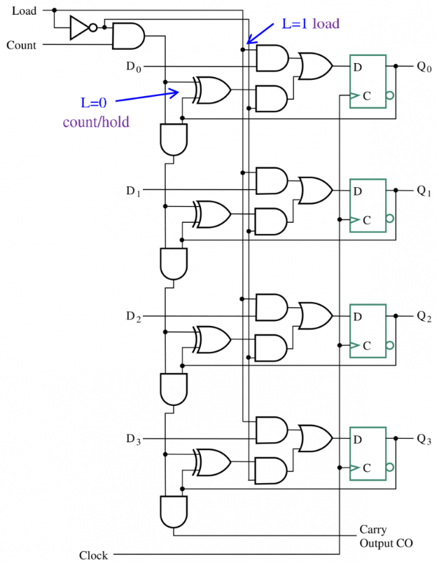

# Chapter6 Registers and Register Transfers

## Register 寄存器
一个n位的寄存器，包含n个触发器，还有若干组合电路来实现特定功能，如移位、计数等
一般通过一个Load信号来控制寄存器，该信号一般通过更高阶的电路控制。可以把Load信号和Clock信号的AND来作为触发器的控制信号。
- Load=1,表示载入，新数据可被写入寄存器
- Load=0,表示储存，寄存器保持已写入的数据

### 时钟偏斜（clock skew）
Clock skew is a phenomenon in synchronous digital circuit in which the same sourced clock signal arrives at different components at different times.
时钟偏移是同步数字电路中的一种现象，即同一源时钟信号在不同时间到达不同元件。

解决方法是将时钟信号直接镰刀所有触发器的控制信号上，但在触发器输入信号借一个2-TO-1 MUX,根据控制信号选择是加载触发器输出还是从输入流加载。

如果载入操作是在同一时钟脉冲种完成，称为并行的（parallel）

### 寄存器传输操作 Register Transfer Operations
处理存储在寄存器中数据的操作

Elementary Operations（初级操作）: load, count, shift, add, bitwise "OR", etc.
Elementary operations called microoperations(微操作)

#### RTL  (Register Transfer Language)
寄存器传输语言，表述寄存器传输操作
- 字母和数字：表示寄存器 $R2,PC,IR$
- 小括号：表示位的范围，$R(1)、PC(7:0)$
- 箭头：表示数据的传输，$R1 \leftarrow R2$
- 逗号：用于分开多次操作，$R1 \leftarrow R2, R3 \leftarrow R4$
- 方括号：（可通过寄存器）指定内存地址, $R0\leftarrow M[AR]$
- **条件传输(conditional transfer)**：如 $K1: (R2 \leftarrow R1)$ 表示当 K1 寄存器的值为 1 时执行 R2 <- R1。

微操作分组：
- 传输 - 将数据从一个寄存器移至另一个寄存器
- 算术 - 对寄存器中的数据进行算术运算
- 逻辑 - 操作数据或使用位逻辑运算
- 移位 - 移位寄存器中的数据

寄存器传输操作的硬件描述语言比较：

例如：
On condition K1 OR K2, the content of R1 is Logic bitwise Or with the content of R3 and the result placed in R1.
$(K1 + K2):R1 \leftarrow R1  \vee R3$
- NOTE
  - “+” (as in K1 + K2) means “OR”.
  - In$ R1 \leftarrow R1 + R3$, “+” means “addition”.
  - 冒号左侧出现的+表示逻辑或，右侧的则表示加（×也是类似）

**Control Expressions**
- The control expression for an operation appears to the left of the operation and is separated from it by a colon操作的控制表达式出现在操作的左侧，并用冒号隔开
- Control expressions specify the logical condition for the operation to occur控制表达式指定操作发生的逻辑条件
- Control expression values of:
  • Logic "1" -- the operation occurs.
  • Logic "0" -- the operation is does not occur.
  控制表达式值为
  - 逻辑 “1” -- 执行操作。
  - 逻辑 “0”--不执行操作。
- For example:
  - $\overline{X}K1:R1 \leftarrow R1 +R2$
  - $XK1:R1 \leftarrow R1 +\overline{R2} + 1$
  - K1 enables the add or subtract operation
  - X=0  for add, X=1 for subtract
- **shift microoperations**

#### Register Transfer Structures
数据传输结构
##### 基于多路选择器的传输 Multiplexer-based Transfer
多个输入通过一个多路选择器进行选择，从而给到目标寄存器中。

##### 基于专有的多路选择器的传输 Dedicated MUX-Based Transfers
这里专有的(dedicated) 的 MUX 的意思是说，每个寄存器的输入都通过一个独立的 MUX 进行选择。

- 可以实现在一个时钟节拍中同时的数据传输。
- 门输入代价高。
  - GN 的计算：MUX 的反相器是可以共享的，每一个 MUX 里需要两个 2 输入与门和一个 2 输入或门，共GN=3×6+3=21。

##### 多路选择器总线 Multiplexer Bus
总线(bus) 的主要思想在于让多个寄存器共享一个多路选择器和数据传输路径，把这个多路选择器称作是共享的(shared)。

##### 三态门总线 Three-State Bus
三台总线的实现需要用到三态门(tri-state gate)，因为其可以输出高阻态，从而使得来自多个寄存器的输出可以直接连起来而不需要逻辑门或 MUX 的控制。

### Shift Registers
一个普通的移位寄存器(shift register) 如下：
正边沿D触发器

- 串行输入(serial input)：In
- 串行输出(serial output)：Out
- 并行输出(parallel output)：A,B,C,Out

#### 并行加载移位寄存器 Parallel Load Shift Register

- shift=0时，加载输入，是并行的
- shift=1时，移位输入
通过给输入信号加一个 2-to-1 MUX 可以实现并行加载功能

如果需要支持保持功能，可以换成3-to-1 MUX

注意，实现保持功能时，我们不能直接给时钟信号 CP 加一个与门，这样的话与门的延迟同样会导致上文提到过的时钟歪斜(clock skew) 问题。

#### 双向移位寄存器 Bidirectional Shift Register
用4-to-1 MUX 实现移位寄存器同时支持2个方向的移位操作：

其功能表如下所示：
|S1|S0|Operation|
|-|-|-|
|0|0|保持 no change|
|0|1|向下移位 shift down|
|1|0|向上移位 shift up|
|1|1|平行加载 parallel load|

### Counters

- 异步计数器（行波）开销小，简单，但是延时高
- 同步计数器开销大，复杂，但是延时低，效果好

#### Ripple Counter 波纹计数器（行波计数器）
触发器$D_A$把始终信号作为控制信号$C_R$，其输出反转频率为始终信号的一般；$D_B$把$D_A$的输出作为控制信号，其反转频率为$D_A$的输出的一半，是始终信号的四分之一...从而实现计数器功能。

这些电路被称为纹波计数器，因为每次边沿敏感转换（示例中为正边沿D触发器）都会导致下一个触发器的状态发生变化。

- 最低有效位（LSB）
- 最高有效位（MSB）

从最低有效位开始计数，低位触发器的输出作为更高一位触发器的控制信号。

时钟到输出延迟 $t_{PHL}$ 会导致每一级转换从时钟边沿开始的延迟不断增加。
- 因此，计数 “波纹 ”从最小有效位到最大有效位。
- 对于 n 位，最坏情况下的总延迟为 $n\times t_{PHL}$。

工作原理：
- 当 A 的时钟输入端出现正边沿时，A 将填上值
- 触发器 B 的时钟输入是触发器 A 的相反输出
- 当触发器 A 从 1 变为 0 时，B 的时钟输入端会出现一个正边沿，导致 B 填值

- 上图中，下一个 FF 的时钟来自于上一个 FF 的输出取反，也就是对于上升沿触发的 FF 来说，下一个 FF 会在上一个 FF 的输出从 1 到 0 时自反，所以是**正向计时**(Upward Counting)；
- 反之，如果下一个 FF 的时钟来自于上一个 FF 的直接输出，也就是对于上升沿触发的 FF 来说，下一个 FF 会在上一个 FF 的输出从 0 到 1 时自反，所以是**逆向输出**(Downward Counting)；

有效位每增大一，输出反转频率减半。

#### Synchronous Counters同步计数器

触发器只用来保存状态，计数的功能用组合电路（n 位计数器只需要n 个半加器）实现。所有触发器同步改变。

- 计数使能(count enable = CE)：控制是否进行计数，当$CE=1$且边沿到来时进行一次计数，当$CE=0$时处于保持状态。
- 进位输出(carry output = CO)：给出最高的进位作为输出，可以指示计数器是否达到上界。当且仅当$CE=1,Q_0=1,Q_1=1,Q_2=1,Q_3=1$时，$CO=1$。

**用4bit的计数器实现8bit的计数器**

当$CO=1$时，连到$CO$的另一个计数器的CE=1，进了一位。

类似于加法器，我们也可以在**并行计数器**中实现提前进位：

#### Counter with Parallel Load 支持平行加载的计数器
通过一个 2-to-1 MUX 控制是从 D 中并行加载还是从组合逻辑中加载。

#### Counter Modulo N 模N计数器
我们以设计模 10 的计数器（BCD 计数器为例），那么只有 0 到 9 是有效的(valid)，剩下的 6 个状态都是未使用的状态。

写出状态转移的**激励方程**，并通过**卡诺图化简**，可以得到我们需要的组合逻辑。

$D_t=Q_{t+1}$

- 需要注意的是，虽然剩余 6 个状态是未使用状态，但是如果计数器因为意外处于未使用状态时，他的下一状态是确定的，画图可知我们设计的这一计数器在有限步后又会回到有效状态（称为自恢复能力；并非对于所有计数器都成立后，最好设计成这样的）。我们也可以设计一个Error 输出，用于指示是否进入了未使用状态，同样可用卡诺图进行化简。

- 不推荐的设计（自杀式计数器）：让模 n 的计数器在输出变成 n 时直接给所有寄存器异步清零。如果异步清零过程的时延不同，可能“卡在”中间的任意有效状态，非常不稳定。

可选设计：
BCD 码循环计数
首先我们需要根据时序电路的设计规则，搞清楚状态序列，显然，根据 BCD 码的定义，我们可以毛毛地认为它是下确界为 0，上确界为 9 的 4 比特整数序列。换句话说，我们需要实现一个计数到 9 后下一个状态是 0 的 4 比特计数器。
于是我们可以当计数器的输出为 9 时，下一周期让计数器载入 0：

按理来说这里应该是 $Load=Q_0  \times Q_1 \times Q_2 \times Q_3$，以对应 $9D=1001B$，但是由于自增过程中，1001 是第一个满足 1??1 的组合，所以可以直接简化为 $Load=Q_0\times Q_3$
如上是修改上确界的方法，而修改下确界的方法则是修改 $D_i$ 序列，例如上图中 $D$ 接地，所以下确界是 $0000B$。

以下技术使用具有异步或同步清零和/或并行加载功能的 n 位二进制计数器：
- 在 Modulo-N 计数序列中检测到 N 个末端计数，异步将计数清除为 0 或异步加载为 0 值（这会导致计数只存在很短时间，在某些定时条件下可能不起作用！）。
- 在模数-N 计数序列中检测终端计数 N - 1，**同步**将计数清除为 0(下一个时钟沿边清零)
- 在一个 N 模数计数序列中检测到一个 N - 1 的终端计数，同步加载数值 0
- 检测一个终端计数，并使用加载功能预设一个终端计数值减去 (N - 1) 的计数

>实际上，我们可以把 BCD 码循环计数器看作是特殊的 Mod N 计数器，即 N = 10 的 Mod N 计数器。
或许你会想，实现 Mod N 计数器能不能在满足输出条件后直接使用 Clear 输入。但是请不要忘记了，Clear 也好，Set 也罢，它们都是异步操作。我们没有必要也不应该使用异步操作，所以**最好的做法还是使用 Load**加载0值。

### Register Cell Design 寄存器单元设计
#### Multiplexer Approach 基于MUX的设计方法
- 寄存器功能(register functions)：可以通过寄存器传输语言 RTL 来描述。
- 控制输入(control inputs)：输入控制信号，控制信号的可以是编码的(encoded) 或未编码的。

- 数据输入(date inputs)：从寄存器中输入。

>"Example

#### Sequential Circuit Design Approach 基于时序电路的设计方法
这里状态本身就是输出，所以一定是**摩尔型电路**。使用时序电路的相关方法进行设计，虽然结果更优但设计**过程非常麻烦**。

- Find a state diagram or state table
  - Note that there are only two states with the state assignment equal to the register cell output value
- Use the design procedure in Chapter 4 to complete the cell design
- For optimization:
  - Use K-maps for up to 4 to 6 variables
  - Otherwise, use computer-aided or manual optimization

- 查找状态图或状态表
  - 注意只有两种状态的状态赋值等于寄存器单元的输出值
- 使用第 4 章中的设计步骤完成单元设计
- 优化
  - 最多使用 4 至 6 个变量的 K 映射
  - 否则，使用计算机辅助优化或手动优化