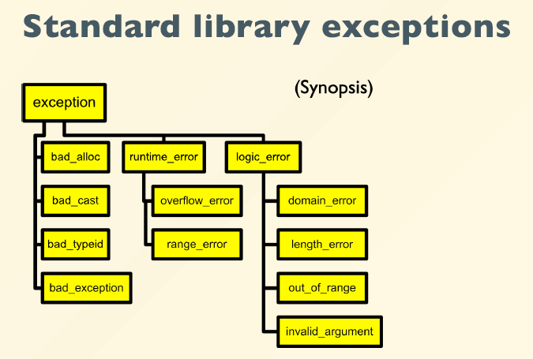
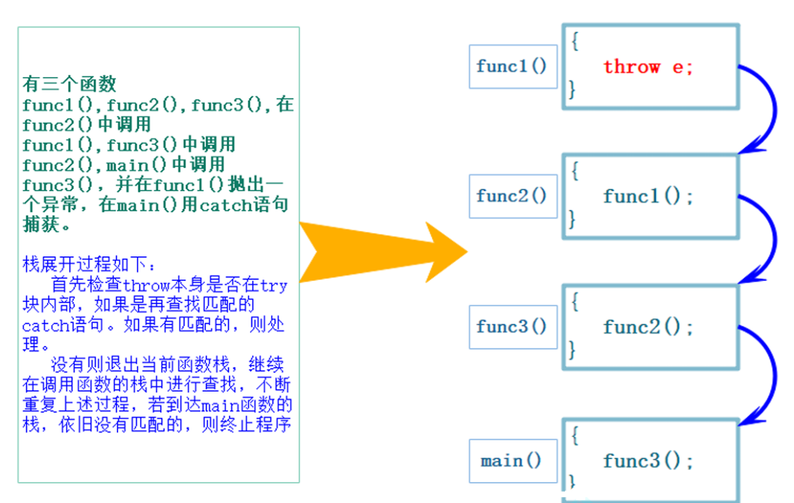

# Exceptions

异常是程序在执行期间产生的问题。C++ 异常是指在程序运行时发生的特殊情况，比如尝试除以零的操作。

异常提供了一种转移程序控制权的方式。C++ 异常处理涉及到三个关键字：try、catch、throw。
- throw: 当问题出现时，程序会抛出一个异常。这是通过使用 throw 关键字来完成的。
- catch: 在您想要处理问题的地方，通过异常处理程序捕获异常。catch 关键字用于捕获异常。
- try: try 块中的代码标识将被激活的特定异常。它后面通常跟着一个或多个 catch 块。

如果有一个块抛出一个异常，捕获异常的方法会使用 try 和 catch 关键字。try 块中放置可能抛出异常的代码，try 块中的代码被称为保护代码。使用 try/catch 语句的语法如下所示：
```cpp
try
{
   // 保护代码
}catch( ExceptionName e1 )
{
   // catch 块
}catch( ExceptionName e2 )
{
   // catch 块
}catch( ExceptionName eN )
{
   // catch 块
}
```
如果 try 块在不同的情境下会抛出不同的异常，这个时候可以尝试罗列多个 catch 语句，用于捕获不同类型的异常。

## 抛出异常
使用throw 关键字来抛出异常。throw 语句的操作数可以是任意的表达式，表达式的结果的类型决定了抛出的异常的类型。
抛出异常的实例如下所示：
```cpp
double division(int a, int b)
{
   if( b == 0 )
   {
      throw "Division by zero condition!";
   }
   return (a/b);
}
```

## 捕获异常

catch 块跟在 try 块后面，用于捕获异常。您可以指定想要捕捉的异常类型，这是由 catch 关键字后的括号内的异常声明决定的。
捕获异常的实例如下所示：
```cpp
try
{
   // 保护代码
}catch( ExceptionName e )
{
  // 处理 ExceptionName 异常的代码
}
```
上面的代码会捕获一个类型为 ExceptionName 的异常。如果您想让 catch 块能够处理 try 块抛出的任何类型的异常，则必须在异常声明的括号内使用省略号 ...，如下所示：
```cpp
try
{
   // 保护代码
}catch(...)
{
  // 能处理任何异常的代码
}
```
下面是一个实例，抛出一个除以零的异常，并在 catch 块中捕获该异常。
```cpp
#include <iostream>
using namespace std;
 
double division(int a, int b)
{
   if( b == 0 )
   {
      throw "Division by zero condition!";
   }
   return (a/b);
}
 
int main ()
{
   int x = 50;
   int y = 0;
   double z = 0;
 
   try {
     z = division(x, y);
     cout << z << endl;
   }catch (const char* msg) {
     cerr << msg << endl;
   }
 
   return 0;
}
```
由于我们抛出了一个类型为 const char* 的异常，因此，当捕获该异常时，我们必须在 catch 块中使用 const char*。当上面的代码被编译和执行时，它会产生下列结果：
```bash
Division by zero condition!
```

## C++标准库异常
C++ 提供了一系列标准的异常，定义在 <exception> 中，我们可以在程序中使用这些标准的异常。它们是以父子类层次结构组织起来的，如下所示：


|异常|描述|
|--|--|
|std::exception|该异常是所有标准 C++ 异常的父类|
|std::bad_alloc|该异常可以通过 new 抛出|
|std::bad_cast|该异常可以通过 dynamic_cast 抛出|
|std::bad_typeid|该异常可以通过 typeid 抛出|
|std::bad_exception|这在处理 C++ 程序中无法预期的异常时非常有用|
|std::logic_error|理论上可以通过读取代码来检测到的异常|
|std::domain_error|当使用了一个无效的数学域时，会抛出该异常|
|std::invalid_argument|当使用了无效的参数时，会抛出该异常|
|std::length_error|当创建了太长的 std::string 时，会抛出该异常|
|std::out_of_range|该异常可以通过方法抛出，例如 std::vector 和 std::bitset<>::operator[]()|
|std::runtime_error|理论上不可以通过读取代码来检测到的异常|
|std::overflow_error|当发生数学上溢时，会抛出该异常|
|std::range_error|当尝试存储超出范围的值时，会抛出该异常|
|std::underflow_error|当发生数学下溢时，会抛出该异常|

## noexcept 关键字
在函数内部抛出异常但未处理，导致上层调用者无法预期。
避免策略：确保每个可能抛出异常的函数都有相应的异常处理逻辑，或者明确声明该函数可能会抛出异常（使用throw()(C++11前)或noexcept）。

noexcept 关键字用于指定函数不会抛出异常。
比如下面就是std::initializer_list的默认构造函数，其中使用了noexcept。
```cpp
constexpr initializer_list() noexcept: _M_array(0), _M_len(0) { }
```
该关键字告诉编译器，函数中不会发生异常,这有利于编译器对程序做更多的优化。
如果在运行时，noexecpt函数向外抛出了异常（如果函数内部捕捉了异常并完成处理，这种情况不算抛出异常），**程序会直接终止，调用std::terminate()函数**，该函数内部会调用std::abort()终止程序。

在以下情形中鼓励使用noexcept:
- 移动构造函数（move constructor）
- 移动分配函数（move assignment）
- 析构函数（destructor）。这里提一句，在新版本的编译器中，析构函数是默认加上关键字noexcept的。

## 异常传播
如果一个函数中的try-catch没有捕获到异常，异常会向上抛给调用者，直到被合适的catch块捕获或导致程序终止。

在函数调用中：
- 首先检查 throw 本身是否在 try 块内部，如果是再查找匹配的 catch 语句。如果有匹配的，则调到 catch 的地方进行处理。
- 没有匹配的 catch 则退出当前函数栈，继续在调用函数的栈中进行查找匹配的 catch。
- 如果到达 main 函数的栈，依旧没有匹配的，则终止程序。上述这个沿着调用链查找匹配的 catch子句的过程称为栈展开。所以实际中我们最后都要加一个 catch(...) 捕获任意类型的异常，否则当有异常没捕获，程序就会直接终止。
- 找到匹配的catch子句并处理以后，会继续沿着catch子句后面继续执行。



```cpp
double divide(double x, double y) {
    if (y == 0) {
        throw std::runtime_error("除数不能为0");
    }
    return x / y;
}

void Func(){
    int len,time;
    cin>>len>>time;
    cout<<divide(len,time)<<endl;
}

int main(){
    try{
        Func();
    }
    catch(std::runtime_error& e){
        cout<<e.what()<<endl;
    }
    catch(...){
        cout<<"未知错误"<<endl;
    }
    return 0;
}
```

## 多重catch块
可以有多个catch块来捕获不同类型的异常，按照从上至下的顺序匹配。

```cpp
try {
    // ...
} catch (const std::out_of_range& e) {
    std::cerr << "数组越界: " << e.what() << '\n';
} catch (const std::bad_alloc& e) {
    std::cerr << "内存分配失败: " << e.what() << '\n';
} catch (...) {
    // ...处理其他所有类型的异常
    std::cerr << "未知异常\n";
}
```
Exception types ordered from special to general

## 异常重新抛出
有可能单个的 catch 不能完全处理一个异常，在进行一些校正处理以后，希望再交给更外层的调用链函数来处理，catch 则可以通过**重新抛出**将异常传递给更上层的函数进行处理。
```cpp
double Division(int a, int b){
 // 当b == 0时抛出异常
  if (b == 0){
    throw "Division by zero condition!";
  }
  return (double)a / (double)b;
}
void Func(){
// 这里可以看到如果发生除0错误抛出异常，另外下面的array没有得到释放。
// 所以这里捕获异常后并不处理异常，异常还是交给外面处理，这里捕获了再
// 重新抛出去。
  int* array = new int[10];
  try {
    int len, time;
    cin >> len >> time;
    cout << Division(len, time) << endl;
  }catch (...){
    cout << "delete []" << array << endl;
    delete[] array;
    throw;
    }
  // ...
  cout << "delete []" << array << endl;
  delete[] array;
}
int main() {
  try{
    Func();
  }
  catch (const char* errmsg){
    cout << errmsg << endl;
  }
  return 0;
}
```

## 异常继承
【基本形式】
- 设置一个类，包含 
  - （1）错误信息：string _errmsg; 
  - （2）错误id：int _id;
- 同时为了支持多态（下面知识点中的抛出的派生类对象， 使用基类捕获），支持虚继承

例如：
```cpp
class Exception{
    public:
    Exception(const string& errmsg, int id): _errmsg(errmsg), _id(id){}
    virtual string what() const{
        return _errmsg;
    }
    protected:
    string _errmsg;
    int _id;
};
```
- 在开发中，一般会有多个部门负责多个模块，例如：数据库模块，缓存模块，网络模块
- 如果各个模块的相同类型异常都直接抛出来，则无法区分是具体哪个模块出的问题，因此需要派生类对象进行更加定制的设计；
- 不同模块继承了基类，设置了 what（）函数，可以返回对应的str错误信息
- catch (const Exception& e) ——这里捕获父类对象就可以
- 通过 e.what() 记录日志——实现多态

```cpp
class sqlException : public Exception {
    public:
    sqlException(const char* msg,int id,const string& sql) : Exception(msg,id),_sql(sql) {}
    virtual string what() const {
        string str = "sqlException:";
        str += _errmsg;
        str += "->";
        str += _sql;
        return str;
    }
    private:
    const string _sql;
 
};
//  使用
int main() {
    try {
        throw sqlException("sql error",100,"select * from user");
    }
    catch (const Exception& e) {//只需捕获父类对象即可，子类对象包含于父类对象中
        cout << e.what() << endl;
    }
    catch(...){
        cout << "unknown exception" << endl;
    }
    return 0;
}
```