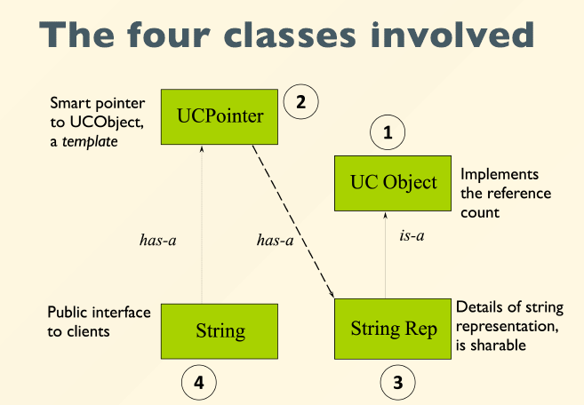

# Smart Pointer
智能指针就是帮我们C++程序员管理动态分配的内存的，它会帮助我们自动释放new出来的内存，从而避免内存泄漏！

- C++98 提供了 auto_ptr 模板的解决方案
- C++11 增加unique_ptr、shared_ptr 和weak_ptr,弃用了auto_ptr

##  std::auto_ptr
auto_ptr 是c++ 98定义的智能指针模板，其定义了管理指针的对象，可以将new 获得（直接或间接）的地址赋给这种对象。当对象过期时，其析构函数将使用delete 来释放内存！

用法:
头文件: #include < memory >
用 法: auto_ptr<类型> 变量名(new 类型)

例 如:
```cpp
auto_ptr< string > str(new string(“我要变得很牛逼！”));
auto_ptr<vector< int >> ar(new vector< int >());
auto_ptr< int > array(new int[10]);
```

例：
先定义一个类，类的构造函数和析构函数都输出一个字符串用作提示！
定义一个私有成员变量，赋值20.
再定义一个私有成员方法用于返回这个私有成员变量。
```cpp
class Test {
public:
	Test() { cout << "Test的构造函数..." << endl; }
	~Test() { cout << "Test的析构函数..." << endl; }

	int getDebug() { return this->debug; }

private:
	int debug = 20;
};
```
当我们直接new这个类时，却没释放
```cpp
int main(){
    Test* test = new Test;
    return 0;
}
```
输出：
```bash
Test的构造函数...
```
只是打印了构造函数这个字符串，而析构函数的字符却没有被打印，说明并没有调用析构函数！这就导致了内存泄露！
解决内存泄露的办法，要么手动delete，要么使用智能指针！

- 使用智能指针
```cpp
//定义智能指针
auto_ptr<Test> test(new Test);
```
- 可像普通指针使用
```cpp
cout << test->getDebug() << endl;
cout << (*test).getDebug() << endl;
```
自动调用了析构函数

### 智能指针三个常用函数
- get() 函数：获取智能指针托管的指针地址
  ```cpp
  auto_ptr<Test> test(new Test);
  Test* p = test.get();
  cout << p->getDebug() << endl;
  ```
  函数原型：
  ```cpp
  _NODISCARD _Ty *get() const _NOEXCEPT
  {
    return _Myptr;
  }
  ```

- release() 函数：取消智能指针对内存的托管
  ```cpp
  auto_ptr<Test> test(new Test);
  Test* p = test.release();//取消智能指针对内存的托管
  delete p;//之前分配的内存需要自己手动释放
  ```
  智能指针不再对该指针进行管理，改由普通指针进行管理！
  函数原型：
  ```cpp
  _Ty *release() _NOEXCEPT
  {
    _Ty *_Tmp = _Myptr;
    _Myptr = nullptr;
    return _Tmp;
  }
  ```   

- reset() 函数：重置智能指针托管的内存地址，如果地址不一致，原来的会被析构掉
  ```cpp
  auto_ptr<Test> test(new Test);
  test.reset();//释放智能指针的内存，并将其置位为null
  test.reset(new Test());//释放智能指针的内存，并将参数指针取代
  ```   
  reset函数会将参数的指针(不指定则为NULL)，与托管的指针比较，如果地址不一致，那么就会析构掉原来托管的指针，然后使用参数的指针替代之。然后智能指针就会托管参数的那个指针了。
  函数原型：
  ```cpp
  void reset(_Ty * _Ptr = nullptr)
  {	// destroy designated object and store new pointer
        if (_Ptr != _Myptr)
            delete _Myptr;
        _Myptr = _Ptr;
  }
  ```
### 弃用原因
1. 复制或者赋值都会改变资源的所有权
```cpp
// auto_ptr 被C++11抛弃的主要原因
auto_ptr<string> p1(new string("I'm Li Ming!"));
auto_ptr<string> p2(new string("I'm age 22."));

cout << "p1：" << p1.get() << endl;
cout << "p2：" << p2.get() << endl;

// p2赋值给p1后，首先p1会先将自己原先托管的指针释放掉，然后接收托管p2所托管的指针，
// 然后p2所托管的指针制NULL，也就是p1托管了p2托管的指针，而p2放弃了托管。
p1 = p2;	
cout << "p1 = p2 赋值后：" << endl;
cout << "p1：" << p1.get() << endl;
cout << "p2：" << p2.get() << endl;
```
输出：
```bash
p1: 0128F0C0
p2: 0128F280
p1 = p2 赋值后：
p1: 0128F280
p2: 00000000
```
2. 在STL容器中使用auto_ptr存在着重大风险，因为容器内的元素必须支持可复制和可赋值

3. 不支持对象数组的内存管理

## std::unique_ptr
简单说，当我们独占资源的所有权的时候，可以使用 std::unique_ptr 对资源进行管理——离开 unique_ptr 对象的作用域时，会**自动释放资源**。这是很基本的 RAII 思想。

由于 auto_ptr 基于排他所有权模式：两个指针不能指向同一个资源，复制或赋值都会改变资源的所有权。以上问题已经在上面体现出来了，下面将使用unique_ptr解决这些问题。

所以，C++11用更严谨的unique_ptr 取代了auto_ptr！

unique_ptr 和 auto_ptr用法几乎一样，除了一些特殊。
- 基于排他所有权模式：两个指针不能指向同一个资源
- 无法进行左值unique_ptr复制构造，也无法进行左值复制赋值操作，但允许临时右值赋值构造和赋值
- 保存指向某个对象的指针，当它本身离开作用域时会自动释放它指向的对象。
- 在容器中保存指针是安全的

### 实例

-  无法进行左值复制赋值操作，但允许临时右值赋值构造和赋值
  ```cpp
  {
    std::unique_ptr<string> p1(new string("hello"));
    std::unique_ptr<string> p2(new string("world"));

    cout <<"p1: "<<p1.get() << endl;
    cout <<"p2: "<<p2.get() << endl;

    p1=p2;//禁止左值赋值
    unique_ptr<string> p3(p2);//禁止左值赋值构造

    unique_ptr<string> p3(std::move(p1));
    p1=std::move(p2);//使用move把左值转化为优质就可以赋值，效果和auto_ptr一样

    cout<< "p1 = p2 赋值后："<<endl;
    cout <<"p1: "<<p1.get() << endl;
    cout <<"p2: "<<p2.get() << endl;

  }
  ```
  运行后后auto_ptr赋值结果一样。p2赋值给p1后，首先p1会先将自己原先托管的指针释放掉，然后接收托管p2所托管的指针，p2会将托管的指针制NULL，也就是p1托管了p2托管的指针，而p2放弃托管。

- 在 STL 容器中使用unique_ptr，不允许直接赋值
  ```cpp
    vector<unique_ptr<string>> vec;
    unique_ptr<string> p3(new string("I'm P3"));
    unique_ptr<string> p4(new string("I'm P4"));

    vec.push_back(std::move(p3));
    vec.push_back(std::move(p4));

    cout << "vec.at(0)：" << *vec.at(0) << endl;
    cout << "vec[1]：" << *vec[1] << endl;

    vec[0] = vec[1];	/* 不允许直接赋值 */
    vec[0] = std::move(vec[1]);		// 需要使用move修饰，使得程序员知道后果

    cout << "vec.at(0)：" << *vec.at(0) << endl;
    cout << "vec[1]：" << *vec[1] << endl;
  ```

- 支持对象数组的内存管理
  ```cpp
  // 会自动调用delete [] 函数去释放内存
  unique_ptr<int[]> array(new int[5]);	// 支持这样定义
  ```

- 赋值
  ```cpp
  unique_ptr<Test> t7(new Test);
    unique_ptr<Test> t8(new Test);
    t7 = std::move(t8);	// 必须使用移动语义，结果，t7的内存释放，t8的内存交给t7管理
    t7->doSomething();
  ```
- 主动释放对象
  ```cpp
  unique_ptr<Test> t7(new Test);
  t7.reset();
  t7=NULL;
  t7=nullptr;
  ```
- 放弃对象控制权
  ```cpp
  Test* t8=t7.release();//t7放弃控制权，t8成为t7的控制权 普通指针
  ```
- 重置
  ```cpp
  t9.reset(new Test);
  ```

unique_ptr 的一些问题：和auto_ptr一样，unique_ptr 不能复制，只能通过移动语义转移控制权,具有排他性，2个指针不能指向同一资源。

## std::shared_ptr
shared_ptr 是一种引用计数智能指针，它允许多个指针指向同一个对象。会对资源做引用计数，当引用计数为0时，资源会被释放。
如果有一种方式，可以记录引用特定内存对象的**智能指针数量**，当复制或拷贝时，引用计数加1，当智能指针析构时，引用计数减1，如果计数为零，代表已经没有指针指向这块内存，那么我们就释放它！这就是 shared_ptr 采用的策略。

### 1. 引用计数的使用
调用use_count()函数可以查看引用计数。
```cpp
shared_ptr<Person> sp1;

shared_ptr<Person> sp2(new Person(2));

// 获取智能指针管控的共享指针的数量	use_count()：引用计数
cout << "sp1	use_count() = " << sp1.use_count() << endl;
cout << "sp2	use_count() = " << sp2.use_count() << endl << endl;

// 共享
sp1 = sp2;

cout << "sp1	use_count() = " << sp1.use_count() << endl;
cout << "sp2	use_count() = " << sp2.use_count() << endl << endl;

shared_ptr<Person> sp3(sp1);
cout << "sp1	use_count() = " << sp1.use_count() << endl;
cout << "sp2	use_count() = " << sp2.use_count() << endl;
cout << "sp2	use_count() = " << sp3.use_count() << endl << endl;
```
如上代码，sp1 = sp2; 和 shared_ptr< Person > sp3(sp1);就是在使用引用计数了。
- sp1 = sp2; --> sp1和sp2共同托管同一个指针，所以他们的引用计数为2；
- shared_ptr< Person > sp3(sp1); --> sp1和sp2和sp3共同托管同一个指针，所以他们的引用计数为3；

### 2.构造
1.  shared_ptr< T > sp1; 空的shared_ptr，可以指向类型为T的对象
```CPP
shared_ptr<Person> sp1;
Person* person1 = new Person(1);
sp1.reset(person1);//托管person1
```
2.  shared_ptr< T > sp2(new T()); 定义shared_ptr,同时指向类型为T的对象
```cpp
shared_ptr<Person> sp2(new Person(2));
shared_ptr<Person> sp3(sp1);
```
3.  shared_ptr<T[]> sp4; 空的shared_ptr，可以指向类型为T[]的数组对象 C++17后支持
```cpp
shared_ptr<Person[]> sp4;
```
4. shared_ptr<T[]> sp5(new T[] { … }); 指向类型为T的数组对象 C++17后支持
```cpp
shared_ptr<Person[]> sp5(new Person[5] { 3, 4, 5, 6, 7 });
```
5. shared_ptr< T > sp6(NULL, D()); //空的shared_ptr，接受一个D类型的删除器，使用D释放内存
```cpp
shared_ptr<Person> sp6(NULL, DestructPerson());
```
6. shared_ptr< T > sp7(new T(), D()); //定义shared_ptr,指向类型为T的对象，接受一个D类型的删除器，使用D删除器来释放内存
```cpp
shared_ptr<Person> sp7(new Person(8), DestructPerson());
```
### 3. 初始化
1.  方式一：构造函数
```cpp
shared_ptr<int> up1(new int(10));  // int(10) 的引用计数为1
shared_ptr<int> up2(up1);  // 使用智能指针up1构造up2, 此时int(10) 引用计数为2
```
2. 方式二：使用make_shared 初始化对象，分配内存效率更高(推荐使用)
make_shared函数的主要功能是在动态内存中分配一个对象并初始化它，返回指向此对象的shared_ptr;
用法：
make_shared<类型>(构造类型对象需要的参数列表);
```cpp
shared_ptr<int> up3 = make_shared<int>(2); // 多个参数以逗号','隔开，最多接受十个
shared_ptr<string> up4 = make_shared<string>("字符串");
shared_ptr<Person> up5 = make_shared<Person>(9);
```

### 4. 赋值
```cpp
shared_ptrr<int> up1(new int(10));  // int(10) 的引用计数为1
shared_ptr<int> up2(new int(11));   // int(11) 的引用计数为1
up1 = up2;	// int(10) 的引用计数减1,计数归零内存释放，up2共享int(11)给up1, int(11)的引用计数为2
```
### 5. 主动释放对象
```cpp
shared_ptrr<int> up1(new int(10));
up1 = nullptr ;	// int(10) 的引用计数减1,计数归零内存释放 
// 或
up1 = NULL; // 作用同上 
```
### 6. 重置
```cpp
p.reset();
p.reset(new int(10));
p.reset(p1);
p.reset(p1, D());//  接受一个D类型的删除器，使用D释放内存
```
### 7. 交换
p1,p2为智能指针
```cpp
std::swap(p1,p2);//
p1.swap(p2);//交换p1,p2对象，原对象引用计数不变
```
### 8. 使用陷阱
shared_ptr作为被管控的对象的成员时，小心因循环引用造成无法释放资源!

如下代码：
Boy类中有Girl的智能指针；
Girl类中有Boy的智能指针；
当他们交叉互相持有对方的管理对象时…

在使用shared_ptr智能指针时，要注意避免对象交叉使用智能指针的情况！ 否则会导致内存泄露！

## UCPointer
UCPointer is a **smart pointer** to a UCObject
- A smart pointer is an object defined by a class
- Implemented using a template
- Overloads operator-> and unary operator*

关系图：



- UCPointer maintains reference counts
- UCObject hides the details of the count, Strin is very clean.
- StringRep deals only with string storage andmanipulation
UCObject and
- UCPointer are reusable
Slower than raw pointers
Invasive design
- see:
  - std::shared_ptr
  - for non-intrusive design