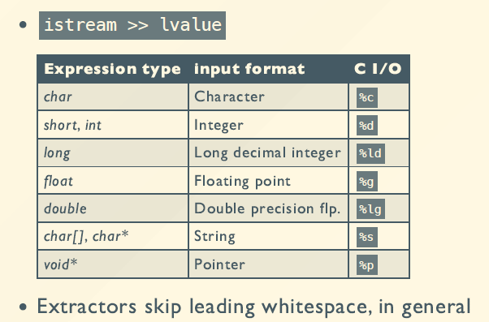
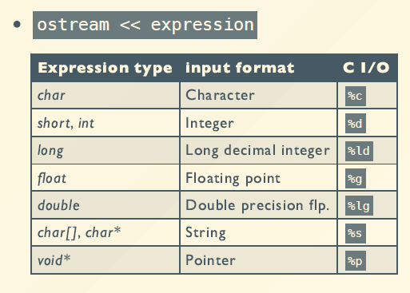

# Streams
## 流的概念
C++语言的数据输入/输出操作是通过I/O流库来实现的。C++中把数据之间的传输操作称为流，流既可以表示数据从内存传送到某个载体或设备中，即输出流，也可以表示数据从某个载体或设备传送到内存缓冲区变量中，即输入流。

C++流涉及以下概念：
- 标准I/O流：内存与标准输入输出设备之间信息的传递；
- 文件I/O流：内存与外部文件之间信息的传递；
- 字符串I/O流：内存变量与表示字符串流的字符数组之间信息的传递

**stream naming convention**
||Input|OutputH|Header|
|- |-|-|-|
|Generic|istream|ostream|\<iostream>|
|File|ifstream|ofstream|\<fstream>|
|C string|istrstream|ostrstream|\<strstream>|
|C++ string|istringstream|ostringstream|\<sstream>|

## stream operations
- Extractors:
  - Read a value from the stream
  - Overload operator>>
- Inserters:
  - Insert a value into the stream
  - Overload operator<<
- Manipulators:
  - Change the state of the stream

## Predefined streams
- cin  - standard input stream
- cout - standard output stream
- cerr - unbuffered error(debugging) output
- clog - buffered error(debugging) output

**Example**
```cpp
#include<iostream>
int i; float f; char c;
char buffer[80];

// Read the next character
cin >> c;
// Read an integer, skips whitespace
cin >> i;
// Read a float and a string separated by whitespace
cin >> f >> buffer;
```
**Predefined extractors:**

输入时跳过空格

## Defining a stream extractor
- Has to be a 2-argument free function
  - The first argument is an istream&
  - The second argument is a reference to a value
```cpp
istream& operator>>(istream& is, T& obj) {
// specific code to read obj
return is;
}//重载输入符
```
- Return an **istream&** for chaining
```cpp
cin >> a >> b >> c; // ((cin >> a) >> b) >> c;
```
## Other input operators
- int get()
  - return the next character from the stream
  - return EOF if no characters left
  - Example: copy input to output

```cpp
int ch;
while ((ch = cin.get()) != EOF) {
    cout.put(ch);
}
```
- get(char *buf,int limit, char delim = '\n')
  - Read up to limit characters, or to delim
  - Appends a NULL character to buf
  - Does NOT consume the delimiter
- getline(char *b, int l, char d='\n')
  - Similar to above
  - Does consume the delimiter
- int gcount()
  - return number of characters read
- void putback(char ch)
  - pushes a single character back into the stream
- char peek()
  - Examines the next character without consuming it

## Predefined inserters


## Creating a stream inserter
- Has to be a 2-argument free function
  - The first argument is an ostream&
  - The second argument is a const reference
```cpp
ostream& operator<<(ostream& os,const T& obj) {
// specific code to write obj
return os; 
}
```
- Return an ostream& for chaining
```cpp
cout << a << b << c;// ((cout << a) << b) << c;
```
## Other output operators
- put(char)
  - prints a single character
- flush()
  - Force output of stream contents
  ```cpp
  cout<<"Enter a number:";
  cout.flush();//flush the buffer
  ```
## Formatting using manipulators
- Manipulators modify the state of the stream
  - \# include \<iomanip>
  - Effects hold (usually)
- Example
  ```cpp
  int n;
  cout<<"Enter a number in hexadecimal:"<<endl;
  cin>>hex>>n;
  ```
  ```cpp
  #include<iostream>
  #include<iomanip>
  int main(){ 
    cout <<setprecision(2) <<1230.243<< endl; cout <<setw(20) <<"OK!";
    return 0;
  }

  1.2e+03 
               OK!
  ```
## Creating mainpulators
```cpp
// skeleton for an output stream manipulator
ostream& manip(ostream& out){ 
    ...
    return out; 
}

ostream& tab(ostream& out){
    return out <<'\t'; 
}

cout <<"Hello"<< tab <<"World!"<< endl;
```

